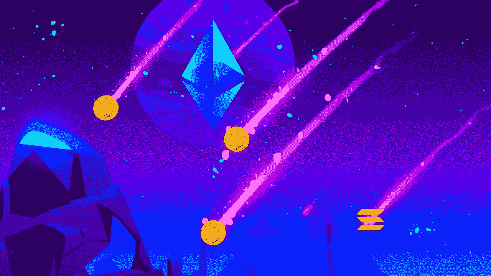
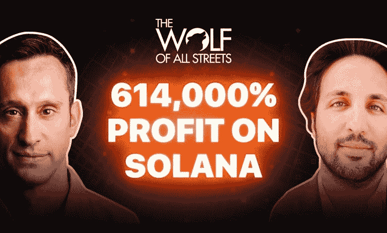
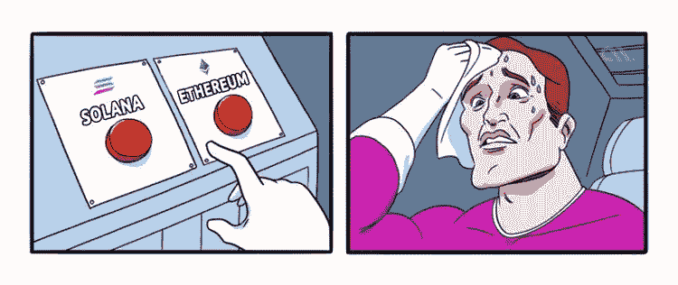

# 8000 个索拉纳钱包被黑，500 万美元被盗。

> 原文：<https://medium.com/coinmonks/8-000-solana-wallets-have-been-hacked-and-5m-stolen-5ffc1c961427?source=collection_archive---------36----------------------->

Is Solana really the ETH killer?

这是备受赞誉的黑仔联邦理工学院的理想简历吗？

索拉纳有问题。

这就像班上最淘气的孩子一样有问题，他总是承诺要守规矩，然后转身开始站在桌子上高呼《权力的游戏》中的战争口号。

让我们仔细看看索尔答应我们要成为什么样的人。

它应该是一个强大的层，使用证据机制，并被设计为快如闪电。

据报道，它每秒可以处理高达 65，000 次交易。

Eth 是每秒 30 次。

BTC 在 4.6，Visa 在 1700 左右。

Sol 交易非常便宜，每笔交易大约 0.00025 美元。

这就是为什么人们称它为 Eth 杀手。

但随后各种问题开始浮出水面。

虫洞桥黑客窃取了 3 . 2 亿美元资金。

哎哟。

这确实削弱了用户对索拉纳的信心。

Till Jump Crypto 毫不夸张地跳了进来，捐赠了 3 . 2 亿美元来完全弥补这个漏洞。

就这样。

更不用说索尔比足球场上的足球运动员倒下的次数还要多。

到目前为止，仅在 2022 年就下跌了 12 次。

Blockchains aren’t reliable if they keep going down.

无论你的区块链有多快或多便宜，如果它不可靠，它就不能持续。

然后有一个有争议的插曲，关于索拉纳的区块链如何由于垃圾邮件和机器人系统超载而大幅减速。

有几个视频流传着 Sol 的早期投资者如何获得数十亿美元，以及 Sol 如何真正属于风投。

尽管并非完全不同寻常，Sol 在早期确实向风投分配了不成比例的巨额股份，引发了质疑和怀疑。

据 Messari 报道，48%的 Sol 代币由内部人士所有:团队、公司和风投。

如果你真的想让更多的用户相信 Sol 并传播它的用例，这可不是理想的叙述。

Multicoin made unbelievable amounts of money from their initial investments in Solana.

Multicoin Capital 赚了这么多，这些数字看起来超现实。

“自 Multicoin 于 2017 年成立以来，适度的种子期投资一直是其增长的驱动力；这位总部位于德克萨斯州奥斯汀的经理是 Solana 的早期投资者，Solana 在每枚代币超过 250 美元的高峰时期上涨了 20，000%以上，后来跌至目前的 30 美元多一点，仍比最初的发行价高出 13，000%。

现在 Sol 投资者正在起诉 Solana Labs 和 Multicoin 向散户投资者倾销并从中非法牟取暴利。

Sol 团队有多次停机要处理，多次推迟了他们的时间表，似乎每天都在吸引更多的争议。

这真的是备受期待的联邦理工学院杀手的素质吗？

Which will survive and thrive in the long run?

现在，有黑客。

8000 个 Sol hot 钱包遭到攻击，500 万美元已经被盗。

最可怕的是，来源仍然未知，黑客攻击仍在进行。

经营像索尔这么大的区块链是一项艰巨的任务。

索尔是 TVL 的第五大区块链，在生态系统中仍然拥有相当大的权力。

他们下一步的行动可能是拯救一个帝国或进一步推动灾难多米诺骨牌的关键。

-

索拉纳会打败以太坊吗？

-

# startups # business # startupx # growth # success # social media # culture # web 3 # strategy # hacks # ronin # horizon # harmony # Solana # bridges # eth # BTC # crypto #黑客# wallets

> *加入 Coinmonks* [*电报频道*](https://t.me/coincodecap) *和* [*Youtube 频道*](https://www.youtube.com/c/coinmonks/videos) *了解加密交易和投资*

# 另外，阅读

*   [Bookmap 评论](https://coincodecap.com/bookmap-review-2021-best-trading-software) | [美国 5 大最佳加密交易所](https://coincodecap.com/crypto-exchange-usa)
*   [加密交易机器人](/coinmonks/crypto-trading-bot-c2ffce8acb2a) | [造币评论](https://coincodecap.com/coingate-review)
*   最佳加密[硬件钱包](/coinmonks/hardware-wallets-dfa1211730c6) | [Bitbns 评论](/coinmonks/bitbns-review-38256a07e161)
*   [新加坡十大最佳加密交易所](https://coincodecap.com/crypto-exchange-in-singapore) | [购买 AXS](https://coincodecap.com/buy-axs-token)
*   [红狗赌场评论](https://coincodecap.com/red-dog-casino-review) | [Swyftx 评论](https://coincodecap.com/swyftx-review)