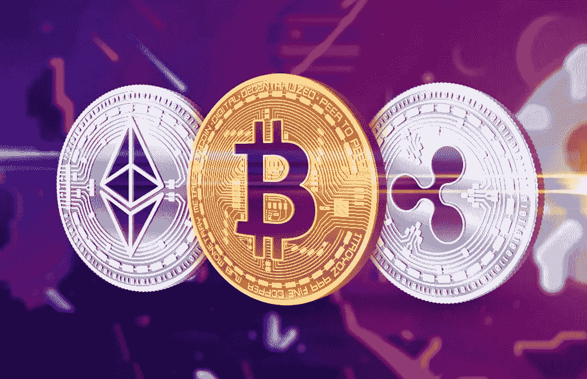
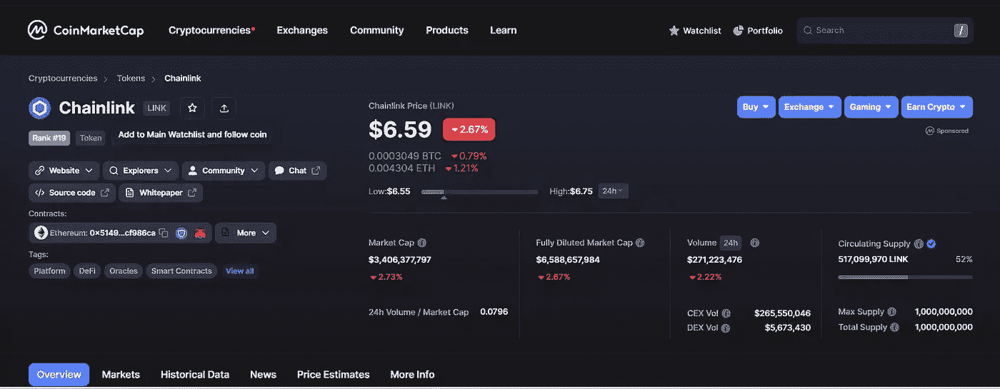
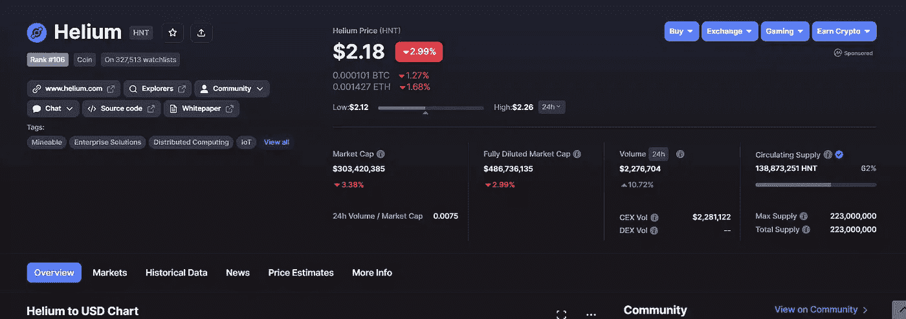
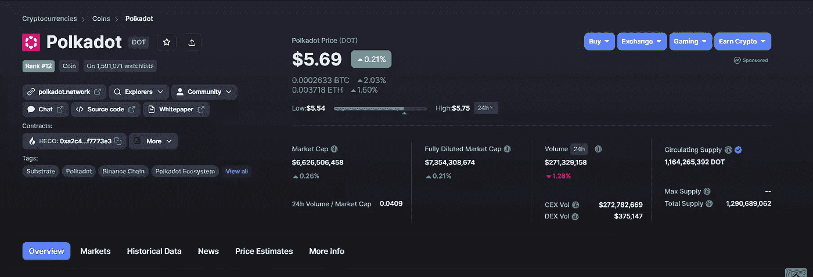
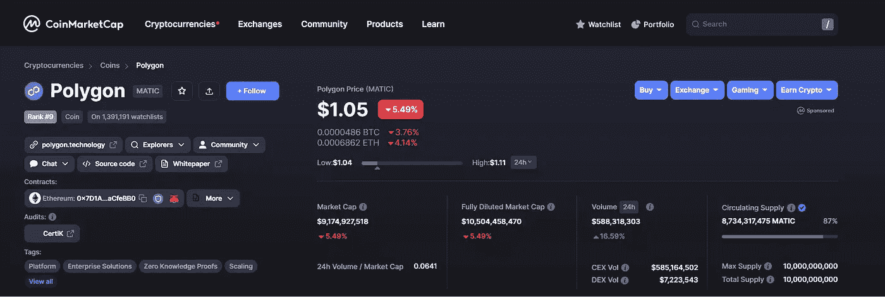

# 现在投资 8 种加密货币——36 crypto

> 原文：<https://medium.com/coinmonks/8-cryptocurrencies-you-should-invest-in-october-2022-36crypto-c85c80ade01d?source=collection_archive---------2----------------------->

现在正在寻找最佳的加密货币投资？请继续阅读这篇文章，了解更多信息。

在 2022 年以下降趋势结束后，2023 年以加密市场的积极趋势开始。然而，我们现在是在 3 月份，像往常一样，你可能会想知道什么是最好的加密货币值得警惕，并可能会添加到你的投资组合中。

引人注目的[以太坊合并](https://36crypto.com/understanding-the-ethereum-merge-in-simple-term/)发生在去年 9 月，我们非常看好这一事件，但升级后，以太坊[下跌超过 15%](https://www.cnbc.com/2022/09/20/ether-eth-drops-15percent-since-ethereum-merge-as-traders-take-profits.html#:~:text=Ether%20(ETH)%20drops%2015%25,merge%20as%20traders%20take%20profits) ，这不是许多人所希望的。

一些问题，如**以太坊在下跌中仍然是一个好的投资吗？**熊市中有哪些[最好的赚钱方法？](https://36crypto.com/how-to-make-profit-in-a-crypto-bear-market/) **现在投资什么加密货币最好？**我们将关注一些仍具有良好投资潜力的加密货币。

在我们之前关于 9 月份[十大投资加密货币的帖子](https://36crypto.com/top-10-cryptocurrencies-to-invest-in-september-2022/)中，我们看到比特币、以太坊、币安币、Polygon 和一些[稳定币](https://36crypto.com/what-is-an-altcoin-investing-for-beginners/)如泰瑟 USDT 和美元币 USDC 榜上有名。

由于加密货币的波动性，建议您在投资加密货币之前进行研究。我们现在投资的顶级加密货币列表包括一些流行的硬币，如比特币和以太坊，还包括一些被低估的硬币，如 Polygon，最后还有一些 [Web 3.0 加密货币](https://36crypto.com/7-best-web-3-0-cryptocurrencies-to-invest-in-right-now/)如氦网络。

如果你错过了我们现在投资的[顶级 web 3.0 加密货币](https://36crypto.com/7-best-web-3-0-cryptocurrencies-to-invest-in-right-now/)，你可以在这里阅读更多关于它们的信息[。](https://36crypto.com/7-best-web-3-0-cryptocurrencies-to-invest-in-right-now/)

# 什么是被低估的加密货币？

被低估的[加密货币](https://36crypto.com/what-is-cryptocurrency-the-beginners-map-to-understanding-how-cryptocurrency-works/)是指在加密市场上以被认为低于其实际长期价值的价格买卖的任何加密货币。

要知道，不仅新的替代硬币可能被低估，甚至市场上一些最古老的硬币，如比特币和以太坊，也可能被低估。众所周知，以太坊还没有完全发挥其潜力，尽管它被称为未来的加密货币[。实际上，被低估的密码是最好的投资对象。](https://36crypto.com/michael-saylor-says-ethereum-will-be-the-currency-of-the-future/)

# 什么是 Web 3.0 加密货币？

众所周知，web 3.0 是互联网的新发展。这是继 web 1.0 和 web 2.0 之后，web 发展的第三个阶段。在互联网的这个阶段，网站和应用程序将使用人工智能处理信息。

Web 3.0 加密货币是支持 Web 3 项目的令牌。像以太坊、波尔卡多特和氦网络这样的加密资产就是这一类别中的一些硬币。

# 现在投资的八大加密货币是什么？

排名不分先后:

# 1.链环(链环)。市值 34.06 亿美元

**Chainlink** 是一个建立在以太坊网络上的分散式网络。它是由一组开发人员集体构建的开源技术。 **Chainlink 由 Sergey Nazarov 和 Steve Ellis 于 2017 年 6 月创建**。

是继比特币之后最受欢迎的[山寨币](https://36crypto.com/what-is-an-altcoin-investing-for-beginners/)之一。它变得流行和广泛使用，因为它能够结合任何区块链技术。本机令牌链接用于补偿节点操作符从外部数据源检索数据。

多年来，LINK 逐渐流行起来，是 ETH 持有者持有最多的令牌之一。LINK 目前的**价格为 6.59 美元，市值******为 34.06 亿美元**。**

****

# **2.氦网络(HNT)。市值 3.02281 亿美元**

**氦网络是一个使用 LoRaWAN 系统的 Web3.0 友好资产。它是去中心化的无线物联网。**

**氦网络允许完全加密，它提供了一个高水平的安全互联网接入。它使任何人都能够拥有和操作低功耗的物联网设备的无线网络。**

**HNT 是氦网络的本地标志。用户在购买或建设热点时会挖掘 HNT 令牌。今天 HNT 股票的当前价格是 2.18 美元，市值为 3.02281 亿美元。**

****

# **3.波尔卡多(点)。市值 66.31 亿美元**

**Polkadot 也是一个 Web 3.0 友好的项目，它使区块链之间能够互联互通。这是旨在发展[加密货币](https://36crypto.com/what-is-cryptocurrency-the-beginners-map-to-understanding-how-cryptocurrency-works/)生态系统的网络之一。**

**它于 2020 年推出，因此 Polkadot 仍然是最新的之一，但自创建以来已经获得了巨大的增长。Polkadot 在两种类型的区块链上运行，主网络和用户创建的网络，称为副链。**

**Polkadot 网络的本地令牌是 dot。根据 CoinMarketCap 的数据，DOT tokens 的**当前价格为 5.70 美元，市值为 66.31 亿美元。****

****

# **4.多边形(MATIC)。市值 91.84 亿美元**

**Polygon 创建于 2017 年，最初名为 Matic network。这是一个第 2 层解决方案，允许其他区块链扩展应用程序。**

**Polygon 旨在提供多种工具，帮助提高区块链的交易速度并降低交易成本。多边形网络的原生硬币是 MATIC。**

**用户可以在网络上用令牌下注、管理和支付汽油费。它被用作网络用户之间支付和补偿的单位。**根据 [CoinMarketCap](https://coinmarketcap.com/currencies/polygon/) 的数据，Polygon 的市值为 91.84 亿美元，目前**的交易价格为 1.05 美元**。****

****

**[此处继续阅读](https://36crypto.com/top-8-cryptocurrencies-to-invest-in-october-2022/):**

***免责声明:此内容中表达的观点和意见仅属于穿帖子的作者。这绝不是财务建议或推荐。您可以自行决定如何处理上述信息。我们总是建议您在投资任何数字资产之前做好研究，因为它们以高波动性而闻名。***

***原载于 2022 年 9 月 30 日*[*【https://36crypto.com】*](https://36crypto.com/top-8-cryptocurrencies-to-invest-in-october-2022/)*。***

> **交易新手？尝试[加密交易机器人](/coinmonks/crypto-trading-bot-c2ffce8acb2a)或[复制交易](/coinmonks/top-10-crypto-copy-trading-platforms-for-beginners-d0c37c7d698c)**