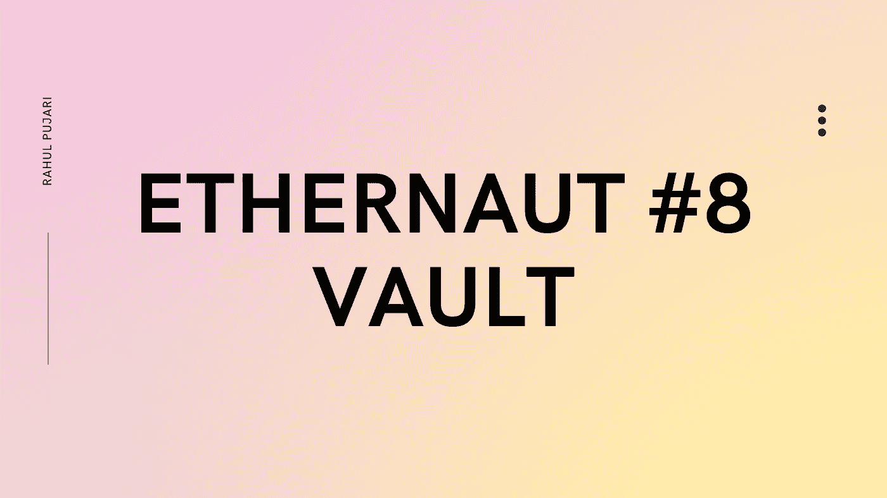

# #8 —以太挑战 8 —跳马

> 原文：<https://medium.com/coinmonks/8-ethernaut-challenge-8-vault-a245a2c5dc62?source=collection_archive---------69----------------------->



# 挑战的目标:

*   解锁金库以通过关卡

# 理解代码:

```
// SPDX-License-Identifier: MIT
pragma solidity ^0.8.0;

contract Vault {
  bool public locked;
  bytes32 private password;

  constructor(bytes32 _password) {
    locked = true;
    password = _password;
  }

  function unlock(bytes32 _password) public {
    if (password == _password) {
      locked = false;
    }
  }
}
```

代码声明了一个公共变量 locked，这是一个布尔类型的变量，它将检查保险库是否被锁定。还有一个名为 password 的 bytes32 类型的私有变量。这个密码可能是私有的，但是我们将会看到，它仍然是可访问的。构造函数将锁定的变量标记为 true，并设置来自部署者的部署附带的密码 a _password。

unlock 函数接受 _password 作为参数，如果密码匹配，则解锁 vault。

> 交易新手？在[最佳密码交易所](/coinmonks/crypto-exchange-dd2f9d6f3769)上尝试[密码交易机器人](/coinmonks/crypto-trading-bot-c2ffce8acb2a)或[复制交易](/coinmonks/top-10-crypto-copy-trading-platforms-for-beginners-d0c37c7d698c)

# 怎么黑这个合同？

1.  在 Ethernaut 页面上启动控制台，并获得一个新实例。
2.  让我们通过检查 **await contract.locked()来检查保险库是否真正锁定。**它应该返回 **true** 表示保险库被锁定。
3.  现在，让我们使用 web3js —继续输入**await web 3 . eth . getstorageat(contract . address，1)。**这个命令只是检查契约的存储，以及在契约的内存槽中有什么可用(嗯，令人震惊:你的私有变量也是可见的)。所以，我们传入 1 的值来获得密码，如果你想获得锁定变量的值，你可以输入 0。这是因为我们按顺序声明了这两个变量。所以在您运行这个命令之后，您会得到密码。
4.  现在你所要做的就是 **contract.unlock("x ")，**其中 x 是你在上一步中得到的密码。
5.  检查 **await contract.locked()** 以确保 **locked** 现在为 false 并提交实例！
6.  恭喜你！你打开了保险库！

如果你觉得这个博客有帮助，请关注并为更多类似的内容鼓掌！

谢谢你读到这里。

> 加入 Coinmonks [电报频道](https://t.me/coincodecap)和 [Youtube 频道](https://www.youtube.com/c/coinmonks/videos)了解加密交易和投资

# 另外，阅读

*   [用于 Huobi 的加密交易信号](https://coincodecap.com/huobi-crypto-trading-signals) | [HitBTC 审查](/coinmonks/hitbtc-review-c5143c5d53c2)
*   [TraderWagon 回顾](https://coincodecap.com/traderwagon-review) | [北海巨妖 vs 双子星 vs BitYard](https://coincodecap.com/kraken-vs-gemini-vs-bityard)
*   [如何在 FTX 交易所交易期货](https://coincodecap.com/ftx-futures-trading)
*   [OKEx vs KuCoin](https://coincodecap.com/okex-kucoin) | [摄氏替代品](https://coincodecap.com/celsius-alternatives) | [如何购买 VeChain](https://coincodecap.com/buy-vechain)
*   [ProfitFarmers 回顾](https://coincodecap.com/profitfarmers-review) | [如何使用 Cornix Trading Bot](https://coincodecap.com/cornix-trading-bot)