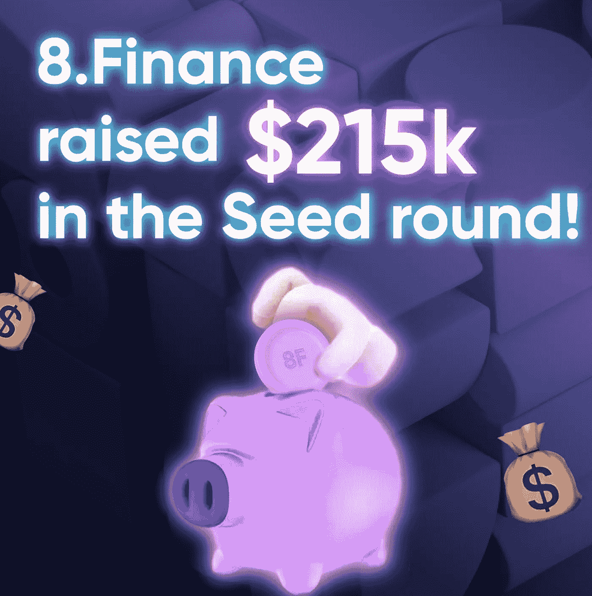

# 8.融资在种子阶段筹集了 21.5 万美元！

> 原文：<https://medium.com/coinmonks/8-finance-raised-215k-in-the-seed-round-1c06351d7bd1?source=collection_archive---------33----------------------->

8.Finance 是一个教育和营销平台，有一个简单的[“Snake for Crypto”](https://snake.8.finance/)游戏，旨在让下一个十亿加密用户参与进来，并教育他们让他们的道路变得平坦和安全。

它是该项目的第二个投资者。前一个投资者在种子期前以 30 万美元购买了我们的代币。因此，到目前为止，我们已经筹集了 515，000 美元，并继续筹款。

8 的网站。金融获得了 3 个国际设计奖的提名( [FWA](https://thefwa.com/cases/8finance) 、 [AWWWARDS](https://www.awwwards.com/sites/8finance) 和 [CSS 设计奖](http://cssdesignawards.com/sites/8finance/41567/))，它们有着精致的象征经济学，带有通货紧缩和超效用的象征，以及免费玩的蛇形游戏的 MVP，由于其简单性，有助于吸引用户。

Tokenomics 是与 Garuda.ai 团队共同开发的。

token 的智能合同由市场上最知名的智能合同审计师之一 [Paladin](https://paladinsec.co/projects/8-finance/) 进行审计。

8.财务团队非常担心安全问题，将要求魔帝安全公司进行另一次审计，这是一家可靠的网络安全公司，有 2 亿美元的 TVL 担保。

8.Finance 受邀参加了 BNB 连锁店(即币安连锁店)的天然气激励计划，并从 Polygon DAO 获得了 5 万美元的资助，用于扩大 Polygon 连锁店的规模。我们已经为我们的合作伙伴举行了几次游戏内空投和比赛。

现在是 8。融资正在由一家做市商和孵化器 [Gotbit.io](https://gotbit.io/) 孵化，指导项目从最早期阶段到与风投达成交易、在顶级交易所上市并获得大规模采用。

在他们的[网站](http://8.finance/)和 [linktree](https://linktr.ee/8.finance) 上找到更多关于该项目的信息。

> 交易新手？试试[加密交易机器人](/coinmonks/crypto-trading-bot-c2ffce8acb2a)或者[复制交易](/coinmonks/top-10-crypto-copy-trading-platforms-for-beginners-d0c37c7d698c)