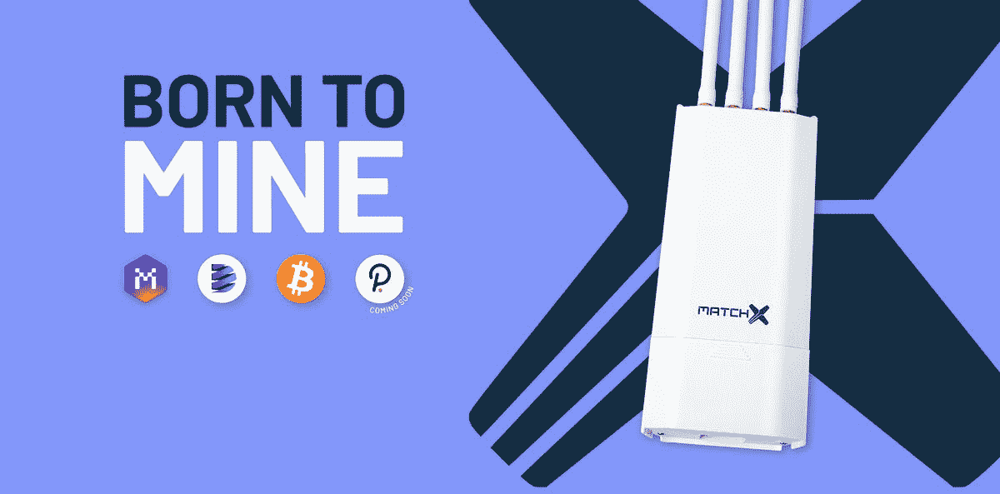

# 8 个月更新我的最高收入，每月 2 美元的电费，即插即用加密矿工使我每天每台设备大约 12 美元，8 个月的投资回报率…

> 原文：<https://medium.com/coinmonks/8-month-update-my-highest-paying-2-electric-per-month-plug-play-crypto-miner-makes-me-222b6e43773c?source=collection_archive---------1----------------------->

早在 2022 年 4 月，我发表了一篇关于一名矿工的文章，这让我每天赚 10-15 美元，这实际上不需要任何电力成本，预计投资回报率约为 8 个月。8 个月过去了，这个设备收回了我投资的钱吗？嗯，我将在本文中介绍这一点以及一些项目更新。

[你可以在这里找到我以前的文章](https://realisticcrypto.medium.com/my-highest-paying-2-electric-per-month-plug-play-crypto-miner-makes-me-around-12-per-day-per-375ccc604988)，如果你决定买一个，你可以使用[这个推荐代码来获得€100 的折扣](https://bit.ly/3zD86qK)，另外他们目前正在进行一个额外的€200 的促销活动。

**最大的问题是，在我投资给两个矿工的 6000 美元中，这些设备在过去的 8 个月里赚了多少？**

嗯，我已经赚了 80，500 MXC，大约是 3，500 美元，这意味着我已经成功了一半，但为什么只有一半呢？

首先，在过去的 12-18 个月里，加密市场一直充满挑战。加密领域的一切都遭受了巨大的打击，这种情况持续了一年。当我写第一篇文章时，MXC 的价值大约是每个 0.10 美元，而今天，每个 MXC 的价格是每个 MXC 0.04 美元。这并不是我要解释的一件坏事。

当 MXC 的价格下降时，你每天仍将获得 10-15 美元的 MXC。这意味着当价格下降时，你将获得更多的 MXC。现在，当我们回到牛市时，如果价格达到前所未有的高点，那么你每天的收入将大大超过 10-15 美元。这当然也值得另想办法！

从这个角度来看，我赚了 80，500 MXC，现在的价格是 0.043 美元，总共是 3，461 美元，但要等到创下历史新高，大幅增加到 10，749 美元。那是我投资的 300%以上的回报。

那么，为什么我仍然认为这个项目会做得很好呢？

自从上次更新以来，已经有了许多项目更新。最近，他们让 MXC 在美国币安上市，增加了这个项目的曝光度。它们已经在 Crypto.com 比特币基地、北海巨妖和东京证交所等大型交易所上市。在撰写本文时，它们排在 250 强加密项目的第 220 位。

他们也开始将企业纳入 M2 专业网络——这是所有这些矿工在全球组成的网络——昨天确认了 7 家企业——2022 年 12 月 13 日。

总之，在整个熊市中，该项目仍在建设和发展。我相当确信，这将为下一轮牛市的到来提供一个坚实的跳板。就目前而言，我很乐意坐享其成，为下一轮牛市做准备。

这就是本文的全部内容，但如果你对加密挖掘、DCA 交易机器人的被动收入或普通加密感兴趣，我们有一个免费的 Discord 组，你可以在这里加入。

**附属链接**

更多优惠还可以在这里找到:【https://linktr.ee/RealisticCrypto】T4

还有，如果你想请我喝杯咖啡或者啤酒:) :

BTC—BC 1 qaxaq 2 q 9 js 89 gyzhr 0202 sxt 6 hgchprqjga 5 px

基于 ETH、BNB、AVAX、SOL 和 FTM 的令牌—0 x3b 7b 843d 8125 Fe 7 EBA 541 e 1d 751 a4 a 73 f 0 cfad 4c

**免责声明**

这不是财务建议，我不是财务顾问或会计或税务专家。这是我对帮助过我的软件工具的体验，以及我使用它们的经历。

我在本指南中使用了推荐链接。使用这些工具有助于以后的文章，所以如果你觉得这篇文章有用，并且想看看我提到的工具，请使用它们。我还会叫出你在哪里打折——双赢对吧？

> *交易新手？试试* [*密码交易机器人*](/coinmonks/crypto-trading-bot-c2ffce8acb2a) *或* [*复制交易*](/coinmonks/top-10-crypto-copy-trading-platforms-for-beginners-d0c37c7d698c)
> 
> *分散加密持股，了解* [*币安的替代方案*](https://coincodecap.com/binance-alternatives)
> 
> *加入 Coinmonks* [*电报频道*](https://t.me/coincodecap) *和* [*Youtube 频道*](https://www.youtube.com/c/coinmonks/videos) *获取每日* [*加密新闻*](http://coincodecap.com/)

# 另外，阅读

*   [复制交易](/coinmonks/top-10-crypto-copy-trading-platforms-for-beginners-d0c37c7d698c) | [加密税务软件](/coinmonks/crypto-tax-software-ed4b4810e338)
*   [电网交易](https://coincodecap.com/grid-trading) | [加密硬件钱包](/coinmonks/the-best-cryptocurrency-hardware-wallets-of-2020-e28b1c124069)
*   [密码电报信号](/coinmonks/top-3-telegram-channels-for-crypto-traders-in-2021-8385f4411ff4) | [密码交易机器人](/coinmonks/crypto-trading-bot-c2ffce8acb2a)
*   [最佳加密交易所](/coinmonks/crypto-exchange-dd2f9d6f3769) | [印度最佳加密交易所](/coinmonks/bitcoin-exchange-in-india-7f1fe79715c9)
*   [面向开发人员的最佳加密 API](/coinmonks/best-crypto-apis-for-developers-5efe3a597a9f)
*   最佳[密码借贷平台](/coinmonks/top-5-crypto-lending-platforms-in-2020-that-you-need-to-know-a1b675cec3fa)
*   [免费加密信号](/coinmonks/free-crypto-signals-48b25e61a8da) | [加密交易机器人](/coinmonks/crypto-trading-bot-c2ffce8acb2a)
*   杠杆代币的终极指南