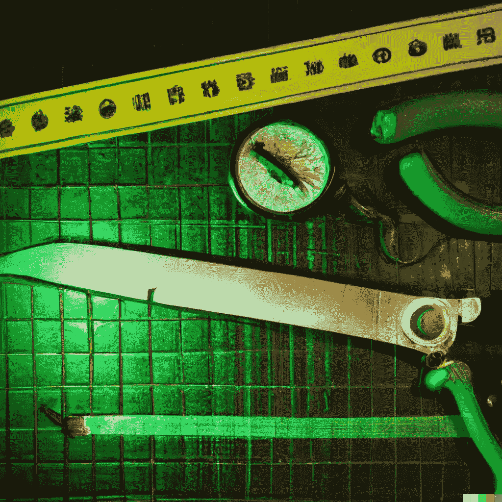

# 8 个必备的加密和 NFT 市场工具

> 原文：<https://medium.com/coinmonks/8-must-have-crypto-and-nft-market-tools-e99767b9013c?source=collection_archive---------34----------------------->

你最喜欢的加密市场工具是什么？

这是我的一些。你都用完了吗？

让我们来看看。

# **1)密码手表—**

**图表、单个加密资产的数据以及综合市场指标。**

**易于使用的图表布局创建。**

**通过它的用户界面在不同的交易所进行交易。**

****用于:**创建图表布局、投资组合跟踪和期货数据。**

# **2)南森—[https://www.nansen.ai/](https://www.nansen.ai/)**

**具有独立 EOA 粒度的链上分析和聚合器。**

**通过行为模式组织数据的本地和自定义分组。**

****用于:**跟踪鲸鱼活动。**

# ****3)coin gecko—**[**https://www.coingecko.com/**](https://www.coingecko.com/)**

**几乎每个加密项目的价格行为数据和细节。**

**最容易识别的基本数据集合的图表和表格，如项目类型、协议和交换。**

****用于:**跟踪价格数据、聚合、观察列表和投资组合。**

# ****4)宝石—【https://www.gem.xyz/】****

****NFT 贸易指标和聚合器。****

****跨交易所发布 NFT 上市以及执行转让的用户界面。****

******用途:**跟随 NFT 系列定价，扫地。****

# ******5)dex tools—**[**https://www.dextools.io/**](https://www.dextools.io/)****

****以 DEX 为中心的资产表和图表指标。****

****聚合和工具，包括多图表、交换、统计和机器人。****

****用于:跟踪 DEX 定价并探索新的鞋对。****

# ******6。dex screener—**[**https://dexscreener.com/**](https://dexscreener.com/)****

****业界领先的新硬币列表、列表信息以及跨协议和 DEX 交换数据的仪表板****

******用于:**跟踪任何协议上几乎任何 DEX 的实时交换数据。****

# ****7)金樱子——[**https://app.laevitas.ch/**](https://app.laevitas.ch/)****

****复杂的仪表板和加密衍生品数据指标，包括选项。****

****来自 CEX 和 DeFi 的数据，包括波动性指标。****

******用于:**跟踪深入的期货指标和期权数据跟踪。****

# ******8)造币玻璃—******

******各种期货指标，包括融资利率、清算和订单数据。******

******用于:了解总体市场期货行为和单个资产的交叉指标关系。******

******我错过了什么重要的吗？******

******请在评论中告诉我！******

******如果你觉得这很有帮助，你可以通过在 Twitter 上关注我 [The Crypto Climax](https://medium.com/u/ac6a6e914928?source=post_page-----e99767b9013c--------------------------------) 来获得所有经验水平的见解和内容。******

******我将开始一个免费的每周时事通讯，内容是你在其他地方找不到的。******

******针对整个加密领域所有经验水平的切实可行的见解、研究和技巧。******

******一定要在下面订阅。******

****** [## 每周简讯的加密高潮- Revue

### 通过 Crypto Climax 在 Crypto、Web3、NFT 和元宇宙市场尖端的可行见解和策展，帮助…

www.getrevue.co](https://www.getrevue.co/profile/thecryptoclimax) 

> 交易新手？尝试[加密交易机器人](/coinmonks/crypto-trading-bot-c2ffce8acb2a)或[复制交易](/coinmonks/top-10-crypto-copy-trading-platforms-for-beginners-d0c37c7d698c)******