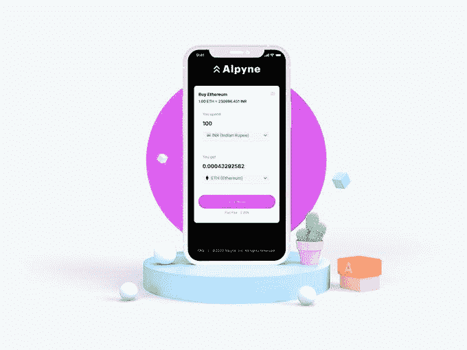
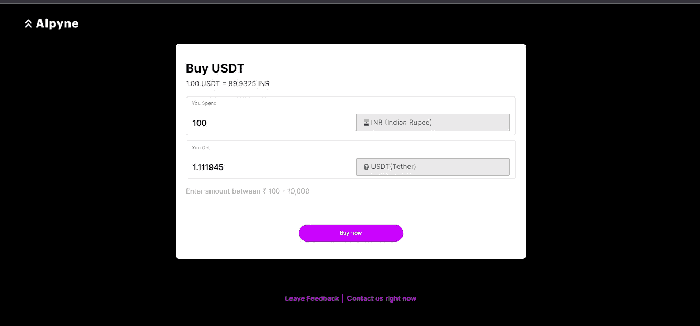

# 选择一个好的菲亚特入口支付提供商的 8 步清单

> 原文：<https://medium.com/coinmonks/8-step-checklist-in-choosing-a-good-fiat-on-ramp-payments-provider-889f83058f53?source=collection_archive---------40----------------------->

# 关键要点

*   随着加密货币采用率的提高，简单高效的法定支付网关变得越来越重要
*   加密交易所和钱包等加密业务使用平面坡道来更快地扩展业务范围
*   在亚洲，本地支付方式的普及率是信用卡的 3 倍

# 全球加密采用趋势

随着加密货币在现代世界越来越受欢迎，以及像萨尔瓦多接受 BTC 为法定货币这样的重大事件，大规模的机构投资，NFT 的巨大销量，元宇宙在社区的炒作；2021 年被称为“加密货币年”。

根据一份全球加密采用报告，2021 年全球加密采用比 2020 年大幅增加了 880%。在排名前 20 的国家中，30%位于亚洲。越南、印度和巴基斯坦占据了前三名的位置。

# 亚洲的本地支付方式

2020 年，在亚太地区，本地支付方式(又名替代支付方式)的渗透率是信用卡的三倍多(T3)。调查显示，相比其他支付方式，亚太地区的用户更倾向于使用替代支付方式。然而，该地区的市场相当分散。缺少一个集中的、一致的、可靠的 APM 服务提供商来满足这些特定的需求。

# 在亚洲选择一个好的菲亚特入口支付网关的 8 步清单

确保他们勾选所有这些框:

*   **1。轻松入职** —快速注册流程，直观地一步一步引导用户。
*   **2。自动化 KYC —** 用户可以在几分钟内完成他们的 KYC，对审批更新有明确的说明和期望。
*   **3。访问加密货币—** 允许用户访问多种加密货币，包括领先的数字资产。
*   **4。直接访问替代币** —允许用户直接访问替代币，而无需将其转换为中间加密货币，降低中间成本。
*   **5。支持** —在全球多个国家提供支持。
*   **6。本地支付方式—** 支付方式在不同地区广泛流行，尤其是因为亚洲市场没有中央支付系统，这与欧洲或美国地区不同。
*   **7。即时订单—** 便于在几分钟内近乎即时地将 crypto 转换为 fiat，反之亦然
*   **8。非托管** —在进行从法定到加密交换的整个过程中，不托管用户的资金，没有信用卡欺诈

# 阿尔平是做什么的？

越来越多的金融科技公司正在进入加密市场，试图吸引这个庞大的加密用户群。由于规则、资源要求、时间承诺和安全问题，将 web3 集成到您自己的产品中就像为初创公司或金融科技公司躲避子弹一样。在 [**Alpyne Labs**](https://alpyne.tech/) **，**我们通过我们的用户友好和安全的 API 以及我们的 on/off ramp 解决方案让您进入 web 3 世界，从而帮助您避开这颗子弹。这使得用户登录变得简单，也为您的企业节省了密码转换的时间。密码奖励、高收益、NFTs 和游戏是我们帮助你成为 web 3 中的大鱼的几个其他产品。要得到我们的回电， [**点击这里**](https://tally.so/r/mBvx1m)

# 提升全球数字货币体验

随着几家企业以创新的功能加入该行业，加密货币正在获得主流采用。对简单、高效且经济的方法将 fiat 转换为 crypto 以及将 crypto 转换为 fiat 的需求比以往任何时候都要多。

[**Alpyne**](https://alpyne.tech/) 不仅帮助其用户以当地货币进行加密支付，还帮助加密交易所和钱包开发自己的界面，为其客户提供加密支付解决方案。这一创新平台支持本地货币和本地支付方式，并在将数字货币带给全球客户方面发挥着重要作用。

Alpyne’s on ramp interface

# **探索其他文章**

[为什么需要加密 API？](/coinmonks/why-you-need-a-crypto-api-fd04ddab3c5b)

[2022 年面向开发者的顶级支付 APIs 印度数字支付趋势](/coinmonks/top-payment-apis-for-developers-in-2022-digital-payment-trends-in-india-4e20deaf339c)

[顶级加密交易所在印度与菲亚特进行加密货币的买卖](/coinmonks/top-payment-apis-for-developers-in-2022-digital-payment-trends-in-india-4e20deaf339c)

> 交易新手？尝试[加密交易机器人](/coinmonks/crypto-trading-bot-c2ffce8acb2a)或[复制交易](/coinmonks/top-10-crypto-copy-trading-platforms-for-beginners-d0c37c7d698c)