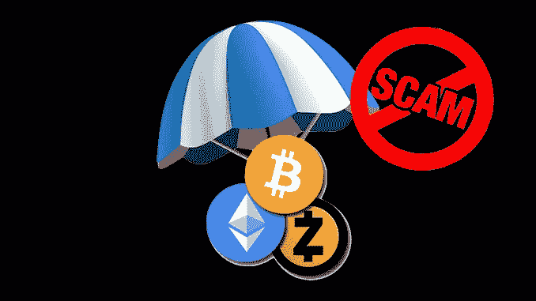
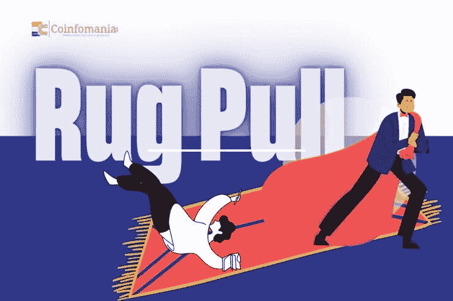

# 9 个致命的网络 3 骗局和如何保护自己

> 原文：<https://medium.com/coinmonks/9-deadly-web3-scams-and-how-to-protect-yourself-d605a4dfd4d?source=collection_archive---------33----------------------->

让我花几秒钟来谈谈网络 3——各种各样的障碍和不利因素，尤其是那些与人们成为骗局和欺诈项目的受害者有关的障碍和不利因素。新技术带来了新的挑战。web3 的世界仍然是一个新兴的蓬勃发展的世界，这使得它成为各种黑客和欺诈项目的诱饵。

如果你熟悉 web3 领域，你应该听说过关于 web3、区块链的各种攻击的报道——例如，nomad cross-chain bridge 上的漏洞，以及其他直接淹没人们资产的攻击。

关于这一点，我提供了一篇有用的文章，介绍了你在 web3 中可能遇到的 9 种致命的骗局和陷阱，以及你可以做些什么来保护自己。

# 1.通过空投进行诈骗

在这里，骗子通过发送到钱包的恶意空投(通常是数百万免费代币)来引诱钱包持有者。钱包持有者访问代币交换网站并尝试代币交换-可能是为了一些 ETH。注意到没有变化，他然后检查了块浏览器和一条消息，指引他到第三方网站要求他们的免费令牌。

一旦钱包持有者访问第三方网站并输入网站上要求的重要细节，骗局就完成了。

# 如何保护自己:

如果你的钱包很容易被拿到，那么它就更容易被恶意空投，实际上，任何人都可以给你发送代币或 NFT。这不是问题，因为您可以决定忽略传输；这个骗局只有在你允许的情况下才会成功，也许是因为你的粗心。

从诈骗令牌或诈骗 NFT 接收交易可能没有特别的补救措施。到目前为止，你的帐户仍然是安全的，你不直接与他们互动，也不分享你的私人资料。

source: [block-builder](https://block-builders.net/attention-scam-new-scam-at-airdrops-what-you-need-to-know/)

# 2.抛硬币骗局

抛硬币是一种从早期的“抛钱”诈骗演变而来的骗局在抛硬币骗局中，易受骗的交易者发送一定数量的硬币，同时指示他们等待硬币翻倍。受害者等待取回双倍硬币，却发现他们刚刚输掉了所有的钱。

# 如何保护自己:

*   避免贪婪
*   在进行任何加密货币交易之前进行适当的研究，记住交易是最终的，不可退款。

# 3.网络钓鱼诈骗

骗子使用网络钓鱼，并通过假冒，他们窃取私人信息，如登录凭证和加密钱包的种子短语。他们通过社交媒体平台和电子邮件联系交易者，伪装成支持人员、代币推销商或慈善捐助者。当骗子进入你的账户时，他们会将你的所有资产转移到他们自己的账户中，让你的账户被清空。

# 如何保护自己

*   在没有进行好的研究之前，不要把你的钱包链接到第三方。
*   不要和任何人分享你的私人钥匙，因为这样做会让他们得到你的钱。
*   任何知道您的恢复密码的人都可以很容易地访问您的帐户，所以请保守密码。

# 4.地毯拉骗局

“拉地毯”这个短语就像“把地毯从某人的脚下拉出来”你知道那是多么的灾难性。在密码世界里，这是同样的灾难，但却是不同的概念。

Rug pull 用于描述骗子在提防买家和卖家的同时，发行与流动性池相关的新货币的行为。一旦资金池里有了足够的钱，他们就会迅速撤出，带着所有投资者的钱潜逃。

source: [coinfomania](https://www.google.com/url?q=https://www.google.com/amp/s/coinfomania.com/what-is-crypto-rug-pull-how-to-avoid-it/amp/&sa=D&source=docs&ust=1662632617764996&usg=AOvVaw1dQ6Ev1_nXg_LqQbl0FZ0f)

# 5.极有吸引力的事物

蜜罐指的是资金陷入困境，你无法移动或使用它们的情况。在蜜罐中，骗子在智能合同中添加一些代码片段，将硬币的销售限制在他们的钱包中。他们是唯一可以出售的人，然而其他人都可以购买。

与此同时，图表一直呈现出陡峭的购买曲线，鼓励投资者购买，硬币的价值是有希望的。可悲的是，当你购买后试图转售时，你意识到你被骗了。骗子输入的代码不允许转售，资金将永远被套牢。

# 如何保护自己免受地毯拉和蜜罐

*   千万不要用不确定的硬币交易或从事活动。
*   总是检查你的首选硬币是否在 CoinMarketCap 和其他可信平台上的最佳列表中。

# 6.抽水和倾倒骗局

一个常见的加密货币骗局是“泵和转储”受欢迎的影响者和令牌创造者(有问题的人物)注意到区块链中的新加密货币，并以低成本购买它们。他们通过各种社交媒体促销来炒作人民币，以增加其需求。

当不知情的公众开始购买新硬币时，代币创造者开始以高价抛售，然后导致价格飙升，硬币贬值。通过这种方式，代币的创造者获得了巨大的利润，而不知情的购买者在价格暴跌时损失了大量资金。

# 如何保护自己

*   对你计划投资的任何平台、公司或货币进行研究。
*   购买前阅读文档并了解更多关于硬币的信息。
*   当一些有影响力的人不断推动和炒作某个特定的硬币时，要小心，因为他们可能有计划，一旦价格足够高，就会卖出。

# 7.PancakeSwap 骗局

PancakeSwap 是一家总部位于区块链的加密交易所，在币安智能链上交易 BEP-20 令牌。PancakeSwap 骗局的受害者大多是社交媒体用户。不知情的用户通常会通过 YouTube 或其他社交媒体得到通知，他们可以在 PancakeSwap 上购买和交易流动性缺口。

骗子向用户发送一个链接，告诉他不需要成为专家或对合同部署的智能合同有太多的了解，但当代码块得到检查时，很明显路由器合同链接与合同相矛盾。

# 如何保护自己:

通过对你在各种社交媒体网站上找到的链接保持警惕和小心，避免成为受害者。

# 8.冒充电报管理员的模仿者

骗子伪装成有影响力的名人、商业巨头或电信集团的管理人员，让自己看起来值得信任。要求提供个人详细信息的直接消息、陌生电话或随机将人添加到群中，都是用户必须警惕的诈骗预警指标。

# 如何保护自己

避免公开您的电话号码等详细信息，并更改您的电报隐私设置。此外，您可以通过电报通道成员列表了解实际的通道管理员。因此，您可以确认任何自称是管理员的人。

# 9.新项目

许多初学者投资新项目，认为它仍然“早期”，因此是一个潜在的大热门。对一个有前途的想法进行早期投资可以产生巨大的回报，但要知道一个项目是真的还是只是一个骗局可能是一个挑战。有时，投资者会失去投入新项目的全部资金。

# 如何保护自己

*   最好等到项目有了坚实的基础再投资。做出明智的决定，因为今天的大多数项目将在未来几个月或几年内由于巨大的损失而被放弃。
*   此外，要警惕像 OpenSea 这样的各种市场平台上带有虚假网站和收藏的虚假项目。

# 关键要点

“web3 去中心化对我们不利”。因此，我并不是反对分散化网络；相反，我试图让你明白，在 web3 的世界里，你的安全掌握在你的手中。

根据研究，web3 网络诈骗最常见的原因是用户的贪婪、FOMO 和无知，都以用户为中心，而不是系统的技术故障。

*   你决定参与的项目，可能是欺诈性的，也可能是合法的。
*   私钥/钱包地址只是给你的，除非你把它公开，否则骗子无法攻击。

我已经列出了你应该保护你的资产的可能方法，我希望这能有所帮助。也请阅读我写的关于[简化的 web3 术语的文章，作为初学者，你必须知道这些术语](/coinmonks/simplified-web3-terminologies-you-must-know-as-a-beginner-50c90d5db6bb?source=user_profile---------0----------------------------)

*原发布于*[*https://gloriaokeke . hashnode . dev*](https://gloriaokeke.hashnode.dev/9-deadly-web3-scams-and-how-to-protect-yourself)*。*

> 交易新手？尝试[加密交易机器人](/coinmonks/crypto-trading-bot-c2ffce8acb2a)或[复制交易](/coinmonks/top-10-crypto-copy-trading-platforms-for-beginners-d0c37c7d698c)