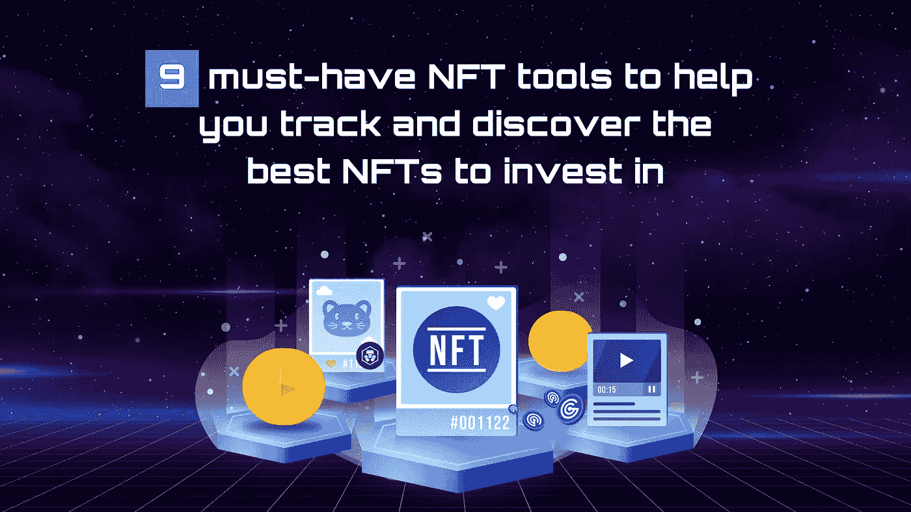
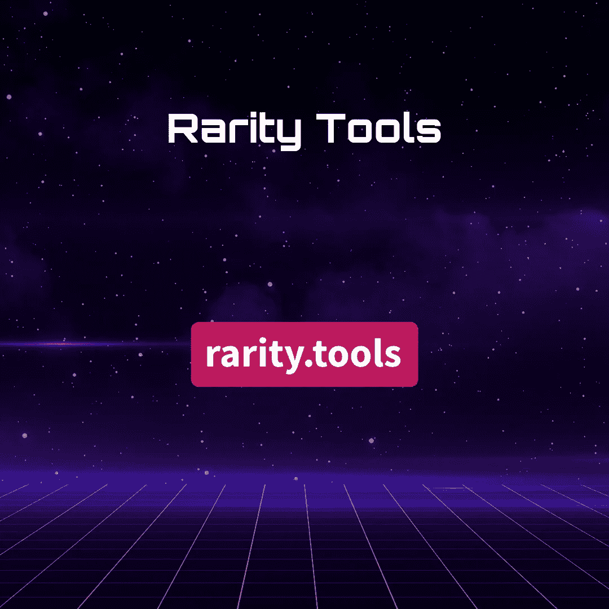
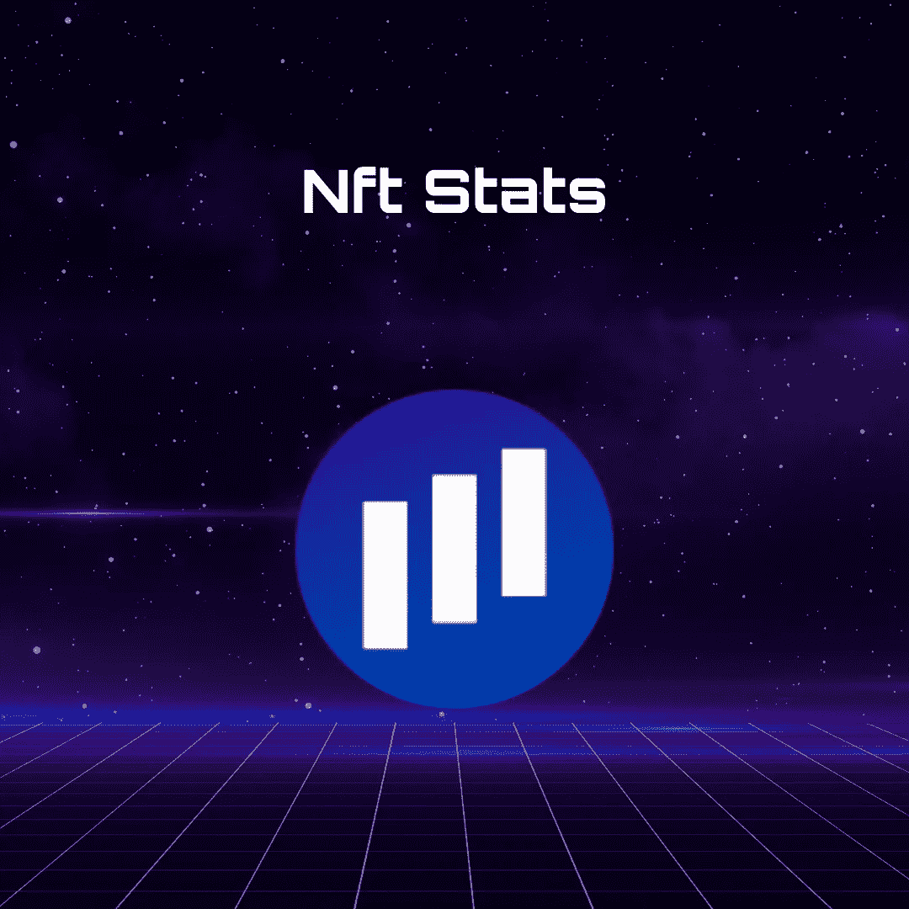
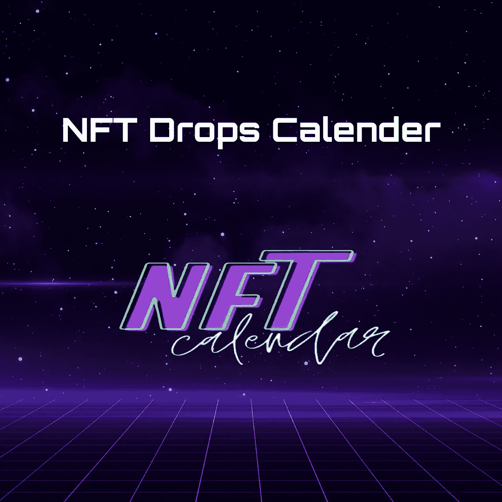

# 9 个必备的 NFT 工具，帮助你追踪和发现投资的最佳非金融资产

> 原文：<https://medium.com/coinmonks/9-must-have-nft-tools-to-help-you-track-and-discover-the-best-nfts-to-invest-in-e49c8b2d6f69?source=collection_archive---------14----------------------->

随着 NFT 产业的飞速发展，每天都有数不清的 NFT 交易发生，包括最近和过去的收藏。但是，如果你是 NFT 投资的新手，决定哪些非金融资产值得购买可能是一个挑战。虽然同一批藏品中的某些 NFT 可以卖到数百万美元，但也可能包括其他只值几分钱的。通过考虑它们的稀缺程度，你可以确定哪些非森林植被是最有价值的。如果 NFT 被认为极其罕见，那么它很有可能会非常昂贵。NFT 的稀缺性经常会推高它的价格。

因此，为了让您的 NFT 投资之旅更加轻松，我们为您带来了 9 个追踪 NFT 稀有度的最佳工具，以及它们的功能和成本信息。

# **1。DappRadar**

DappRadar 旨在帮助用户追踪不同 NFT 系列的销售信息。几年前还发布了一个投资组合跟踪器，允许用户实时跟踪他们的以太坊钱包。您只需提供 ENS 名称或钱包地址，即可获得钱包的 NFT 余额和总净值。通过销售、交易量或交易商过滤 NFT 收藏增强了 DappRadar 强大的投资组合跟踪和实时监控能力。这使您能够监控发生的任何销售以及 NFT 趋势。此外，DappRadar 完全免费使用。

# **2。Crypto.com**

[Crypto.com](https://crypto.com/nft/)提供了一系列有用的追踪工具和 NFT 珍贵资产的关键细节。您可以通过跟踪来访问特定 NFT 的交易量和价格数据。每个 NFT 收集还包括即将下跌的信息，资产的价值和铸造价格。除了让你在一个平台上管理你的加密货币和你的 NFT，Crypto.com 还提供了许多免费的跟踪工具。你可以通过销售额、底价、交易量、总资产和收藏价值来筛选网站，以确定最好的 NFT 收藏品来投资。该网站界面友好，易于掌握。Crypto.com，也显示即将举行的 NFT 收集，使您能够组织您的投资组合的潜在投资。

# **3。稀有工具**

以其 NFT 追踪功能而闻名的[稀有工具](https://rarity.tools/)程序允许对 NFT 数量、收藏和平均价格进行排序。该网站为每一个 NFT 收藏都有一个单独的页面，在另一个页面上有进一步的细节。每个 NFT 也有稀有等级。稀有工具的功能都可以免费使用，这是它最大的特点。该计划提供了一个直观的用户界面，显示每个 NFT 的稀有分数。用户可以通过网站直接使用该工具，其唯一可能的缺点可能是其有限的分析能力。

# **4。南森**

[南森](https://www.nansen.ai/)于 2013 年开发，目标是将其用作 [NFT 钱包](/@orbis86/hardware-wallets-explained-why-they-are-the-safest-ways-to-store-crypto-643352e6ebc?source=user_profile---------9----------------------------)分析工具。用户可以查看最受欢迎和最赚钱的 NFT 钱包的记分牌，结果将基于钱包在一段时间内积累的资金量。投资跟踪也可以和南森一起做。跟踪工具提供了关于 ERC-20 代币的详细信息，如铸造成本和 NFT 商店费用。南森也是最早创建的 NFT 跟踪系统之一。除了对具体的非功能性交易进行详细检查的可能性之外，该应用程序还提供了对项目所有者的实时分析。

# **5。Icy.tools**

一个非常强调趋势收集的有效跟踪工具是 icy.tools 。将您的钱包与它关联后，您可以检查过去 15 到 30 分钟的趋势 NFTs。在跟踪 NFT 的同时，还提供了关于销售额、底价、平均价格和交易量的数据。该应用程序是相当用户友好的，它包括钱包监测，以及基于特征和稀有性的 NFT 项目分类。通过它可以访问许多跟踪和分析工具，所有这些工具都在不断改进和扩展。该软件的高级版售价仅为 75 美元，用户可以查看每一件 NFT 藏品的详细信息，比如历史数据和价格图表。

# **6。稀有嗅探器**

当今最好的 NFT 追踪工具之一是稀有度嗅探器。免费版本只监测最新的收藏，你必须支付 1.5 ETH 才能加入该工具的 Discord 频道，以便获得对正在进行的 NFT 项目的分析，并了解它们的稀有程度。稀有嗅探器具有非常用户友好的设计，并能够跟踪所有当前收藏的能力。

# **7。密码猛击**

一个 NFT 监测工具，提供详细的市场研究和 NFT 分析， [CryptoSlam](https://cryptoslam.io/) 在每个 NFT 收藏的个人页面上提供关于最近[铸造](/@orbis86/the-complete-step-by-step-guide-on-how-to-mint-nfts-8af3e691cdcb)或出售的 NFT 的信息。通过 CryptoSlam，人们可以访问一系列 NFT 统计数据，包括销售额、底价、业主总数和交易量。

# **8。NFT 统计数据**

[NFT 统计](https://www.nft-stats.com/)是一个易于使用的 NFT 追踪器，提供了广泛的 NFT 统计设置。关于个人收藏的信息有限，你可以仔细阅读。通过销量或稀有度排名过滤可以帮助你特别关注由 NFT 统计排名的某些趋势收藏。可以通过过滤过去 30 天、前一周或前 24 小时来查看销售排名靠前的收藏，以获得所提到的每个 NFT 的详细统计信息。此外，NFT 统计也完全免费使用。

# **9。NFT 滴日历**

[NFT 掉落日历](https://www.nftdropscalendar.com/)旨在帮助用户在 NFT 掉落并进入 NFT 市场后立即找到它们。使用这个工具将确保您可以在价格上涨太多之前购买 NFT。您还可以使用各种搜索参数和过滤器来搜索某些集合。有搜索选项，包括价格，铸造日期和数量。该工具有一个强大的排序机制，具有广泛的功能，以及对即将到来的 NFT 销售，活动和赠品的提醒。您可以在 NFT 滴日历上宣传您自己的 NFT 出售，并跟踪即将到来的滴和赠品。

# **结论**

这些工具应该帮助你精通 NFT 稀有性，它的价值，以及如何量化它，这样你就可以利用你的优势知识。虽然也有很多其他方法来估计非功能性交易的价值，但在许多情况下，这也归结为个人偏好。因此，最好的做法，一如既往，是彻底进行你自己的研究，使用不同的工具和分析解决方案来确定你的投资组合的最佳新成员！

> 交易新手？试试[加密交易机器人](/coinmonks/crypto-trading-bot-c2ffce8acb2a)或者[复制交易](/coinmonks/top-10-crypto-copy-trading-platforms-for-beginners-d0c37c7d698c)