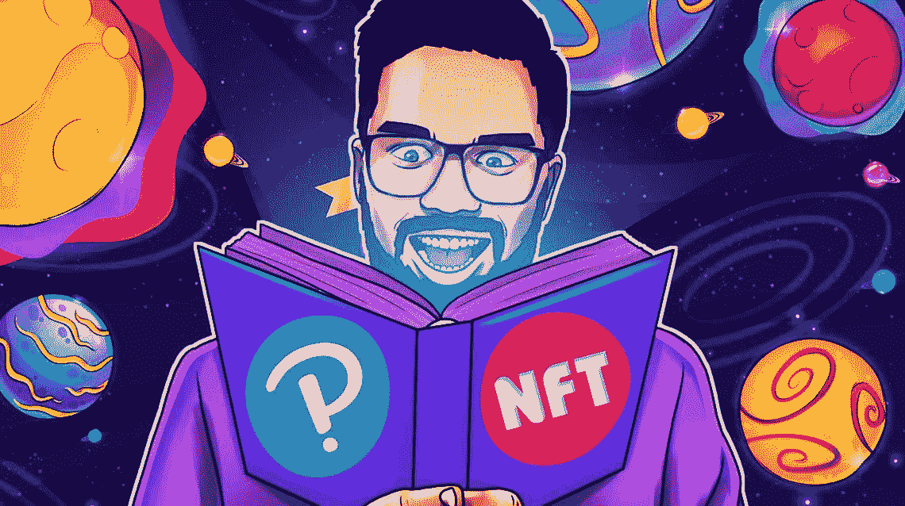
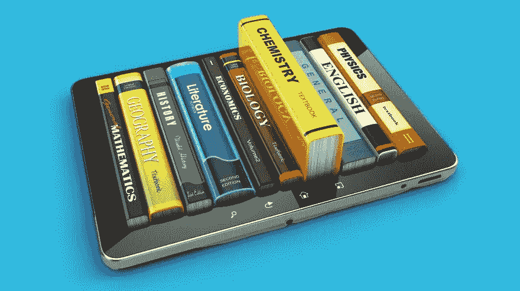

# 一家有着 178 年历史的公司正在拥抱 NFTs 来卖书。

> 原文：<https://medium.com/coinmonks/a-178-year-old-company-is-embracing-nfts-to-sell-books-5e9ad61bb399?source=collection_archive---------31----------------------->

Pearson is trying to sell eBooks as NFTs but will it work?

你没看错。

我今天学到了一些东西，我想你也会的。

你知道，在你所有的书中不断出现的皮尔逊这个名字，是来自英国的出版商。

它们自 1844 年以来一直存在。

那是 178 年前的事了！

在某种背景下，西班牙最古老、最著名的教堂之一的圣家堂建于 1882 年，距今已有近 40 年。

皮尔逊过去只是为全世界的读者印刷和出版教科书。

现在，他们将近一半的收入来自数字销售。

他们在 2021 年赚了 47.1 亿美元，拥有 3.2 万名员工。

不完全是一个小球员。

留在游戏中，保持相关性并在几个世纪后仍能获利绝非易事。

猜猜这位老政治家决定为他们的下一个魔术表演做什么？

把它的教科书作为非功能性教材出售。

Selling digital books as NFTs might be a really viable use case for the industry.

在培生集团发布中期业绩后，首席执行官安迪·伯德解释了他出售数字教科书的计划，这使得出版商即使在书籍易手时也能追踪其所有权，[彭博报道](https://www.bloomberg.com/news/articles/2022-08-01/pearson-hopes-blockchain-will-make-it-money-every-time-its-e-books-change-hands)

“在模拟世界中，一本皮尔逊教科书最多可以转售 7 次，我们只会参与第一次销售，”他说，并解释说，“像区块链和 NFTs 这样的技术使我们能够参与该特定商品在其生命周期中的每一次销售”。

这听起来是个简单的想法。

大多数影响世界的想法乍看起来都很简单。

皮尔逊是世界上最大的图书出版商。

它“每年有 1000 万的数字注册，来自该公司目前提供的约 1500 本书，涵盖了学院和大学的所有主要课程。”

区块链和 smart 合同将允许它利用否则“损失的收入”。

如果你还没有意识到，转售书籍是一个庞大的行业，只会随着时间的推移而增长。

更好的是，有了电子书，交易和跟踪区块链上的每一笔销售将变得轻而易举。

考虑到一本大学教科书的生命周期，想想每一次后续销售的潜在收入。

The worldwide revenue of the eBook market increased significantly in 2021 by around 1.3 billion dollar to over 16.1 billion U.S. dollars.

更多的转售和交易也意味着更多的知识被需要的人所掌握。

这对所有人都是双赢的。

培生必须非常战略性地设计智能合同和非功能性交易。

甚至可能在第一次购买时定价较低，但永远从版税中收回。

对于这家老牌图书出版商来说，这将是一个大胆而有趣的举措。

-

把教育类书籍当 NFT 卖是好事吗？

-

# startups # business # startupx # growth # success # social media # culture # web 3 # strategy # hacks # Pearson # books # publisher # revenue # nfts # eth # BTC # crypto #黑客#evil

> *交易新手？试试* [*密码交易机器人*](/coinmonks/crypto-trading-bot-c2ffce8acb2a) *或* [*复制交易*](/coinmonks/top-10-crypto-copy-trading-platforms-for-beginners-d0c37c7d698c)
> 
> *分散密码持有量，了解* [*币安替代品*](https://coincodecap.com/binance-alternatives)
> 
> *加入 Coinmonks* [*电报频道*](https://t.me/coincodecap) *和* [*Youtube 频道*](https://www.youtube.com/c/coinmonks/videos) *获取每日* [*加密新闻*](http://coincodecap.com/)

# 另外，阅读

*   [复制交易](/coinmonks/top-10-crypto-copy-trading-platforms-for-beginners-d0c37c7d698c) | [加密税务软件](/coinmonks/crypto-tax-software-ed4b4810e338)
*   [网格交易](https://coincodecap.com/grid-trading) | [加密硬件钱包](/coinmonks/the-best-cryptocurrency-hardware-wallets-of-2020-e28b1c124069)
*   [密码电报信号](/coinmonks/top-3-telegram-channels-for-crypto-traders-in-2021-8385f4411ff4) | [密码交易机器人](/coinmonks/crypto-trading-bot-c2ffce8acb2a)
*   [最佳加密交易所](/coinmonks/crypto-exchange-dd2f9d6f3769) | [印度最佳加密交易所](/coinmonks/bitcoin-exchange-in-india-7f1fe79715c9)
*   [面向开发者的最佳加密 API](/coinmonks/best-crypto-apis-for-developers-5efe3a597a9f)
*   最佳[密码借贷平台](/coinmonks/top-5-crypto-lending-platforms-in-2020-that-you-need-to-know-a1b675cec3fa)
*   [免费加密信号](/coinmonks/free-crypto-signals-48b25e61a8da) | [加密交易机器人](/coinmonks/crypto-trading-bot-c2ffce8acb2a)
*   杠杆代币的终极指南