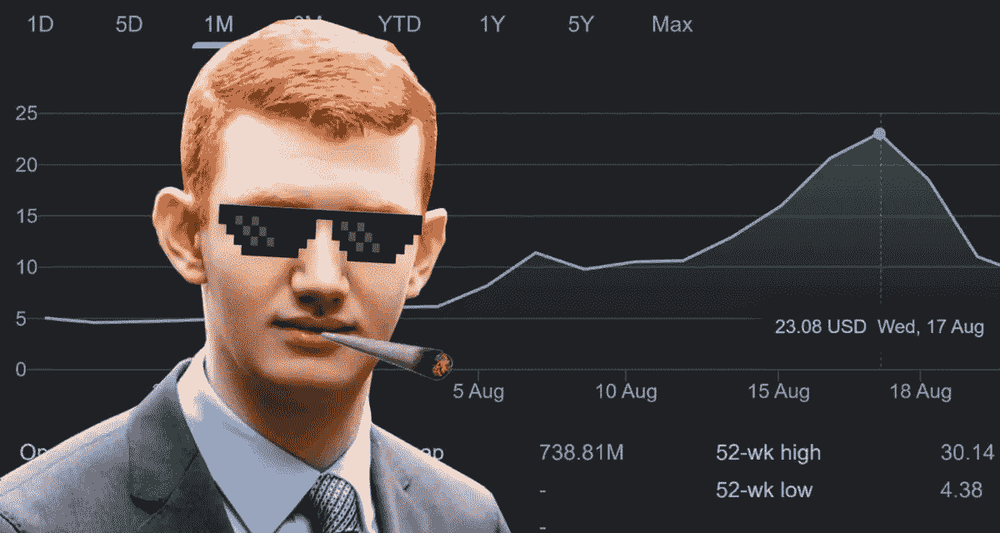
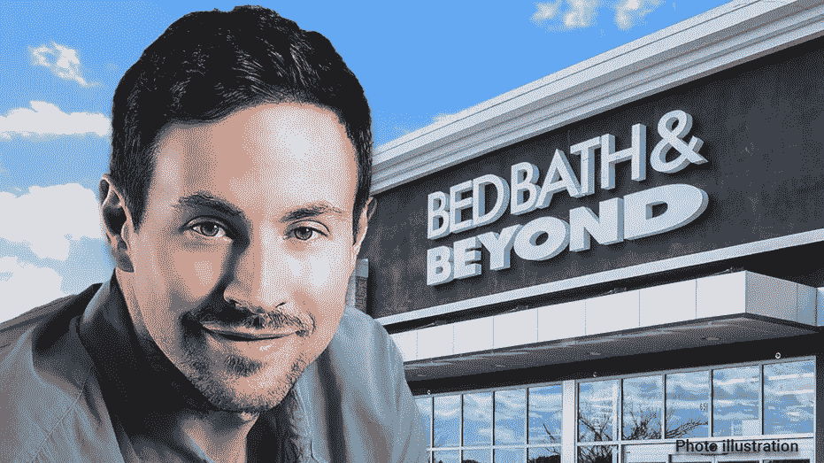
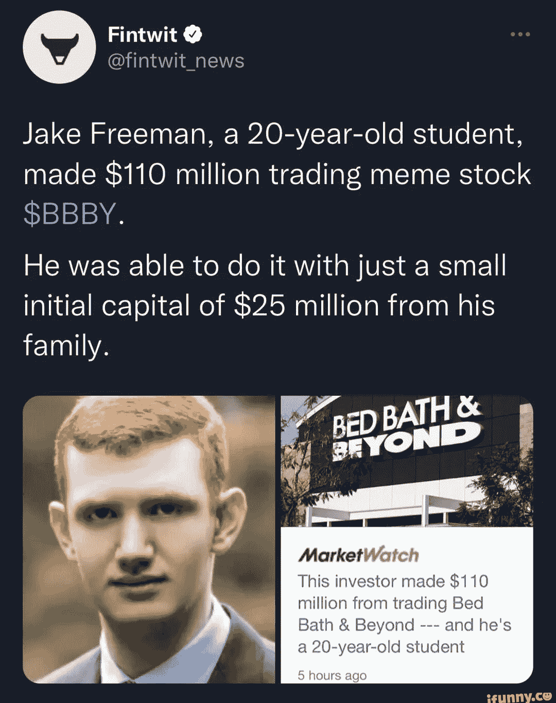

# 一个 20 岁的学生在一次交易中赚了 1.3 亿美元。

> 原文：<https://medium.com/coinmonks/a-20-year-old-student-made-130m-in-a-single-trade-770d3604aad0?source=collection_archive---------12----------------------->

Who says you can’t make money from meme stocks?

这听起来很不可思议。

加州一名 20 岁的大学生 5X 了他的全部投资组合，在一次交易中赚了 1.3 亿美元。

见见杰克·弗里曼，他可能比你我更了解 Reddit 上的华尔街。

是什么股票？

贝德柏士比昂公司(BBBY)。

是的，我知道，这个心脏很可爱。

但是 BBBY 的故事并不可爱。

美国一家著名的百货商店，他们出售从蜡烛棒到毯子的各种东西。

他们一直在疫情苦苦挣扎，收益一点也不好。

因此，当这只股票涨到每股 5.50 美元时，我们的米姆股票英雄杰克决定买进。

很多。

准确地说价值约 2500 万美元。

那是不可预见的事情发生的时候。

BBBY 股票价格不顾一切开始攀升。

为什么？

如果我知道，他们会在国家电视台采访我。

但我猜这是由迷因股票热、reddit、散户投资者 FOMO 涌入以及瑞安·科恩宣布将抛售他在 BBBY 的 12%股份的综合因素造成的。

Billionaire Ryan Cohen pocketed a $68.1 million profit from the sale of his stake in Bed Bath & Beyond Inc., scoring a 56% gain on an investment he held for roughly seven months.

瑞安是宠物食品公司 Chewy 的亿万富翁创始人和 GameStop 的董事长，他喜欢购买 meme 股票并发起一场运动。

所以我不会说杰克在玩他的午餐钱，他看起来像一个非常严肃和合法的投资者。

显然，他 17 岁时在一家对冲基金实习，已经投资多年。

我记得我 17 岁时对任天堂游戏机欣喜若狂，所以我们显然不一样。

我有几个问题困扰着我。

在所有的股票中，是什么促使杰克买了 BBBY？

他们很清楚自己的表现一点也不好，而且他们最近的季度报告也相当糟糕，这表明没有理由让任何人相信股票价格会上涨。

杰克有什么神力知道什么时候该出手？

在价格回落之前，他差不多在 27 美元的高点卖出了。

我想让他喝的东西获得占卜者的力量。

此外，说实话，一个 20 岁的年轻人拿着 2500 万美元四处投资，并不是典型的大学生。

他一度拥有 BBBY 6%的股份！

Pretty sure with this monumental success, Jake can do anything he pleases next.

好吧，不仅仅是杰克，他也为朋友和家人管理着很多钱。

他可能在一个非常冒险的赌注上走运了。

迷因股票热可能也起了很大作用。

但是，在今天这个时代，一个 20 岁的学生能从股票市场赚到 1.1 亿美元，这难道不是太棒了吗？

这可能是一个幸运的打击，一个有钱的特权孩子赚钱，但它仍然是一个令人敬畏的疯狂的故事。

无论是哪种情况，想象一下杰克的简历会有多疯狂:我 20 岁的时候，甚至在大学毕业之前，一次交易就赚了 1.3 亿美元。

-

你最近从股市赚钱了吗？

-

# startups # business # startupx # growth # success # social media # culture # web 3 # strategy # meme stock # meme # Reddit # gamestop # stocks # Ryan Cohen # bby # college # eth # BTC # crypto #黑客#jakefreeman

> 交易新手？试试[加密交易机器人](/coinmonks/crypto-trading-bot-c2ffce8acb2a)或者[复制交易](/coinmonks/top-10-crypto-copy-trading-platforms-for-beginners-d0c37c7d698c)