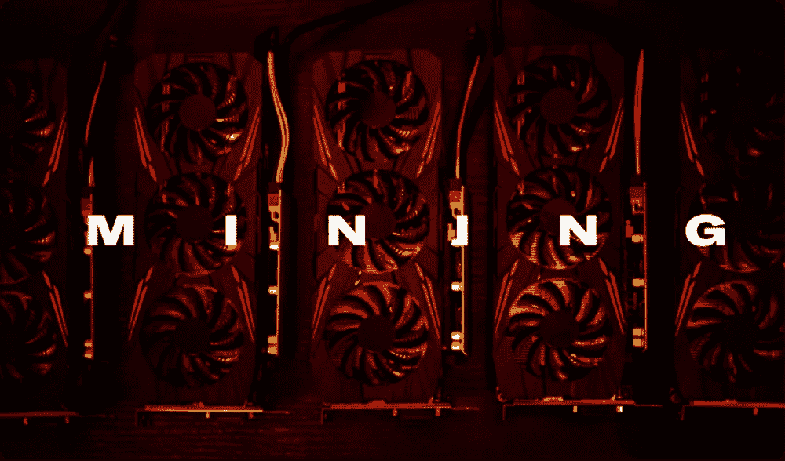
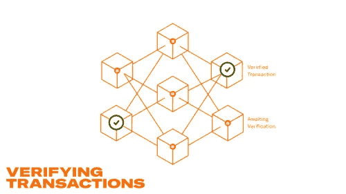
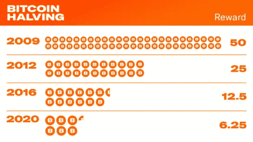

# 比特币挖矿初学者指南

> 原文：<https://medium.com/coinmonks/a-beginners-guide-to-bitcoin-mining-a39e69ef684a?source=collection_archive---------38----------------------->

## 采矿如何保护比特币网络，以及为什么它是整个系统的心脏。

*本文原帖*[*【NOAH.com】*](http://noah.com/)*。NOAH 是一款用于全球支付和赚取比特币和 stablecoins 利息的一体化货币应用程序。报名候补* [*这里*](https://mandrillapp.com/track/click/30895797/noah.com?p=eyJzIjoianNhRFBvdkV6c3BFY2JCTjZtcHcxSjlYN3dVIiwidiI6MSwicCI6IntcInVcIjozMDg5NTc5NyxcInZcIjoxLFwidXJsXCI6XCJodHRwczpcXFwvXFxcL25vYWguY29tXFxcLz9yZWZlcnJhbD00Y3pia2Z2JnJlZlNvdXJjZT1jb3B5XCIsXCJpZFwiOlwiYmM2OTFmYmVhMGVhNGRiOWIyMzc1Y2JlMzI4OGI0ZmJcIixcInVybF9pZHNcIjpbXCI0ZTUwMzQwOTI2NTBkMDBlZWIxM2Q1NzM1NWNjNTg4YTExYTgwOGEzXCJdfSJ9) *。*

# 什么是比特币挖矿？

比特币挖矿是交易被验证并加入[区块链](/@jacksonrickun/5-ways-blockchains-will-change-the-world-and-3-ways-it-might-not-449e3509b7b2)的过程，也是新比特币被发行进入流通的手段。比特币“矿工”运行专门的硬件来解决计算困难的数学问题，在这样做的过程中，他们验证比特币交易，并为比特币网络提供必要的安全保障。他们的努力得到了比特币的奖励，这激励人们将时间和资源投入到比特币挖掘中。

挖掘是一个计算密集型过程，需要强大的硬件。在比特币的早期，只用一台个人电脑就可以挖矿。随着比特币越来越受欢迎，人们开始将更强大的硬件用于挖掘。如今，比特币挖矿主要由大型比特币农场完成，因为竞争变得过于激烈，个体矿工无法盈利。这些比特币农场使用专门为采矿设计的专用硬件，在电力最便宜的国家和环境中蓬勃发展。

# 比特币为什么需要挖矿？

比特币挖矿有两个目的:保护比特币网络，帮助新比特币进入流通。采矿激励矿工不断验证交易，因为这样做会给他们带来巨大的回报——比特币。这种双管齐下的激励体系确保了比特币在一段时间内仍然是一个安全稳定的系统。

如果一个人或实体是唯一负责验证交易的人，那么这个人就有可能操纵交易，并可能窃取比特币。这就是比特币挖矿如此重要的原因——它确保了一个可验证的随机群体负责比特币验证，而不仅仅是一个人或一个实体。

由于比特币奖励的激励系统，遵守规则符合矿商的最大利益。试图欺骗或骗取系统是无利可图的；篡改比特币交易极其困难且代价高昂。这意味着双重花费比特币、伪造记录和任何其他欺诈企图都不是非常有效的努力。这是一个典型的囚徒困境——每个人都被激励去遵守规则并验证交易，因为他们知道如果他们不遵守规则，其他人也会这么做。

# “工作证明”是怎么来的？

比特币挖矿的工作方式使得解决数学问题变得异常困难，但一旦你找到了答案，就很容易验证它的正确性。想象门上的锁或密码锁；解决它是非常困难的，但是当它被解决了，并且你知道解决方法，任何人都可以打开锁或者密码并且走进房间。这是一个从所有可能的解决方案中找出一个解决方案的问题，非常困难。第一个找到解决方案的人可以证明它是正确的。这正是比特币将[工作证明](/coinmonks/the-consensus-mechanism-a-cryptos-beating-heart-ab3a340a2dfe)整合到其系统中的方式。如果矿工给出证据，他们就能得到比特币。

这就是为什么一个人的计算机能力越强，解决数学问题的速度就越快。如果你让一个人试着猜一把锁的密码，另一个人让几百个人为他工作，那么有几百个人的那个人将有更好的机会得到答案。

> 交易新手？试试[密码交易机器人](/coinmonks/crypto-trading-bot-c2ffce8acb2a)或者[复制交易](/coinmonks/top-10-crypto-copy-trading-platforms-for-beginners-d0c37c7d698c)

# 关于比特币挖矿的一些常见问题

## 矿工赚多少比特币？

比特币矿工赚取的金额被称为“块奖励”。最初，区块奖励是 50 个比特币，但比特币协议的设计使得这一奖励随着时间的推移而减少，确切地说是每四年减半(这就是所谓的“减半”)。奖励减半可以抑制比特币通胀，并确保比特币开采长期保持盈利，因为比特币减半通常与价格大幅上涨相关。如果对比特币的需求保持不变(或者更好的是增加)，而比特币的供应量减半，价格更有可能上涨。随着时间的推移，这种机制是比特币变得如此流行和有价值的原因之一。其数学上的可预测性赋予了比特币任何其他全球资产都无法比拟的稀缺性和稳定性。

# 什么是比特币挖矿池？

比特币矿池是一群比特币矿工，他们一起工作来开采比特币。通过集中资源，矿工可以更快地获得比特币，并增加他们获得奖励的机会。集中资源也有助于分散与比特币开采相关的风险，因为没有一个矿商或资金池负责验证比特币交易。

# 比特币挖矿要多少钱？

比特币开采的成本取决于许多因素，包括比特币的价格、地理位置、能源可获得性以及与运行采矿钻机相关的电力成本。一般来说，比特币挖矿是一项非常昂贵的工作，通常只有获得大量廉价电力的专业矿工才能盈利。然而，比特币挖矿仍然是一项受欢迎的努力，因为该领域的创新和越来越多的政治认可开始欢迎比特币矿工加入。

# TL；速度三角形定位法(dead reckoning)

*   比特币挖矿是验证比特币交易和保护比特币网络的过程。
*   [工作证明](/coinmonks/the-consensus-mechanism-a-cryptos-beating-heart-ab3a340a2dfe)用于确保矿工有动力验证比特币交易，因为他们的努力会得到比特币的奖励。
*   比特币矿池是一群矿工，他们共同努力增加获得奖励的机会。
*   比特币挖矿的成本可能会因几个因素而有很大差异，包括比特币的价格、位置、能源成本等。
*   尽管成本很高，比特币采矿仍然是一项受欢迎的努力，因为对获得廉价电力的矿工来说，这是有利可图的。

**杰克森·里昆是一名编剧、文案和密码爱好者。杰克逊的写作集中在加密货币、心理健康、性等方面。**

你可以在[推特](http://twitter.com/jacksonrickun)和 [Instagram](https://www.instagram.com/jacksonrickun/) 上关注他。

*免责声明:我是诺亚的活跃文案和内容撰稿人。以上并非投资建议，仅供参考。*