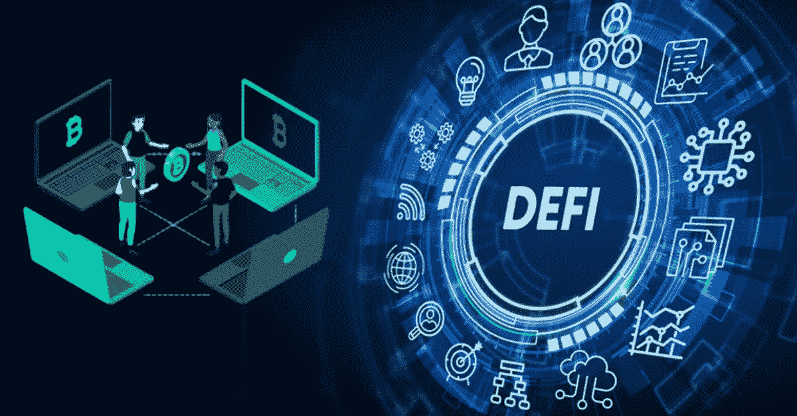
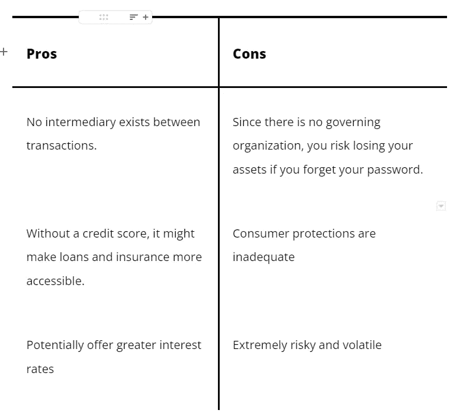

# DeFi 初学者指南

> 原文：<https://medium.com/coinmonks/a-beginners-guide-to-defi-87f165afa7b?source=collection_archive---------52----------------------->

DeFi 被称为加密货币的“狂野西部”。许多人认为这种不受监管的金融体系将彻底改变我们进行金融交易的方式。

然而，投资者通常没有像在传统金融市场那样的保护措施，因为它仍然基本上不受监管。然而，尽管存在风险，DeFi 提供的可能性使其成为加密投资者的迷人舞台。

# 什么是 DeFi？

一个被称为“分散金融”或“DeFi”的全球金融系统可以在开放的区块链，特别是以太坊使用。

分散融资通常被称为 DeFi。总而言之，它代表自我监管金融。在 DeFi 中，你是唯一能接触到你的钱的人，不像传统的金融那样，由一家企业、银行或基金掌管。

使用这种尖端技术，DeFi 拓宽了加密货币的可能范围，超越了仅仅是一种交换媒介，并建立了各种应用程序的复杂系统，通常是分散的应用程序或 dApps。

一群商人和以太坊工程师在 2018 年创建了 DeFi，旨在消除传统金融应用的障碍。

> 交易新手？试试[加密交易机器人](/coinmonks/crypto-trading-bot-c2ffce8acb2a)或者[复制交易](/coinmonks/top-10-crypto-copy-trading-platforms-for-beginners-d0c37c7d698c)

# DeFi 如何工作

DeFi 以前被称为“开放金融”，它消除了金融交易中的中间人。因此，当您进行购买时，您使用数字货币并直接拥有其所有权，而不是让您的银行或信用卡发行商充当中介。比特币之后领先的加密货币以太坊是 DeFi 的基础。

DeFi 的核心信念如下:

*   因为没有中间人，没有银行或其他组织管理你的钱。
*   有一些透明度，因为任何人都可以审查代码。
*   有跨越全球的开放网络。
*   有无数的用户应用程序，其中大部分都是建立在以太坊之上的。

虽然 DeFi 经常是加密货币讨论中的主要声音，但它不仅仅是提供一种替代数字货币或价值。借助智能合约，DeFi 试图取代传统金融系统的功能。

在 DeFi 中，代码就是一切。你的钱被设计成使用智能合约来实现多种功能。因此，任何拥有电脑和互联网连接的人现在都有参与全球经济的独特机会。

DeFi 取消了许多此类金融活动的准入门槛，这是其对客户最具吸引力的特点之一。例如，您不再受金融产品资格要求的约束，或者您的资金不再由政府或公司管理。

你通过常规金融程序申请贷款，根据你的信用，你可能会被拒绝。你把钱存在银行账户里，或者通过投资机构进行管理。

借助 DeFi 的智能合约，一些金融交易会在满足特定要求后进行。交易条款以物理方式编码在智能合同的代码中，允许借贷和其他金融交易。虽然这使得这些交易更加用户友好和实用，但也使它们更容易出现无法纠正的错误。

由于这些智能合约和以太坊构建应用程序的能力，可以使用 DeFi:

*   提供点对点借贷作为**借贷网络**。
*   通过**分散交易**，用户可以将一种货币兑换成另一种货币。例如，用乙醚换美元。
*   对于**赌博**，顾客对某些事件的可能结果打赌。
*   通过将特定的加密货币与更传统的货币形式(如美元)联系起来，Stablecoins 降低了价格波动性，增加了稳定性。

# DeFi 的利与弊

DeFi 和其他加密货币正变得越来越受欢迎，这让它看起来像是一项不错的投资。然而，在冒险尝试之前，理解你将要进入的领域和它的优缺点是至关重要的。

在 DeFi 中，你保留对你的钱的所有权，并有权支配它的使用。此外，DeFi 是有效的，因为一切都是可编程的，你只需按一下按钮就可以完成复杂的交易。

可访问性因素可能会消除一些障碍，但也有一些缺点需要注意。

DeFi 是全新的、实验性的。一切都是代码；因此，可能会有错误。bug 会导致经济损失或黑客攻击。DeFi 是新的和复杂的。尽管如此，用户体验可能是棘手的。尽管仍然很陡，学习曲线会变平。

DeFi 的风险与其他投资相同。然而，鉴于监管的挑战和欺诈的可能性，任何加密货币或 DeFi 应用都可能带来更高的风险。因此，不要投资任何你输不起的钱是一个明智的建议。