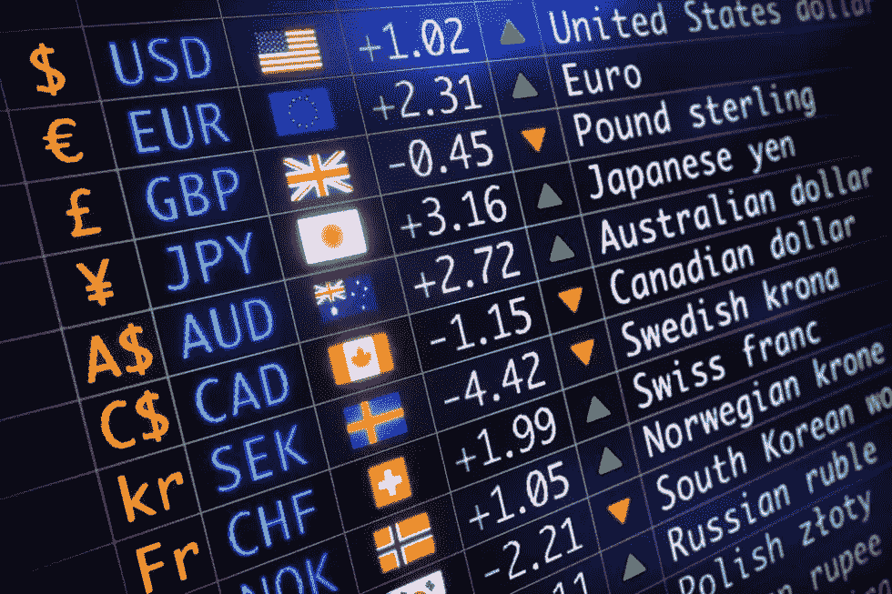

# 外汇交易初学者指南

> 原文：<https://medium.com/coinmonks/a-beginners-guide-to-forex-trading-27227e215cd3?source=collection_archive---------19----------------------->

什么是外汇交易？简单来说，外汇交易就是买卖货币的行为。这可以通过两种方式实现:投机于货币价格的涨跌，或对冲海外市场的潜在损失。外汇交易是最受欢迎的交易形式之一，公司和个人使用它有两个主要原因:从货币价格的涨跌中赚钱，或者锁定海外市场的制造和销售价格。

什么因素影响货币价格？

一种货币的价值是多种因素的函数，如该国的政治和经济。因此，以支付违约或与另一种货币的贸易关系失衡形式出现的经济不稳定等事件可能会导致大幅波动。

**外汇市场受到监管吗？**

外汇交易法规取决于司法管辖区。像美国这样的国家拥有复杂的基础设施和市场来进行外汇交易。因此，外汇交易受到美国全国期货协会(NFA)和商品期货交易委员会(CFTC)的严格监管。然而，由于在外汇交易中大量使用杠杆，像印度和中国这样的发展中国家对外汇交易中使用的公司和资本有限制。欧洲是外汇交易的最大市场。金融行为监管局(FCA)负责监督和管理联合王国的外汇交易。

**我可以交易哪些货币？**

流动性高的货币有现成的市场，因此在应对外部事件时表现出更平稳、更可预测的价格波动。美元是世界上交易量最大的货币。在市场上流动性最强的七种货币对中，人民币占据了六种。然而，流动性低的货币如果没有与价格相关的重大市场波动，就不能进行大批量交易。这种货币一般属于发展中国家。当它们与一个发达国家的货币配对时，就形成了一个奇异的货币对。例如，美元和印度卢比(USD/INR)的配对被认为是一种奇特的配对。

**如何开始外汇交易？**

外汇交易的第一步是让自己了解市场的运作和术语。接下来，你需要根据自己的财务状况和风险承受能力制定交易策略。最后，你应该开一个经纪账户。如今，在网上开立外汇账户并为其注资以及开始交易货币比以往任何时候都要容易。

我如何获得这类交易的必要技能？

有多种方法可以获得外汇交易的必要技能。

**常规培训-辅导**

一种选择是参加在线课程或辅导，如 Investopedia Academy 提供的课程或辅导。或者，你可以通过导师项目向更有经验的交易者学习。

**模拟账户**

一些经纪人提供免费的模拟账户，允许你用虚拟货币进行外汇交易。这也可以通过在 MetaTrader 软件平台中设置一个演示帐户来完成。

**什么是 MetaTrader？**

MetaTrader 是许多货币交易者使用的流行软件。它提供了各种功能，包括图表工具、技术指标和新闻提要。MetaTrader 还允许交易者使用专家顾问(EAs)实现交易自动化。MetaTrader 可以从大多数经纪人那里免费获得，也可以通过 iPhone 应用商店和 Google Play 获得，版本可能会有所不同。

**什么是 MetaTrader 专家顾问？**

MetaTrader 专家顾问是在 MetaTrader 框架内运行的自动化交易程序，允许您进行外汇交易，而不必亲自完成所有工作。这些程序可用于下单和管理交易，以及监控市场状况和生成交易信号。虽然 MetaTrader 专家顾问可以节省你的时间和精力，但重要的是要记住，他们不是不会犯错的。在使用专家顾问之前，请确保您了解它是如何工作的，并首先在模拟帐户上进行测试。

无论你选择哪种途径获取外汇交易知识和技能，在投入任何真金白银之前，请确保你了解其中的风险。

**外汇交易有哪些相关风险？**

像任何形式的交易一样，外汇交易也有其自身的风险。首先，货币价格波动性很大，这意味着它们会随着政治和经济事件而快速波动。这使得很难预测任何时候的价格，如果你不知道自己在做什么，很容易亏损。此外，外汇交易是杠杆交易，这意味着如果你的交易对你不利，你可能会损失比你账户上更多的钱。最后，外汇市场一天 24 小时开放，一周 5 天，这意味着你需要能够全天候监控你的交易。

尽管有这些风险，外汇交易可以是一个有利可图的赚钱方式，如果你有必要的技能和知识。所以，如果你有兴趣开始，在投入真钱之前，一定要做好研究，用一个模拟账户进行练习。

**外汇交易有哪些好的新手策略？**

这个问题没有放之四海而皆准的答案，因为外汇交易的最佳策略将根据您的个人目标和风险承受能力而有所不同。然而，初学者可以使用的一些基本策略包括购买预期升值的货币对，出售预期贬值的货币对，以及持有预期不会大幅波动的货币对。无论你选择什么策略，在投入真钱之前，一定要用一个模拟账户进行测试。

外汇交易的最佳时间框架是什么？

同样，这个问题没有放之四海而皆准的答案。有些交易者喜欢做长线，而有些交易者喜欢做短线。最终，外汇交易的最佳时间框架将取决于你的个人目标和风险承受能力。如果你刚刚开始，从较短的时间框架开始，然后随着你获得更多的经验，逐渐转向较长的时间框架，这可能是一个好主意。

**初学外汇交易者会犯哪些常见错误？**

初学外汇交易者最常犯的一个错误是，在投入真钱之前，没有用模拟账户练习。模拟账户可以让你测试你的交易策略而不用冒任何真钱的风险，所以在你开始真的交易之前使用一个模拟账户是很重要的。此外，外汇交易新手经常犯使用过多杠杆的错误，如果他们的交易对他们不利，这可能会导致严重损失。最后，许多新手没有制定一个可靠的交易计划，这可能导致冲动和情绪化的决定，代价可能很高。

如果你对外汇交易感兴趣，一定要避免这些常见的错误，尽最大努力制定一个可靠的交易计划。

**外汇交易成功的秘诀是什么？**

外汇交易成功没有万全之策，但所有成功的交易者都遵循一些基本原则。首先也是最重要的是，他们要确保对市场有所了解，并对相关风险有一个坚实的理解。此外，他们制定了详细的交易计划，概述了他们的目标和风险承受能力。他们还确保在投入真钱之前先用模拟账户进行练习。最后，即使事情对他们不利，他们也会遵守纪律，坚持自己的计划。如果你能做到这些，你就能在外汇交易的道路上取得成功。

开始外汇交易需要很多钱吗？

不，你不需要很多钱来开始外汇交易。事实上，许多经纪人允许你用少至 100 美元开立账户。然而，重要的是要记住，如果你的交易对你不利，你可能会失去账户里所有的钱。所以，如果你要在外汇交易中投入真正的钱，确保你只使用你能承受损失的钱。

**新手最好的外汇经纪人是什么？**

对于这个问题，没有一个放之四海而皆准的答案，因为对于初学者来说，最好的外汇经纪人会根据你的个人目标和风险承受能力而有所不同。然而，一些可能很适合新手的经纪商包括 eToro、Forex.com 和 FXCM。这些经纪商提供较低的最低存款要求、模拟账户和用户友好的平台。因此，如果你刚刚开始外汇交易，它们可能值得一试。

**底线**

对于交易者来说，尤其是那些资金有限的交易者，在外汇市场进行小额日内交易或波动交易比在其他市场更容易。对于那些眼光更长远、资金更多的人来说，基于长期基本面的交易或套利交易可能是有利可图的。专注于理解推动货币价值的宏观经济基本面，以及技术分析的经验，可能有助于新的外汇交易者变得更有利可图。

对于那些花时间了解市场并理解推动货币价值的因素的人来说，外汇交易是一项有利可图的事业。然而，重要的是要记住，外汇交易是一项高风险的活动，可能并不适合所有的投资者。在开始交易之前，你应该仔细考虑你的投资目标、经验水平和风险承受能力。
———

大家好，我是里克·格雷森，这篇文章的作者。我正努力在 Medium、Instagram 和 Twitter 上建立粉丝群。你知道，试着找到适合我的部落。:-)

一份追随一份追随，一份分享一份分享；只是想放大这里的声音。我们来连线。

IG: [里克·格雷森(@ therickgregson)insta gram 照片和视频](https://www.instagram.com/therickgregson/)

推特:[里克·格雷森(@therickgregson) /推特](https://twitter.com/therickgregson)

LinkedIn: [里克·格雷森| LinkedIn](https://www.linkedin.com/in/therickgregson/)

> 交易新手？尝试[加密交易机器人](/coinmonks/crypto-trading-bot-c2ffce8acb2a)或[复制交易](/coinmonks/top-10-crypto-copy-trading-platforms-for-beginners-d0c37c7d698c)