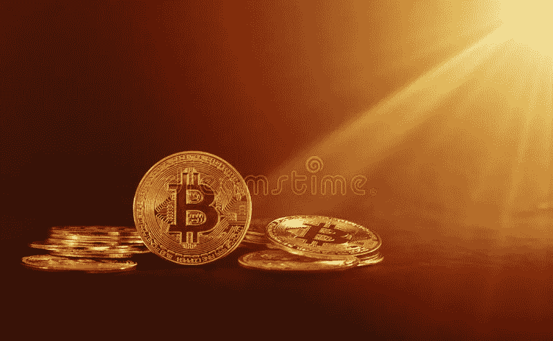

# 圣诞节前的一点秘密阳光

> 原文：<https://medium.com/coinmonks/a-bit-of-crypto-sunshine-just-in-time-for-christmas-7525431d6b2a?source=collection_archive---------68----------------------->

Dreamstime

路透社 2022 年 12 月 12 日报道:

“虽然比特币可能仍会测试 10，000 美元至 12，000 美元的潜在低点，但根据瓦内克数字资产研究主管马修·西格的说法，它可能会在 2023 年下半年回升至 30，000 美元。”

“大多数大银行和投资经理预计加密货币市场将在 2023 年复苏。”