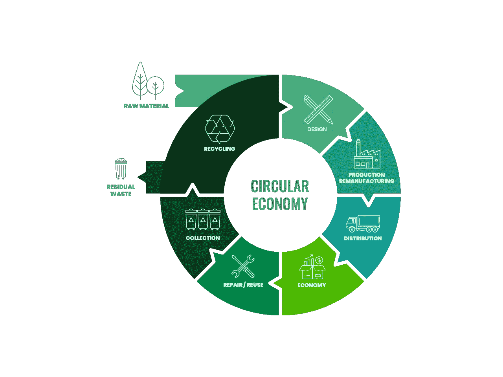

# 循环经济的区块链

> 原文：<https://medium.com/coinmonks/a-blockchain-for-the-circular-economy-b26044dc0e17?source=collection_archive---------6----------------------->

## 介绍 Cometa，这是一款支持循环商业模式的应用专用区块链

## 背景

在今天的线性经济中，产品是由从地球上提取原材料获得的组件制成的，组装后卖给用户，通常在很短的时间后就被扔掉。这要求每一步都要消耗大量的能量。许多产品甚至不是为维修而设计的，也不提供实际可用的备件。这种*提取、制造、销售、使用、燃烧*的循环的结果是我们目前正在目睹的环境灾难:我们有限的自然资源的持续枯竭。

唯一的出路是改变产品的设计、制造和销售方式。我们需要非常小心地对待过程中使用的资源，并确保用它们创建的产品是持久的和可维护的。我们还必须最大限度地增加可重用组件的数量。换句话说，我们需要采用循环经济的原则，即首先用于制造产品的资源，重新进入系统，一次又一次地创造价值。

从线性经济模式转向循环经济模式是一种战略创新，可以采取多种形式，包括商业模式创新。以使用为基础的商业模式，即产品的销售是为了使用而不是所有权，解决了循环经济的目标，即将创造财富与使用能源和其他自然资源脱钩。

要采用基于使用的业务模式，必须解决几个挑战，首先是为客户提供有吸引力的价值主张，客户可能习惯于所有权业务模式，必须看到转换到基于使用的业务模式的明显优势，以便进行这种改变。

由于公司在基于使用的业务模式中仍然是设备的所有者，因此它也对产品的正常运行负有责任。它需要能够快速解决任何故障，最好甚至通过云监控和使用机器学习来预测故障来防止故障。

从货物的卖方到货物使用的卖方，公司成为服务的有效集合者，其中包括一个行动者网络，从提供零件的公司到提供资金的银行，到现场委托和维护产品的第三方、房东、公用事业公司等。

转向基于使用的业务模式，*“通常会扩大参与者的网络，并需要一个真正的参与者系统”*，*“合同成为价值主张的一部分，因为它应该正式确定要达成的结果以及将评估成就水平的服务水平协议”*。

由于价值主张的核心部分现在是服务而不是商品，发票的单位可能很难定义。竞争仍然是购买有形商品的传统方式。监控合同中的消费单位和服务级别必须是一项具有必要安全性和透明度的关键功能，因为这种监控提供发票单位，并且必须可由客户和网络中的其他参与者验证，从而使服务成为可能。

行为者之间的合作、透明和信任，以及对提供商实现目标能力的信心，对于基于使用的商业模式至关重要，公司需要证明有能力创建这样一个网络，并监测和实现承诺的结果。与客户的关系取代了基于使用的业务模式中的交易。

除了行动者网络中的许多行动者仍在以线性思维方式运营这一事实之外，还在以下方面发现了采用基于使用的业务模式的实施障碍:

1.  需要调整行为者之间的激励措施
2.  高昂的管理成本
3.  复杂的所有权分割
4.  需要处理微交易

所有这些困难都可以通过采用区块链、细分资产的令牌化、加密货币和智能合约来缓解。

为了解决和协调所有需要为资产的正常运行分担责任的参与者的激励，所有参与者都需要得到补偿并分享资产的所有权。在资产被令牌化的区块链中，使用(稳定的)加密货币的资产支付通过智能合约在资产的所有所有者之间自动分配。

管理费用大幅减少到使用区块链的气费。这些只是每笔交易的一小部分，而且还分散在区块链的所有验证器节点中，以确保管理区块链交易和其中所代表的资产的安全性和公平性。

一旦资产被令牌化为(部分)NFT 并由智能合同管理，所有权的划分就非常简单。微交易是加密货币使用的内在要求，加密货币一次可以轻松交易小至百万分之一美元的部分。

采用基于使用的业务模式的产品公司将通过采用云监控、机器学习和区块链等技术来管理资产所有权、使用监控和计费，从而在转型为集成解决方案提供商的过程中受益匪浅。

# Cometa 网络

[Cometa Network](https://www.cometa.io) 是一个位于区块链的平台，融合了 NFTs、资产令牌化、部分所有权和智能合同，促进了将设备作为服务而非资产销售的服务化业务模式。Cometa 的目标是物联网和工业物联网设备，如机器人和自主系统，以及分布式发电、商业供暖、制冷、LED 照明和分布式能源系统中的制造设备、可再生和节能系统。

按使用付费的商业模式，为了有效地实现循环生产模式，必须包括参与产品或项目生命周期的所有可能的行为者，包括制造商、部件制造商、电力公司、金融机构、安装和维护公司、业主、建筑管理部门和最终用户。所有人都有一致的激励和惩罚措施，以确保产品或项目的有效循环周期。

显然，从法律和后勤的角度来看，建立这样一个复杂的支付、奖励和惩罚制度是困难的。Cometa 提供的技术为按使用付费的商业模式创建了一个公平、安全的生态系统，该生态系统基于区块链、智能合同和加密货币，用于支付托管设备提供的性能。

Cometa 中的按使用付费服务合同基于测量和跟踪使用和产品性能的能力，并在区块链中作为软件实现，为无信任交互提供分散的、可扩展的和安全的基础设施。作为获得产品使用的结果，服务合同以透明、安全的方式自动执行区块链中的所有支付。

按使用付费商业模式的例子包括空调和商业制冷的冷却即服务、工业机器人系统产生的工作、商业 LED 照明的照明、电动车辆的移动性、放置在使用点的系统产生和储存的能量(分布式能源)。

工业和商业设备的按使用付费商业模式为制造商设计和制造更耐用的产品提供了激励和动力，这些产品易于维护，使用寿命更长，部件易于回收，备件可及时获得。从用户方面来看，采用更新、更节能的产品是有动机的，因为它们不是资本支出，而且采用的风险较低。

## 基本机制

产品由所有者(例如制造商、银行或其他资产管理公司)提供，供他们的客户使用，具有特定的性能表现，并按性能单位收费。这些产品配有一个安全的硬件模块，具有一定的加密功能，固件能够测量产品性能并与云中的 Cometa 区块链节点通信。

在区块链，每个产品都被标记为 NFT，在 NFT，产品的安全硬件模块中的固件会跟踪产品的使用情况。固件通过硬件模块定期向区块链发送专用区块链事务来测量性能。

基于测量的性能和产品关税，区块链自动执行从用户到产品所有者的加密货币支付交易。

区块链中的共识机制保证了公平性，它有许多独立的验证器，以运行 Cometa 区块链软件的节点的形式存在。

## 共识；一致

Cometa 使用由许多验证器组成的 [Tendermint](https://tendermint.com/) 节能利益证明(PoS)共识，这些验证器或是可信的，或是潜在的拜占庭式的。当 Cometa 这样的系统处理价值时，系统的完整性变得非常重要。确保完整性的一个方法是与一大群独立的参与者共同承担维护的责任，这些参与者充当同时运行 Cometa 区块链节点的验证者。

## 代币

区块链有两种令牌:COMETA 本地令牌和用于支付产品性能的稳定加密货币令牌，例如 USDC。

COMETA 令牌是区块链的本地令牌。COMETA 是赌注和治理令牌，也是网络的 gas。当 staking COMETA 时，令牌持有者被绑定到一个验证器，帮助确认阻止和保护网络。COMETA 令牌的持有者将控制管理，并获得网络的佣金。它将以待定的方式发行，并将在 Cosmos 生态系统(如 Osmosis)的做市商上进行符合 SEC 要求的首次 DEX 发行(IDO)后向公众开放。

用于支付产品性能的加密货币是 USDC，这是一种与美元挂钩的稳定货币，在区块链宇宙中可以买到。

# 硬件组件

产品在固件中集成了一个硬件模块来执行计量功能，并连接到云中的区块链节点。产品有自己的区块链帐户，相应的私钥保存在硬件中。

## 要求

1.  一个可信的执行环境，例如由 [ARM TrustZone](https://www.arm.com/technologies/trustzone-for-cortex-a) 技术为 Cortex-M 处理器提供的环境。
2.  使用他们的帐户私钥保护数据存储。
3.  主动篡改检测。
4.  网络连接。

这方面的一个例子是使用适当运行时间的 [ST 微电子 STM32U5](https://www.st.com/en/microcontrollers-microprocessors/stm32u5-series.html) 微控制器，如 [Twilio Microvisor](https://www.twilio.com/iot/microvisor-iot-platform) 。

## 固件功能

硬件模块的主要功能是计量代表产品性能的可测量量的使用，该可测量量用作产品使用的收费单位。固件计量模块持续跟踪决定性能的可测量量的使用情况。性能是用单位来衡量的，单位的含义取决于设备。

固件以固定的时间间隔向区块链广播一个计量交易，其中包含以“单位”为单位的计量计费可测量数量的值的消息。该交易触发区块链中的“软件合同”，使其以支付加密货币向设备所有者发起支付交易，支付交易的金额在配置中与所有者分数成比例地确定。

## 甲骨文方法

除了在设备中安装安全硬件组件之外，还将开发一个 oracle 来提供离线消息，以将设备的计量性能传达给 Cometa 区块链。通过 oracle，可以将链外消息引入区块链，并用于触发使用硬件模块时使用的相同支付逻辑。

这种方法很可能在一个系统中提供相同级别的安全性，例如，在该系统中，能耗由智能仪表测量并用作可测量单位，能耗通知 oracle 由 Cometa 管理的设备。如果可以信任一家公用事业公司来测量电能，那么也可以信任其自动化仪表基础设施(AMI)平台来“供给”oracle。

## 结论

按使用付费的商业模式需要的不仅仅是简单的卖方-买方互动，因为一个行动者网络需要承担责任并分享被服务资产的所有权。像区块链彗星这样的技术对这个系统来说是必不可少的。

使用区块链是提供确定性和信任的关键。当利益相关者之间的支付可以双向流动时，这一点尤其明显。例如，能源效率激励的支付和分配就是这种情况，该激励可以由实现某些测量的消耗减少的特定产品来触发，然后在产品的所有者和用户之间分配付款，同样可以说在几个电网互连产品的分布式能源(DER)系统中，许多所有者、用户(本身就是所有者)和公用事业公司在彼此之间具有双向的能量和付款流。

Cometa 仍处于非常早期的阶段，虽然原型和演示已经实现，但还没有验证器网络来提供实际无许可区块链运行所需的分散化。

与此同时，它证明了区块链技术(如 Cosmos SDK)可以有效地用于概念化特定于应用程序的区块链，该允许对资产进行令牌化，并嵌入具有所需性能的智能合同逻辑，以实现按使用付费的业务模式，即使有广泛的参与者和利益相关者网络。

未来的工作包括与有意合作开发 [Cometa 网络](https://www.cometa.io)的制造商和区块链公司一起部署实际的概念验证。

[1]森佩尔斯和霍夫曼，2012 年。*未来的商业模式:在一个资源有限的世界里的德尔。法国培生教育公司。*

[2]h .托克斯佩乌斯、e .阿赫特博格和 f .波尔津，2021 年。企业如何获得银行融资进行循环商业模式创新？。*商业战略与环境*， *30* (6)，第 2773–2795 页。

> 交易新手？尝试[加密交易机器人](/coinmonks/crypto-trading-bot-c2ffce8acb2a)或[复制交易](/coinmonks/top-10-crypto-copy-trading-platforms-for-beginners-d0c37c7d698c)