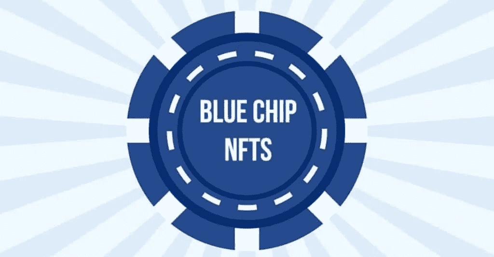
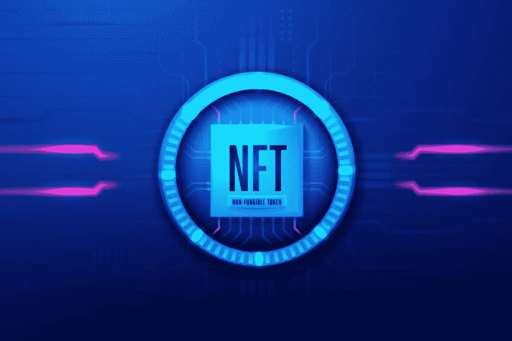
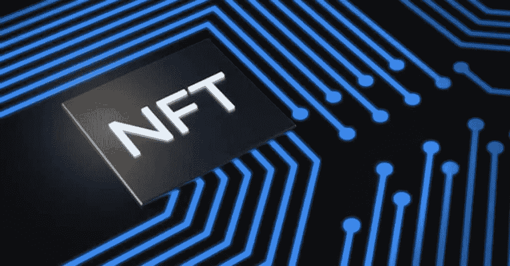

# 蓝筹股 NFT:是什么？

> 原文：<https://medium.com/coinmonks/a-blue-chip-nft-what-is-it-ae1b7cd76072?source=collection_archive---------44----------------------->

# 蓝筹股

 [## 什么是蓝筹股 NFT | NFT - KOOP360

### 蓝筹非功能性交易是成功的计划，并有可能随着时间的推移保持其价值。

koop360.com](https://koop360.com/blog/what-is-blue-chip-nft/) 

> 尽管蓝筹股有着稳定的历史记录，但它们通常不会像投机性更强的投资那样产生好的结果。蓝筹股 NFT 也是如此。蓝筹股 NFT 是长期有利可图的可靠项目。—蓝筹 NFT 具有各种特征，包括相对较高的底价、市场领导地位、名人赞助、团队奉献精神和实践应用。—一些成功的 NFT 的例子有 Crypto Punks、Bored Ape Yacht Club、variant Ape Yacht Club 和 ENS: Ethereum Name Service。

# 非功能测试的基础

在讨论蓝筹 NFT 之前，我们需要对 NFT 进行定义和估值。

不可替换令牌，也称为 [NFTs](https://koop360.com/blog/social-media-are-simplifying-nft-trading/) ，是加密唯一的数字或物理令牌。它们与作为所有权、合法性或组成员身份证明的数字和物理内容相关联。在游戏中，NFT 让用户拥有独特的数字资产，如宠物怪物或星际飞船，并进行交易或出售。

> 交易新手？在[最佳加密交易](/coinmonks/crypto-exchange-dd2f9d6f3769)上尝试[加密交易机器人](/coinmonks/crypto-trading-bot-c2ffce8acb2a)或[复制交易](/coinmonks/top-10-crypto-copy-trading-platforms-for-beginners-d0c37c7d698c)

CryptoSlam 报告称，2022 年 10 月全球 NFT 销售额为 3.33 亿美元。DappRadar 和 CoinMarketCap 一样，是一个监控 NFT 和分散应用程序经济(包括蓝筹股非功能性交易)的重要平台。

# 什么是蓝筹股 NFT？

蓝筹非功能性交易是成功的计划，并有可能随着时间的推移保持其价值。

蓝筹股是传统金融中知名的、财务稳定的公司。蓝筹企业即使在经济低迷时期也能保持盈利。

蓝筹股有着成功和稳定增长的历史。蓝筹股是安全的，但它们的利润通常很低。

# 为什么投资蓝筹 NFT 很重要？

蓝筹股 NFT 的意义在于，它们提供了投资于优秀事物并获得正回报的机会。如果得到支持，蓝筹品牌将继续在全球范围内提供优质的商品和服务。

大多数非上市公司永远不会成为蓝筹股，但那些继续执行、为消费者提供价值并建立良好声誉的公司将作为蓝筹股品牌长期存在。

一般来说，一个社区会更容易接受一个对其所有者有更大效用的不可替代的令牌(NFT ),而不是仅仅提供一个没有价值的产品。

几个备受瞩目的 NFT 项目提供了现实世界的价值。一些 NFT 投资者接收商品、活动、一对一会议和其他资源来帮助用户。

**蓝筹策略**

# 1.密码朋克

[幼虫实验室](https://larvalabs.com/)，一家软件开发公司，开发了 CryptoPunks，最著名的 NFT 集合之一。在以太坊区块链，**密码朋克**是一万张数字图像的符号化版本。如果你有一个 NFT，你的像素头像是独一无二的。密码朋克是第一个以太坊不可替代令牌(NFT)。它们创建于 2017 年，远在除了密码爱好者之外的任何人知道或关心稀有数字收藏品之前。CryptoPunks 于 2017 年免费提供。幼虫实验室的两人小组将它们作为实验发射。当时，以太坊的不可替换令牌的 ERC-721 标准还不存在。向公众开放的 9000 个加密朋克很快被那些有以太坊钱包的人购买，而幼虫实验室为他们保留了剩余的部分。

在随后的三年里，NFT 的交易量稳步上升。然而，对这些可核实的稀有数字收藏品的需求在 2020 年底左右爆炸，特别是在 2021 年初。CryptoPunks 的二级市场价值飙升，导致数百万美元的 NFT 销售，佳士得和苏富比拍卖，以及许多 Twitter 个人资料图片。

[**百无聊赖的泼猴游艇俱乐部**](https://boredapeyachtclub.com/) **是 NFT 最大的集合，但隐朋克是第一个。**

# 2.无聊猿游艇俱乐部

宇迦实验室的无聊猿游艇俱乐部拥有 10，000 张以太坊 NFT 个人资料图片。无聊的猿类收藏家有一个随机生成特征和配件的猿类插图。没有两张照片是完全相同的。

购买一张[无聊猿游艇俱乐部](https://boredapeyachtclub.com/)不可替换的代币可以授予同一“俱乐部”的会员资格及其奖励。根据 CryptoSlam 的数据，2022 年 1 月，Bored Ape NFTs 的交易量超过 7.5 亿美元，包括变体集。无聊的猿类成为运动员、音乐家和其他人首选的推特 NFT 头像。

# 3.涂鸦

[烧焦吐司的涂鸦](https://burnttoast.myportfolio.com/) NFTs 于 2021 年 10 月登场。这 10，000 件涂鸦作品具有各种颜色、特征和尺寸。涂鸦用户可以对社区财政资助的体验和激活进行投票。

9 月，Doodles 宣布法瑞尔·威廉姆斯已经成为首席品牌官，并将制作一张以项目为灵感的唱片。同月，Doodles NFT 公司的销售额增长了 1200 %,市值达到 7 . 04 亿美元。

# 4.志那都红豆

1 月份首次亮相的《志那都红豆》,已经达到了新的交易量里程碑，成为 2022 年制作的最受欢迎的 NFT 项目之一。基于以太坊的个人资料图片计划于 1 月推出，到 2022 年 3 月，二次销售收入达到 100 万美元。

志那都红豆#9605 决定以 420.69 ETH 或 142 万美元的价格出售，比该项目此前在 2 月 13 日以 204 ETH 或 58.6 万美元的价格出售志那都红豆#4666 的纪录高出一倍多。

**2022 年，受动漫启发的以太坊系列成为 NFT 的领先项目之一。**

# 5.双生火焰

【2021 年 2 月发布的《双生火焰，是为了纪念艺术家贾斯汀·阿弗萨诺未出生的双胞胎兄弟而开发的。Twin Flames 展示了 100 张不同双胞胎的照片。这些照片是在 2017 年至 2018 年期间在世界各地拍摄的。他们在他们选择的地点和衣服上展示了各种各样的人，但是他们都有一个相似的地方:他们是双胞胎。

Twin Flames 于 2 月份发行，以以太坊为基础，是收藏家们非常想要的。根据 OpenSea 的数据，到 2021 年 10 月，Twin Flames NFTs 的交易量将达到约 1300 万美元，其所有者包括史努比·道格和加里·维纳查克。在这一年中，收藏的一件非功能性纺织品以总共 506 件 ETH 售出，相当于 190 多万美元。

# 6.隐猫

由 Dapper Labs 推出的 CryptoKitties 是以太坊网络上不可替代的 ERC721 令牌。在 ERC721 创建之前，使用区块链的令牌是可替换的；每一个比特币或以太币都是等价的。ERC721 允许引入不可替换的、非唯一的令牌。

每只 CryptoKitty 都有一个独特的智能合约存储的数字基因组。智能合约的基因型定义了它的表现型。使用遗传算法，可以培育任何两种不同类型的隐猫，以产生具有双亲特征(或“属性”)的新型隐猫。

对密码猫的兴趣突然激增，淹没了以太坊网络，该网络实时处理新交易的能力有限。饲养 CryptoKitties 变得如此受欢迎，以至于阻碍了网站上其他企业快速验证其交易的能力。

【2020 年 5 月，隐猫宣布迁徙至区块链。

与股票类似，蓝筹股 ETF 来来去去。今年，一场隐秘的熊市抹去了许多人的储蓄，包括那些曾经不可阻挡的无聊猿游艇俱乐部的成员。著名艺术家贾斯汀比伯在 1 月份花了 130 万美元买了一只猿猴；截至 2022 年 11 月，购买的 JPEG 现在只值 69，000 美元。

**结论**

人们希望进行投资，但他们希望知道这些投资会给他们带来回报。在进行 NFT 交易之前，确保该项目具备蓝筹风险投资的所有特征，如果不具备，就不要投资。

找到蓝筹股 NFT 需要努力。著名的蓝筹股对一些人来说太贵了。因此，如果你正在寻找一个蓝筹项目进行投资，你应该寻找一个有潜力达到蓝筹地位的企业。

> 加入 Coinmonks [电报频道](https://t.me/coincodecap)和 [Youtube 频道](https://www.youtube.com/c/coinmonks/videos)了解加密交易和投资

# 另外，阅读

*   [TraderWagon 回顾](https://coincodecap.com/traderwagon-review) | [北海巨妖 vs 双子星 vs BitYard](https://coincodecap.com/kraken-vs-gemini-vs-bityard)
*   [如何在 FTX 交易所交易期货](https://coincodecap.com/ftx-futures-trading)
*   [OKEx vs KuCoin](https://coincodecap.com/okex-kucoin) | [摄氏替代品](https://coincodecap.com/celsius-alternatives) | [如何购买 VeChain](https://coincodecap.com/buy-vechain)
*   [ProfitFarmers 点评](https://coincodecap.com/profitfarmers-review) | [如何使用 Cornix 交易机器人](https://coincodecap.com/cornix-trading-bot)