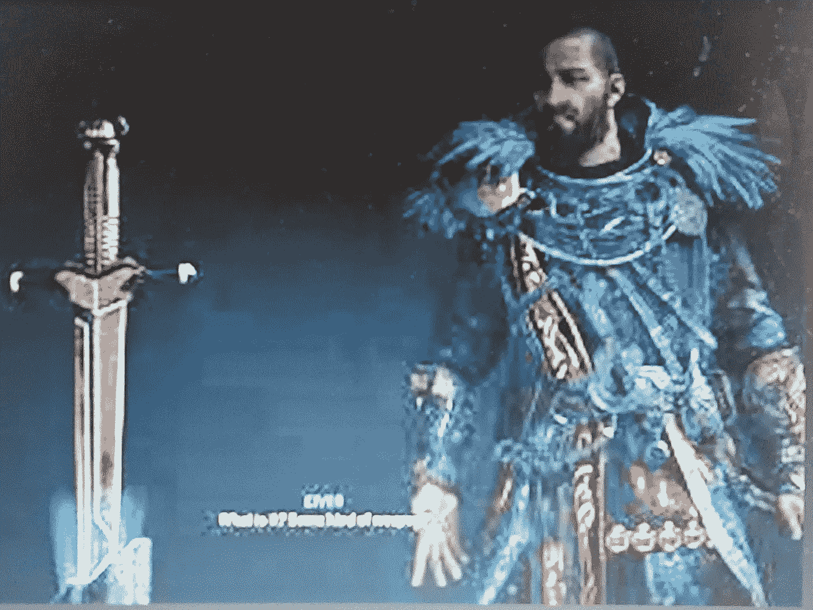

# 交流瓦尔哈拉，坟墓，炽热的剑，军械库，天啊！

> 原文：<https://medium.com/coinmonks/a-c-valhalla-tombs-blazing-sword-armory-oh-my-5070f9079605?source=collection_archive---------4----------------------->

这仅仅是在过去的两个半小时内！

Taken With My Android Phone

昨晚很晚的时候，我在马尼斯的坟墓里找到了一个惊人的发现，一把燃烧的剑。为了得到这个宝贝，我不得不穿过几个房间，解决了许多光束反射器的难题，但男孩是值得的。