# 密码领域的一连串事件。

> 原文：<https://medium.com/coinmonks/a-cascade-of-events-in-the-crypto-space-2dc149d24075?source=collection_archive---------5----------------------->

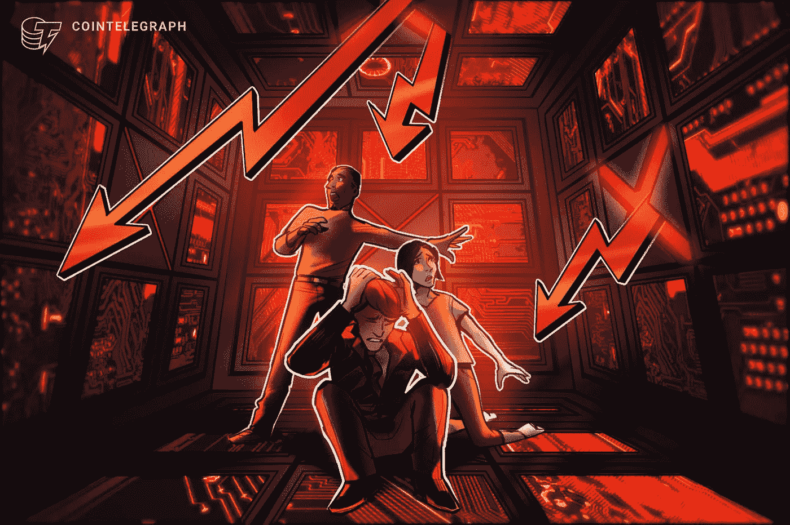

Source: [Cointelegraph](https://medium.com/u/ab02052dd327?source=post_page-----2dc149d24075--------------------------------)

考虑到大多数证券和加密货币的价格下跌，我们目前处于熊市不应该是新闻。在这个艰难的时刻，令人惊讶的是，一连串的事件会进一步加剧市场感受到的痛苦。从大型机构承担不可逾越的杠杆，到看到我们最喜爱的加密资产从“德根游戏”中暴跌，这是零售的行为特征。

> 交易新手？试试[加密交易机器人](/coinmonks/crypto-trading-bot-c2ffce8acb2a)或者[复制交易](/coinmonks/top-10-crypto-copy-trading-platforms-for-beginners-d0c37c7d698c)

在这一小段摘录中，我将尽我所能去揭开这一连串事件是如何发生的，以及它们如何影响我们这些交易者和投资者。

# 机构德根剧

三箭资本(Three Arrow Capital)是最大的加密风险投资公司之一，由于其在市场上的敞口过大，现在被认为资不抵债，正在进行全面清算。由凯尔·戴维斯(Kyle Davies)和苏竹(Su Zhu)两个以前的同学创建的风险投资。他们在自己的公寓里用 120 万美元创办了这家公司，在 AUM，他们的资产增加到了 100 亿美元。

我将要描述的这一连串事件始于 Terra，一个区块链，它的灭亡正在失去控制，似乎已经影响了大多数机构玩家。如果你想快速浏览一下地球传奇，试着翻翻我在 [**地球月球故事**](/@nwaugowalter/what-happened-to-terra-luna-5b7d8a2bed50) 上的帖子，看看那个生态系统中发生了什么。

UST 的死亡螺旋导致了卢娜价值的崩溃，而卢娜的价值被创造为无穷大。这一事件对风投和整个秘密经济造成了严重损害。Three Arrow Capital 的联合创始人凯尔戴维斯(Kyle Davies)证实，风投在 LUNA 事故中损失了 2 亿美元。有很多猜测认为 3AC 在那次崩溃后已经破产，直到独立的连锁分析师发现 3AC 已经开始抛售丽都金融控股的 ETH，stETH。

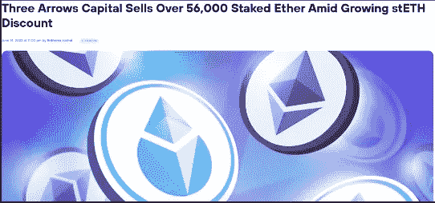

Source: [CoinDesk](https://medium.com/u/f2fa6f2d51a6?source=post_page-----2dc149d24075--------------------------------)

他们目前的困境因 3AC 在 stETH 身上的大笔赌注而变得更加糟糕。随着与以太坊平起平坐的 stETH 开始偏离其信标链，恐惧开始隐现，许多机构，如阿拉米达研究公司，开始将他们的 stETH 倾倒在曲线池中。

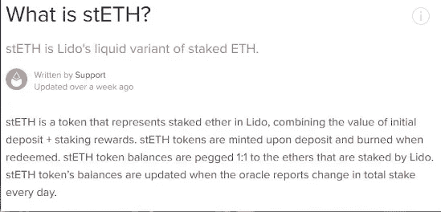

[Link to article](https://help.lido.fi/en/articles/5230610-what-is-steth)

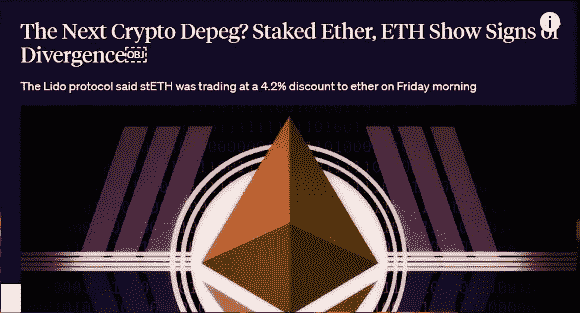

大规模抛售导致了资金池中的流动性问题，因为这些机构抛售他们的债券导致了巨大的失衡，导致散户无法出售他们的债券。因此，进一步造成市场恐慌。

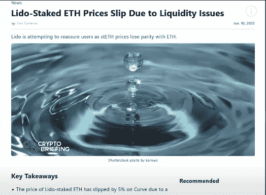

[Link to article by Webtimes](https://webtimes.uk/lido-staked-eth-prices-slip-due-to-liquidity-issues/)

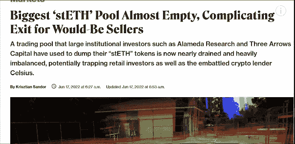

[Article from CoinDesk](https://www.coindesk.com/markets/2022/06/17/biggest-steth-pool-almost-empty-complicating-exit-for-would-be-sellers/)

许多人认为，一只通过可接受的对冲进行良好风险管理的基金，与其说是自己的资金，不如说是一个押注于德根收益率的农场。几个大的密码机构与 3AC 有联系。像 Deribit，BlockFi，Bitmex，Genesis 等。一家名为 Finblox 的值得注意的公司被曝光，并在很大程度上受到 3AC 传奇的影响，他们停止了对其平台的提款，随后将提款金额增加到每天 500 美元，每月 1500 美元。

这些事件表明，我们还没有看到 Terra LUNA 坠毁造成的全部损害。3AC 投资的其他项目也令人担忧。这可能会给该领域的大多数参与者和项目本身带来厄运，因为当 3AC 申请破产时，这些锁定/既得资金将在到期日立即被抛售，并用于支付 3AC 的贷款人。以下是 3AC 在其官网上看到的一些投资项目。

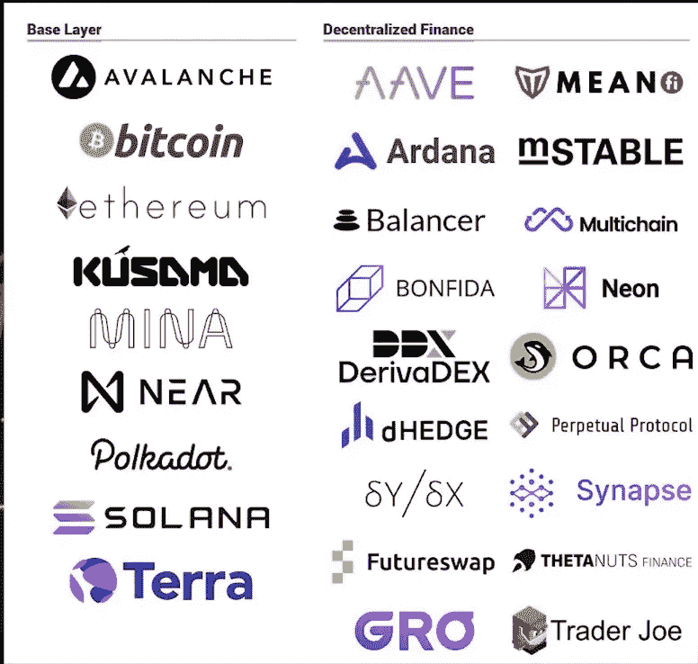

[Link to official website](https://www.threearrowscap.com/select-investments/)

当有消息称他们从 Terra 的生态系统中提取了 5 亿贷款人资金，勉强避免了崩溃时，加密货币借贷和储蓄平台 Celsius 的膝盖受到了打击。在 3AC 发行期间，他们停止了平台上的提现和互换，扰乱了加密生态系统。为了产生收益，Celsius 的商业模式需要从其用户那里接受资金，并将其借给个人、组织和特定的反欺诈协议。在幕后，大部分收益被返还给其用户。

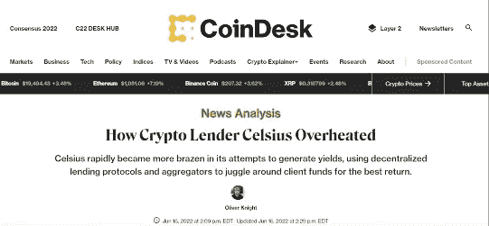

每当用户将 ETH 存入 Celsius，贷款平台就会将部分 ETH 存入丽都金融，用于 stETH，然后利用这些 ETH 赚取额外收益。没有人知道利多金融中 ETH Celsius 的确切估计值，但据 CoinDesk 报道，100 万个 ETH Celsius 中有 70%已经转化为 stETH。当 stETH 开始与 ETH 在价格上出现负差异时，问题就出现了。当 Celsius 以其在 DeFi 协议(如 Aave)中的 stETH holdings 为抵押借入数百万美元的稳定硬币，以获得额外的杠杆收益率以及其他资产时，情况变得更糟。

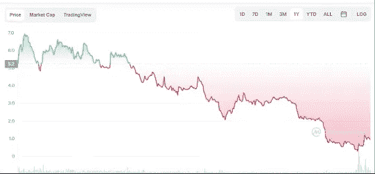

$CEL token price chart YTD

年初至今，借贷平台的象征性价格下降了近 99%,清楚地表明了这种疯狂。

Celsius 最近的下跌是寻求高风险收益的行为与利多金融的 stETH 相对于 ETH 的价格下跌相结合的结果。

最近有消息称，该借贷平台正在寻找律师，为潜在的破产做准备。

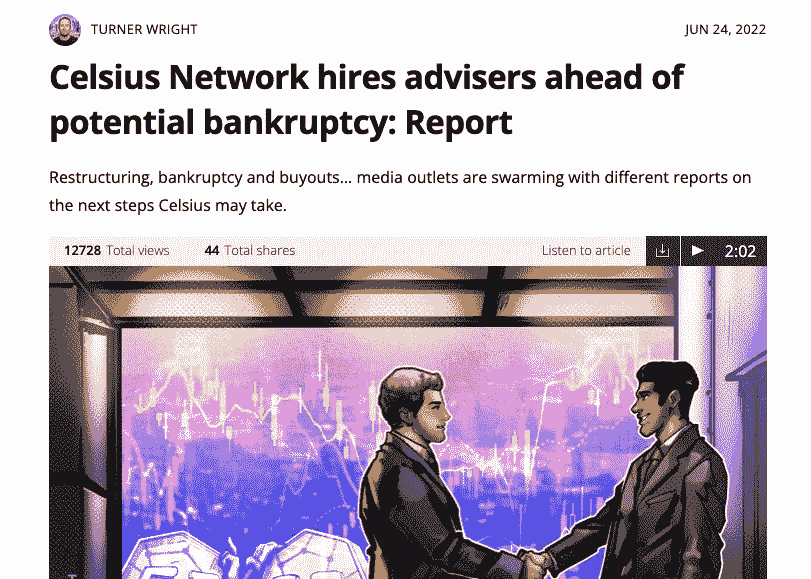

[Link to article](https://cointelegraph.com/news/celsius-network-hires-advisers-ahead-of-potential-bankruptcy-report)

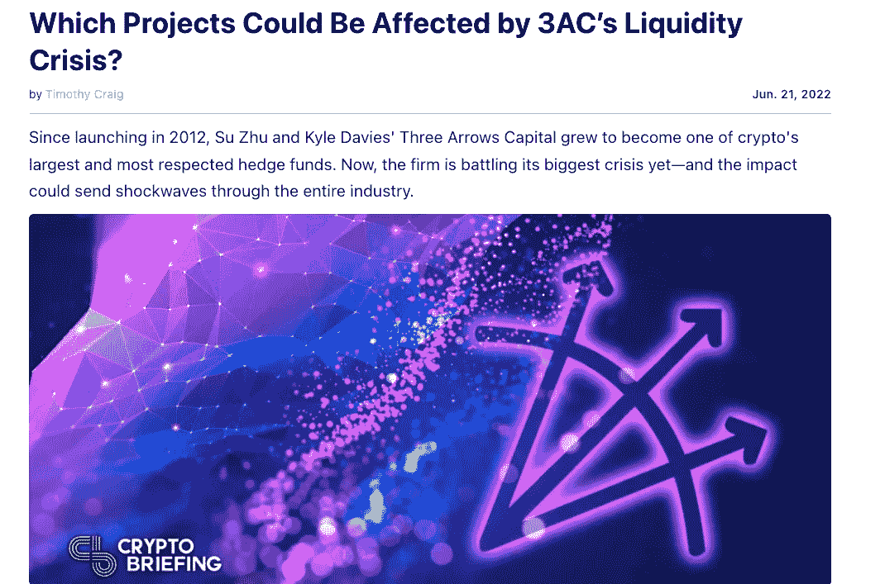

[Link to article](https://cryptobriefing.com/which-projects-could-be-affected-by-3acs-liquidity-crisis/)

这一系列事件表明了加密经济是如何联系在一起的，以及大多数加密机构将如何受到影响。从马多夫式的 3AC 吹到停止交易的贷款平台 Celsius，到像 Celsius 这样的借贷平台 BlockFi 的猜测新闻，在 3AC 和其他人的坏账上损失了数亿美元，以及 Voyager Digital 在 3AC 上内爆，还接受了 Alameda Research 的紧急贷款，到 Babel Finance 受到 3AC 传染的影响，在 saga 中损失了数十亿美元，下至 SEC 拒绝灰度 BTC ETF， 在 crypto exchange 被拒绝后的 24 小时内，gray 反过来起诉 SEC，CoinFlex 因向 Roger Ver 提供不良贷款而损失了 4700 万美元，并反过来将这些债务转换为资产，然后以 rvUSD 的形式出售给少数几家公司，以弥补损失。 这些作者将在这个平台上的未来文章中涉及更多内容。

敬请关注。