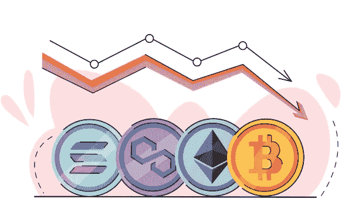
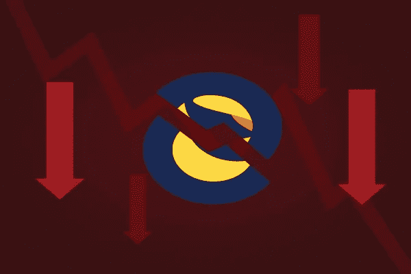

# 案例研究:尽管有如此多的宣传，为什么加密市场会崩溃

> 原文：<https://medium.com/coinmonks/a-case-study-why-is-crypto-market-crashing-inspite-of-so-much-hype-b4c817899072?source=collection_archive---------22----------------------->

## 名为 FTX 的加密货币交易所的突然崩溃将整个行业置于聚光灯下。

加密货币市场目前正处于危险地带。大多数硬币都经历了两位数百分比的损失。加密货币的整体市值已跌至**7810 亿美元，创下该行业自 2020 年 12 月以来的新低。**

**虽然有几个因素导致了 crypto 的全面衰落。这种突然下降的主要原因是 FTX 的崩溃，这是最重要的加密货币交易所之一。毫无疑问，这场崩盘令投资者痛苦不堪，并引发了广泛的恐慌。**

****

**source: vecteezy**

**自本月初以来，由于 FTX 崩盘引发市场担忧，比特币、以太坊和加密价格已经下跌。如果你现在担心加密货币的未来，你不是唯一一个。但是，是什么引发了这种下滑，哪些项目受到了最严重的打击，加密行业将何去何从？**

**在下面找到关于加密货币市场最近崩溃的一些基本问题的答案。**

# **FTX 如何一夜之间颠覆了密码世界？**

## **理论 1**

**FTX 向加密货币交易公司 Alameda Research 提供了价值数十亿美元的信贷。FTX 首席执行官萨姆·班克曼-弗里德持有多数股权。据称，阿拉米达随后利用这笔钱为高风险交易提供资金。**

**CoinDesk 还透露，阿拉米达的大部分资产是由加密货币交易所的原生代币 FTX 代币持有的。班克曼-弗里德拥有阿拉米达和 FTX，这发出了红色信号，因为阿拉米达是基于 FTX 的硬币。**

**这一消息公布后，投资者立即开始将资金撤出 FTX。然而，由于 FTX 向阿拉米达投入了如此多的资金，它需要更多的流动性让投资者撤资。**

**这给 FTX 留下了大约 80 亿美元的赤字。证券交易所最近根据第 11 章提交了破产申请，班克曼-弗里德也递交了辞呈。**

## **理论 2**

**在 CoinDesk 发表一篇质疑 FTX 金融稳定性的文章之前的几天，该交易所平台照常运营。很快，破产的谣言流传开来，让投资者陷入疯狂。正因为如此，许多投资者开始从平台上撤资，导致抛售。**

****

**source: freepik**

**无独有偶，另一家加密货币交易所币安表示，将在 [**清算其在 FTT**](https://www.investopedia.com/binance-to-sell-ftt-6826211)的所有股份。当时的资产价值惊人**5 亿美元。FTX 交易所使用自己的硬币，用 FTT 符号表示。这些事件的结合导致了 FTT 的垮台。****

****[**token 的价格从 11 月 7 日晚些时候的大约 22.79 美元下跌到 11 月 8 日中午的大约 15.04 美元。由于 FTT 价值下跌导致的权衡效应，整个市场进入红色。在币安宣布打算收购 FTX 后，局势进一步恶化。**](https://decrypt.co/113838/ftx-exchanges-native-token-plummets-below-22-binance-led-selling-continues)****

****消息发布后，FTT 价格从 11 月 8 日晚些时候的 19.01 美元暴跌至 11 月 9 日早些时候的 3.59 美元。幸运的是，币安收购的消息最终平息了投资者的恐惧。之后，FTT 出现复苏迹象，几小时后攀升至 5 美元区间。****

****出乎意料的是，币安在 11 月 9 日退出了交易，导致 FTT 股价暴跌。其当前价格[**【1.60 美元**](https://coinmarketcap.com/currencies/ftx-token/) ，与上周交易发生的同一时间相比下降了 95%。FTX 股市崩盘看起来很像 5 月份的 Terra 崩盘，那次崩盘也导致了市场下跌。****

****目前，存在类似的情况，前 100 名中的大多数硬币显示红色价格，有些甚至显示两位数的损失。****

# ****2022 年 5 月的 Terra-Luna 坠毁****

********

****source: freepik****

****加密货币崩溃的最终原因是 2022 年 5 月发生在 Terra 周围的事情。 [**Terra 是一种稳定货币**](https://www.investopedia.com/terra-5209502#:~:text=Terra%20is%20an%20open%2Dsource,of%20currencies%20or%20other%20assets.) ，旨在通过保持相对稳定来减少加密货币市场的价格波动。****

****然而，Terra 不像其他稳定的货币，因为它没有像美元或黄金这样的东西支持。相反，这种货币的稳定性依赖于一种姊妹加密货币 Luna 的算法。****

****当 [**Luna 的价格从月初的差不多 80 美元降到不到两美分的时候**](https://www.coindesk.com/markets/2022/05/11/terras-luna-drops-to-under-8-after-90-weekly-plunge/) ，Terra 的价格也下跌了。Terra-Luna 灾难在市场上造成了广泛的恐惧，并在消费者中播下了不信任的种子。****

****据报道，投资者希望他们存储在交易所或银行的加密货币转移到他们的个人钱包中。许多持有客户存款的银行负债过多，因为它们获得了大量加密货币贷款。****

********

****source: freepik****

****随着时间的推移，许多大公司因为资产无法覆盖负债而破产，就像银行遭遇挤兑一样。****

# ****未来市场会出现更严重的崩盘吗？****

****因为 [**FTX 及其关联公司已经申请破产**](https://www.forbes.com/advisor/investing/cryptocurrency/ftx-declares-bankruptcy/) ，要从他们那里讨回钱很难，而且需要很长时间。如果是这样的话，那么这种影响将通过市场一路感受到。随后市场崩盘的可能性非常大。****

****加密货币借贷平台 Blockfi 已经披露将无法继续照常运营。根据条款和条件的要求，停止客户提款。参与该项目的人以及任何投资 FTX 的投资者或企业都将受到影响。****

********

****source: freepik****

****支付账单和员工工资的能力将因此受到负面影响。这场悲剧对加密货币市场的负面影响可能超过今年早些时候的特拉·卢纳-USDT 灾难。****

****此外，如果比特币价格进一步下跌，矿商可能会被迫清算他们持有的 BTC 股票，以支付运营成本。最好的行动是深呼吸，评估形势，谨慎地进行任何财务决策。****

****加密货币市场经历周期。如果过去的数据是可信的，它们应该会比现在好，但他们仍在确定这需要多长时间。****

# ****结果****

****即使是巨人也可能失败。它们越大，撞击地面的力度就越大。FTX 灾难是对这一事实的及时和重要的提醒。FTX 崩盘打破了比特币行业的许多神话，并教会投资者小心使用自己的钱。****

****它显示了拥有开放的、高杠杆的系统是多么重要，这些系统能够以可控的方式被关闭。具有讽刺意味的是，这强调了密码监管的必要性，以保护用户和投资者免受市场上不诚实个人的影响。****

****此外，这种危机影响整个市场，同时削弱投资者的信心。还有，这是今年第二次发生这种事情了。密码世界以前经历过更糟糕的灾难。****

****很不幸，但是冬天过后总是春天。让我们抱最好的希望吧！！****

****我真的希望你喜欢这篇文章，如果你有任何问题，请不要犹豫，在下面的评论区提问👇🏻****

****我很想知道你的想法。如果你喜欢这篇文章，并希望我为你的公司写作，请随时通过*联系我，即使只是询问一些事情。*****

> *****交易新手？试试[密码交易机器人](/coinmonks/crypto-trading-bot-c2ffce8acb2a)或[复制交易](/coinmonks/top-10-crypto-copy-trading-platforms-for-beginners-d0c37c7d698c)*****