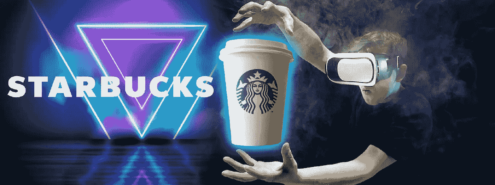
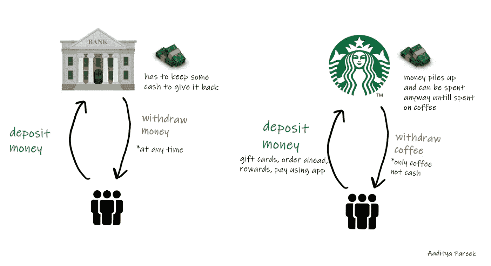

# 一家在 2022 年赚了 32 亿美元的咖啡公司刚刚加入了 Web3 游戏。

> 原文：<https://medium.com/coinmonks/a-coffee-company-that-made-32b-in-2022-just-joined-the-web3-game-9332dd4843e9?source=collection_archive---------36----------------------->

Coffee x Metaverse coming to all 34,317 Starbucks near you.

星巴克推出了 Starbucks Odyssey，这是其首次尝试利用 web3 技术增强顾客体验。

见鬼，是时候了。

当 LV、耐克、阿迪达斯和许多其他巨头品牌进入元宇宙并开始拥抱 Web3 时，星巴克紧随其后只是时间问题。

星巴克在全球拥有超过 1 亿名顾客。

他们在 2022 年赚了 319.8 亿美元。

截至 2022 年 1 月 2 日，星巴克在全球有 34，317 家门店，仅次于美国的 17，000 家。

是的，他们是规模的大师。

地球上的咖啡之王。

他们的规模和影响力令人难以置信。

我不知道有哪个朋友之前没听说过星巴克这个名字。

Starbucks is an unconventional bank holding nearly $1.5B in deposits.

更好的是，当他们在 2016 年开始他们的移动应用程序上的忠诚度计划时，他们创建了一个本质上的虚拟银行。

数以百万计的用户现在向应用程序预付并存入信用点数，以购买咖啡和小吃。

欢迎来到星巴克，一家出售咖啡的“银行”。这家豪华咖啡机制造商在 2021 年第四季度持有约 15 亿美元的预载资金。如果你认为 15 亿美元不是一个大数目；美国 85%以上的银行资产不到 10 亿美元。”

太神奇了。

现在，他们加入了许多其他人的行列，一头扎进了 web3 的兔子洞。

“该公司昨天推出了星巴克奥德赛计划，这是一个使用 Polygon 的平台，一个以太坊网络，喝咖啡的人可以用他们现有的计划证书登录，玩游戏或接受挑战，以赚取不可替代的代币。”

他们甚至给了我们的 NFTs“旅程印章”，用户可以像玩游戏一样玩下去。

Starbucks finally enters the metaverse.

将体验游戏化，Web3 风格。

他们为可能不了解 Web3 的最终用户简化了它。

他们捆绑价格，并“隐藏”复杂因素，如汽油费和从菲亚特到加密的过渡。

我赞扬这种方法。

世界上 95%的人不知道如何进行加密支付(设置钱包、种子短语、了解汽油费、不同的层次、什么是地址。等等)。

对于任何有兴趣将 web2 原生程序引入 web3 的人来说，简化应该是北极星。

Starbucks is the first F&B company to dive into web3, but it won’t be the last.

我是说，我们有必要喝一杯咖啡吗？

不完全是。

但是，如果我们已经为你定制的咖啡饮料支付了 6-12 美元，为什么不从中获得非功能性食物和一些有趣的东西呢？

在未来，我希望一切会更简单。

每个人都会有一个私人的、受保护的 web3 钱包。

他们所要做的就是连接到星巴克或阿迪达斯或任何品牌的 web3 网站，还有 viola！

他们所有的个性化信息和品牌历史都可以被即时访问和识别。

不需要登录几十次，回忆密码，摸索另一个应用程序，试图记住你前几天从哪个品牌买了什么。

它简化了用户的旅程。

这是革命性的。

-

你喝星巴克吗？

-

# startups # business # startupx # growth # success # social media # culture # entrepreneur # strategy # eth # BTC # crypto # opensea # Howard Schultz # coffee # NFT #星巴克# nftmarket # journey #钱包

> 交易新手？试试[加密交易机器人](/coinmonks/crypto-trading-bot-c2ffce8acb2a)或者[复制交易](/coinmonks/top-10-crypto-copy-trading-platforms-for-beginners-d0c37c7d698c)