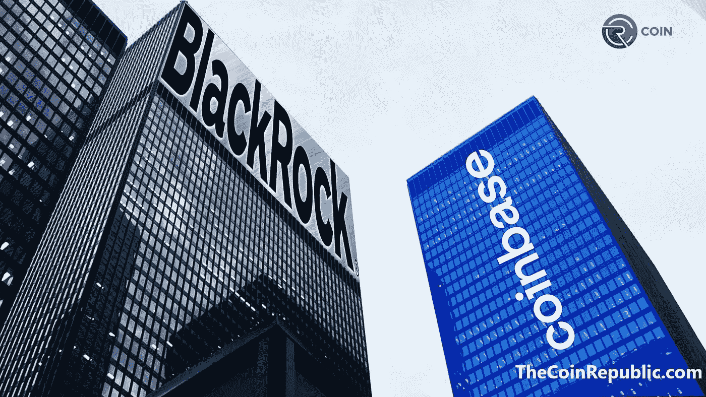
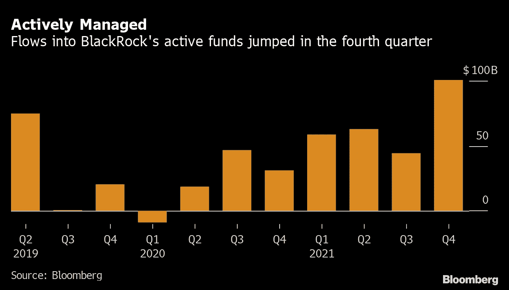

# 一家管理着 10 万亿美元资产的公司也进入了加密领域。

> 原文：<https://medium.com/coinmonks/a-company-managing-10-trillion-dollars-is-getting-into-crypto-too-d1ab7edfde3c?source=collection_archive---------51----------------------->

BlackRock, the world’s largest asset manager, teamed up with crypto exchange Coinbase in August in a move that both Wall Street and the crypto industry are watching closely.

不是十亿，是万亿。

"比特币基地和贝莱德联手让机构投资者有更多机会接触加密货币."

这是什么意思？

意味着贝莱德的客户可以随时直接、轻松、灵活地买卖加密货币。

为什么这是一件大事？

贝莱德管理着价值 10 万亿美元的资产。

比特币基地是世界上最大的密码交易所和玩家之一。

当两个行业巨头碰撞或合作时，市场将会发生变化。

Has the crypto market gone mainstream?

从本质上说，这意味着大型机构的资金正在流入 crypto。

是的，即使在熊市，冬季市场。

当更多的钱流入任何一个行业，会发生什么？

它刺激和激发增长，更多的需求，兴奋和兴趣。

这是工业如何建立，经济如何变得更强大。

这意味着，被压抑的需求之大，足以让贝莱德做出这样的举动。

这意味着 crypto 向主街又迈进了一步。

它不再是无人愿意偶然走进的孤独、黑暗的小巷。

贝莱德的这一举动也向其它金融机构和企业发出了一个强有力的信号。

它说，法庭上最大的男孩之一贝莱德对加密货币很有信心，并支持它。

BlackRock Assets Hit Record $10 Trillion.

贝莱德的客户是谁？

官方机构、央行、主权财富基金、多边实体、公共养老金计划、政府部委和机构、企业养老金、基金会和捐赠基金以及家族理财室。

即使他们只是将现有投资组合的 0.5%投入到 crypto 或 BTC，你能想象这会引起多大的波澜吗？

看着其他人很快开始跟随他们的脚步。

我知道我们中的许多人仍然对加密持怀疑态度，因为 NFTs、诈骗、诈骗、崩溃和欺诈正在发生。

但是就像生活一样，并不是所有的东西都是不好的。

比特币等数字资产和区块链的现实世界应用都有一些有用的案例。

甚至像贝莱德这样的金融机构中最聪明、最聪明、最富有的人也支持 crypto。

那里一定有什么东西。

不要睡在上面。

-

加密成为主流了吗？

-

# startups # business # startupx # growth # success # social media # culture # web 3 # strategy # hacks # eth # BTC # crypto # black rock # financial institutions # bank #退休金#基金#信仰

> 交易新手？试试[密码交易机器人](/coinmonks/crypto-trading-bot-c2ffce8acb2a)或者[复制交易](/coinmonks/top-10-crypto-copy-trading-platforms-for-beginners-d0c37c7d698c)