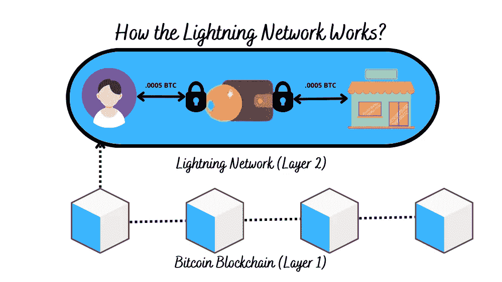

# 比特币闪电网络完全指南

> 原文：<https://medium.com/coinmonks/a-complete-guide-on-the-lightning-network-in-bitcoin-37eda00434a3?source=collection_archive---------2----------------------->

闪电网络旨在解决比特币区块链的可扩展性问题，可以帮助用户几乎免费地发送或接收比特币。双方之间的交易发生在链外/第 2 层。闪电网络是帮助解决比特币区块链问题的最有前途的创新，在这篇博客中，我将解释你应该知道的关于闪电网络的一切

# 什么是闪电网？

闪电网络是比特币网络的第二层，众所周知，它可以处理链外交易。外链交易发生在双方之间。Lightning 网络通道使双方之间的交易更加容易，双方可以相互发送或接收交易。比特币区块链的可扩展性可以通过闪电网络得到增强，因为它运行在比特币区块链的第二层。

可扩展性是制约比特币区块链适当扩展的障碍，而收取低费用和离线结算交易的闪电网络帮助了比特币区块链。此外，闪电网络已经解决了创建小额支付的问题，如现在可以用密码购买咖啡，这加快了处理时间，减少了与比特币区块链相关的费用。

尽管闪电网络解决了比特币区块链的可扩展性问题，但一些问题仍有待解决:恶意攻击和低路由费用。

# 闪电网络的创始人-

Thaddeus Dryja 和 Joseph Poon 是两位研究人员，他们在 2015 年题为“[比特币闪电网络](https://lightning.network/lightning-network-paper.pdf)”的论文中提出了闪电网络。比特币区块链的匿名创始人中本聪对支付渠道进行了讨论。中本聪对支付渠道的讨论与他的开发伙伴迈克·赫恩分享，后来，该讨论于 2013 年发表。

2016 年，Dryja 和 Poon 成立了 Lightning Labs，还有其他一些贡献者，他们都专注于开发 Lightning 网络。最后，通过各种改变，闪电网络变得与比特币区块链兼容。

基于 SegWit 的软 fork 于 2017 年在比特币下推出，旨在为更多交易释放每个区块下的空间，并消除一个名为交易延展性的 bug。在这个 bug 的帮助下，用户可以向网络撒谎，伪造交易，并在钱包中保留比特币。

2018 年，闪电实验室在比特币 Mainnet 上推出了其闪电网络的第一个测试版。因此，推特创始人杰克·多西开始参与这个项目。

# 闪电网络-当前状态-

自 2018 年首次推出测试版以来，闪电网络的增长令人印象深刻。

截至 2022 年 8 月 14 日，闪电网络已经提升了超过 [17，796 个在线节点、87，122 个活跃信道和超过 4，589 个 BTC](https://1ml.com/) 容量。

与 2021 年中期相比，数字 4，589 BTC 超过了 300%，反映了闪电网络的爆炸式增长。

[Twitter](https://blog.twitter.com/en_us/topics/product/2021/bringing-tips-to-everyone) 推出了一项名为 Tips 的新小费功能，可以使用 [Strike](https://strike.me/) 通过闪电网络用比特币支付小费，这是一个建立在闪电网络上的支付平台，允许用户在双方之间发送和接收比特币。

而且，比特币每秒只能处理 7 笔交易(TPS)。但是，Lightning 网络通过实现每秒 100 万次交易帮助解决了这些限制。

# 什么是闪电节点？

闪电网络节点的责任是监控它持有令牌的基础区块链。如果闪电网络未能履行这一责任，用户的资金可能被盗。

此外，闪电网络节点的责任是跟踪谁在闪电网络下的支付通道中持有什么。

# 闪电网节点和比特币节点有什么区别？

闪电网络节点验证用户之间交易的有效性。并且比特币节点验证在比特币网络上执行的不同交易。

# 闪电网络的升级-

Lightning Labs 发布了 Lightning 网络守护程序(Ind)的测试版升级，这是 Lightning node 的一个实现。它包括最新的协议升级，包括 [Taproot 和 Musig2](https://cointelegraph.com/news/breaking-the-bitcoin-network-welcomes-taproot-soft-fork-upgrade) ，使其成为 0.15 测试版。

Ind 是 Lightning Network 下的一个组件，它处理各种方面，如生成支付发票、管理数据库、撤销支付等。最新的更新旨在帮助开发者在比特币的闪电网络下创建解决方案。

# 闪电网络下的有条件智能合同-

哈希时锁合同(HTLC)是闪电网络下的一个有条件合同。使用散列时间锁合约(HTLC)降低了交易对手风险，因为这种智能合约是基于时间的托管，需要密码才能访问资金。

简而言之，用户必须执行两个操作来访问资金——输入正确的密码短语并在特定时间内申领资金。如果用户输入不正确的密码短语，或者在申请资金时出现延迟，他们可能会失去资金。

# 比特币可扩展性问题-

随着比特币开始流行，更多的交易开始在区块链发生。区块链是一种共享数据库的技术，允许参与者检查他们在[分布式账本](https://www.investopedia.com/terms/d/distributed-ledgers.asp)下记录的交易。比特币区块链上进行的交易被称为[链上交易](https://www.investopedia.com/terms/c/chain-transactions-cryptocurrency.asp)。

尽管每个用户或节点都会收到事务的副本，但每个挖掘器都会验证所有事务，因此，在高事务量期间，这些事务可能会导致系统停机。

因此，比特币面临着可扩展性问题，这意味着当网络上发生更多交易时就会出现问题。因此，如果比特币需要处理更多数据，网络需要扩展，它可以允许更多交易高效处理。

# 闪电网络协议是如何工作的？

闪电网络协议提供了两个不同方之间的对等支付通道。一旦在双方之间建立了通道，支付通道允许无限制的、便宜的、即时的交易。闪电网络为其交易充当自己的分类账，这些交易可能是任何较小的商品或服务，这些交易不会影响比特币网络。

用户可以通过在网络中锁定一定数量的比特币来创建支付通道。一旦比特币被锁定在网络中，用户就可以按照自己认为合适的金额开具发票。如果用户希望保持支付渠道的持续，他们必须始终如一地添加比特币。

在闪电网络的帮助下，双方可以在不通知比特币区块链的情况下进行交易。因为区块链中的所有事务不需要所有节点的批准，所以这种策略加快了事务处理时间。闪电网络节点的路由交易是通过结合双方的支付渠道形成的。因此，闪电网被称为将许多支付渠道联系在一起。

一旦交易完成，双方可以关闭支付通道。支付通道上的数据库被合并到一个交易中，并被发送到比特币 mainnet 进行记录。将几十个小事务组合在一个事务下有助于节点在更短的时间内验证事务。此外，如果没有支付渠道，小额交易会阻碍大额交易，导致网络拥塞，需要更多节点进行验证。

智能合同是在使用闪电网络时在双方之间创建的。协议规则不可违反，因为它们已写入合同中。一旦用户事先同意了需求，就创建了契约，智能契约确保契约的履行变得自动化。一旦这些合同要求得到满足，比如客户支付交易金额，合同履行就会自动完成，而不需要任何第三方的帮助。一旦支付渠道在闪电网络下得到验证，交易就变成匿名的了。没有人能看到单笔交易，但只能看到总的转账金额。

在没有对比特币区块链的链外/层 2 的任何限制的情况下，交易是可能的。离线交易是可信的，因为一旦交易完成，一旦支付通道关闭，组合数据就会被发送到比特币区块链主网上进行记录。由于第二层/链外协议有自己的分类账，分类账总是集成回比特币区块链的主网。

# 雷电网络下瞭望塔的重要性-

瞭望塔充当区块链的保护者，并识别在闪电网络下的信道内欺骗其他用户的恶意用户。此外，瞭望塔代表用户全天候监控比特币区块链。这有助于用户，他们是安全的，不能被任何人欺骗，当他们离线。

瞭望塔是一个由第三方组成的生态系统，用户利用它进行链上交易，这与他们的闪电渠道有关。

对于了望塔的服务，他们从用户那里收取费用，并且可以部署两种现有的货币化方法。这两种货币化方法是订阅服务和罚款交易费。

随着瞭望塔的最新发展，它们在具有伸缩性的雷电网络中发挥着至关重要的作用。

# 闪电网络的三个问题-

尽管闪电网络通过将交易从链外/第二层移除来解决比特币区块链问题，因此它可以处理双方之间的微支付。

但是，闪电网络并没有解决比特币区块链的全部问题，它带来了三个问题

## 1.打开和关闭闪电网络中的通道-

开通和关闭渠道在双方闪电网下分成两个成本。虽然闪电网络提供双方之间的无限交易，但开户交易或存款必须通过比特币网络上的链上交易进行。

双方可以在支付通道上进行多次交易。一旦交易结算，用户想要关闭支付通道，结算交易必须记录在比特币区块链上结算的金额。

## 2.路由费用-

除了开通和关闭支付通道所需的交易费之外，在通道之间转移支付还需要另一项费用，即路由费。

## 3.节点的敏感度-

为了发送和接收付款，Lightning 网络上的节点应该始终在线。由于用户使用私钥来登录，因此，存在硬币被盗的可能性，并且如果存储私钥的计算机被泄露，将存在风险。

闪电网络提供了存储加密货币资产最安全的方法:[冷藏](https://www.investopedia.com/terms/c/cold-storage.asp)。

# 关闭支付通道的 3 种方式-

您可以通过 3 种方式关闭闪电网下的支付通道-

## 1.合作—

如果支付通道中的一方在闪电网发起通道关闭，另一方认可。然后就没有时间锁了，一旦确认审批，钱就准备花了。选择支付渠道的最佳方式之一是在闪电网。

## **2。单边—**

如果一方想要关闭通道，那么即使对方不认可，该方也可以在闪电网发起关闭支付通道。这导致一个时间锁，另一方可以对被称为“违约补救”的关闭提出异议。但如果对方不反对关闭，一旦时间锁定到期，资金将可以自由使用。这也是一种可以接受的关闭闪电网支付通道的方式。

## **3。违约救济—**

作为闪电网络，交易是有时间戳的。存在一方试图通过单方面关闭支付通道来欺骗另一方或违反信任的可能性。这一行动导致时间锁定，在此期间，被骗的一方可以收回他们的资金，并使用“违约救济”交换整个支付渠道。

# 闪电网络的利与弊

## 闪电网络的优点-

闪电网络最重要的优点是交易更便宜、更快，可以实现微支付。如果没有闪电网络，用户甚至需要等待一个小时来验证一个简单的交易，并且必须在比特币区块链上支付高额费用。每一笔小交易都伴随着更长的等待时间，因为矿商会批准更大的交易，因为它们为开采区块提供了更大的回报。

闪电网络受益于比特币区块链协议，因为闪电网络是第二层或处理链外交易。这意味着用户可以使用比特币网络进行更大的交易，也可以使用闪电网络进行更小的交易，而不用担心安全问题。闪电网络支付通道还提供私人交易，这意味着其他用户只能看到整体套餐，而个人交易是隐藏的。

[原子互换](https://bitcoinist.com/first-ever-cross-chain-atomic-swap-between-bitcoin-and-litecoin-has-now-taken-place/)是一种在没有第三方参与的情况下，在独立的区块链之间交换加密货币的技术。与加密货币交换相比，原子互换是有帮助的，并且提供即时交换，几乎没有费用或钱包转账。

## 闪电网络的缺点-

用户应该有一个兼容的钱包，以利用闪电网络。为闪电网络找到一个钱包很容易，但初始资金必须通过比特币钱包来完成，这需要收费。因此，要使用闪电网络钱包，用户必须从比特币钱包中丢失一些比特币。一旦资金转移到闪电网络钱包，用户必须锁定他们的比特币资金，以创建一个支付通道。

在不同的钱包之间发送比特币资金可能会很烦人，因此许多新用户都在避免这样做。虽然一些钱包可以管理链上/第一层和链下/第二层交易而无需付费，但随着时间的推移，这将提高便利性。

如果用户决定从闪电网络中的支付通道拉回一些资金，那么用户必须关闭支付通道，然后他才能收到资金。但是，用户不可能从现有资金中提取一些资金，并保持支付渠道畅通。

闪电网络的一个主要问题是离线交易。如果一方在另一方离线时关闭支付通道，触发关闭的一方可以窃取资金。

此外，Lightning 网络中也存在漏洞，例如支付停滞，这意味着传出的交易不会进行验证。虽然比特币网络可以退还卡住的付款，但这可能需要几天时间，因为优先考虑的是有效交易，而不是卡住的交易。

# 结束语-

我们可以看到闪电网络自 2018 年推出以来的大规模增长，如果未来闪电网络继续增长，将会有更多钱包开发者集成闪电网络支持的需求。这可以加快闪电网络下的交易时间。

你对闪电网未来的成长有什么想法？

> 交易新手？试试[加密交易机器人](/coinmonks/crypto-trading-bot-c2ffce8acb2a)或者[复制交易](/coinmonks/top-10-crypto-copy-trading-platforms-for-beginners-d0c37c7d698c)