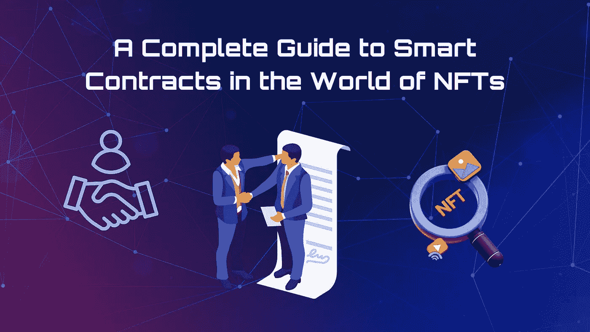

# 非金融交易领域智能合约完全指南

> 原文：<https://medium.com/coinmonks/a-complete-guide-to-smart-contracts-in-the-world-of-nfts-a8771e6ccc80?source=collection_archive---------25----------------------->

虽然世界各地都见证了 T2 NFT 现象的快速发展，但对于许多新 NFT 爱好者来说，推动非功能性思维的一些基本要素仍然是神秘的。由于所有的 NFT 都采用在加密货币区块链上记录和验证的识别码和信息，区块链上的每个 NFT 都是独特的资产。与加密货币不同，NFT 是不可替代的，因为它们不能按平价交易或交换。它们通常是独一无二的，或者可用性有限，而其他数字资产可以无限供应。因此，NFT 从数字资产的稀有性中获得价值。

# **什么是智能合约？**

在[铸造](/@orbis86/the-complete-step-by-step-guide-on-how-to-mint-nfts-8af3e691cdcb?source=user_profile---------35----------------------------)过程中，区块链上的 NFT 使用智能合约创建，该技术使它们能够保持其合法性、唯一性和安全性。根据智能合同的定义，它是一种自我实现的程序或协议，其中协议的条款直接包含在计算机代码行中，以帮助协议的实现。

智能合同也记录在区块链上，并在满足特定条件时自动执行特定操作，作为达成销售协议的基本工具。智能合同包含有关 NFT 的详细信息，例如谁创建了它，每次出售时都欠谁版税，以及历史上谁拥有它。大多数 NFT 没有保存在区块链上，因为这样做成本高并且使用大量电力。因此，智能合约通常包含一个链接，指向它们所代表的 NFT，只有所有者才能访问该链接。

在分散设置中，两个人可以通过使用智能合同代替通常的中间人来进行交易。智能合约已经被区块链利用，例如[比特币](https://bitcoin.org/en/)和[以太坊](https://ethereum.org/en/)，以加速交易和自动化程序。

那么什么定义智能合同为“智能”呢？这些代码行简化了操作并消除了人为错误，从而减少了传统合同的时间和费用。除了减少人为错误，智能合同还提供了对区块链行业至关重要的额外优势。

# **智能合约在 NFT 世界发挥着至关重要的作用**

实施智能合同的一些好处包括:

*   它们通过促进无信任系统中的交易，使各方无需相互了解或信任即可参与。
*   他们通过消除对中间人和文书工作的需要来减少开支和提高速度。
*   它们更加安全，因为它们在部署后无法更改。
*   当智能合约在任何公共区块链上使用时，每个人都可以看到它们，并且它们是透明的。
*   它们适用于各种目的，因为它们可以在使用前定制。
*   他们只执行为他们设计的任务，因为它们是确定性的。
*   人为错误是不可能的，因为它们是自动化的。

尽管如此，与常规合同不同，智能合同仍然没有法律约束力。因此，虽然这些代码行有助于在区块链上执行结果，但它们无法实施链外协议。

# **利用智能合约创建 NFT**

NFT 是通过一种称为“铸造”的过程制作的，这需要将图片、电影、声音片段和其他数字媒体转换为区块链上的加密资产。实质上，您在创建 NFT 时配置了智能合约的代码，该代码决定了您的加密资产的特征。已经为智能合约设计了许多标准，以保证 NFTs 可以很容易地与应用程序通信。例如，众多智能合约区块链如 [TRON](https://tron.network/) 、 [EOS](https://eos.io/) 、 [Tezos](https://tezos.com/) 提供 NFT 创作工具。如果对于智能合约以及最终的非交易平台应该如何构建，没有一致认可的标准，那么在其它平台上创建的非交易平台就不能在同一个 NFT 市场上交易。

# **使用智能合约创建 NFT 的标准**

作为以太坊上存在的第一个 NFT 标准，ERC-721 是加密世界中最流行的标准之一。它被广泛用于生产和推出 NFTs，因为它是 NFT 造币行业的先驱之一。ERC-721 规定所有的令牌必须是不可替换的，并且有不同的令牌 id，这可能不是其他标准的先决条件。除了 ERC-721，还有另一个标准，ERC-1155 标准，主要用于 NFT 博彩业。它既支持可替换的资产，如游戏中的货币，也支持不可替换的资产，如限量版皮肤。

# **智能合同在元宇宙的作用**

元宇宙是一个连接现实、虚拟和金融世界的 3D 数字环境，包括 NFTs、加密货币和区块链游戏。鉴于智能合约构成了非功能性交易的支柱，它们成为创造元宇宙的重要工具也就不足为奇了。例如，智能合同可能能够在现有的元宇宙中维持 NFT 游戏和艺术。智能合约还可以用来简化货币交易，消除对中间人的需求，解决元宇宙互动的许多挑战。

# **所有权和真实性**

数据认证和所有权强制是使用智能合约创建 NFT 的两个好处。当托管在公共区块链上时，任何人都可以访问关于这些 NFT 的所有权和创建时间的信息。教育机构可以向开放区块链的学生提供独特的非功能性外语教学，作为一种数字学位的形式。希望招聘学生的雇主可以使用适用的 block explorer 进行搜索，以确认候选人学位的有效性。任何人都可以使用这个搜索引擎访问存储在区块链上的公共信息。

这也可能包括 NFT 许可证。NFT 的新持有者可以快速生成对图像或音乐文件的转让权利的记录。任何人都可以检查所有权以及授予购买者的特权。

# **防止侵权和欺诈**

智能合同也有助于利用非功能性技术打击剽窃和盗版。智能合约可以自动验证 NFT 或令牌的创建时间和位置，因为它们是在区块链上创建的，特别是第一个登录的钱包地址。此外，智能合同可以跟踪创意作品的所有权，阻止虚假认证，并帮助消除假冒产品。例如，如果这些项目不满足特定要求，它们可能会被自动过滤掉。

# **促进商业交易**

使用智能合同可以提高公司交易的速度和安全性。当双方签订智能合同时，一旦条件得到满足，预定义的结果就会得到保证。消除与信任相关的延迟使交易过程更加有效。智能合同可以通过在合同条件得到满足时自动执行交易，向可能不信任彼此的各方保证。

想想[买房](/@orbis86/how-nfts-can-revolutionise-the-real-estate-industry-6bf19fa0c72a?source=user_profile---------8----------------------------)的程序。智能合同可以同时向卖方支付款项，并在买方满足所有条件(包括成功的首期付款和信用检查)后，立即将所有权转让给买方。地契的转让可能是交易的一部分，也记录在区块链上，以便于核实。

# **结论**

由于智能合同可以针对各种领域和需求进行专门定制，因此几乎可以在任何业务中使用。随着 NFT 应用的增加和元宇宙的增长，智能合同的重要性预计会增加，因为它们是当今增长最快的数字资产类别之一的基础。

> 交易新手？试试[密码交易机器人](/coinmonks/crypto-trading-bot-c2ffce8acb2a)或[复制交易](/coinmonks/top-10-crypto-copy-trading-platforms-for-beginners-d0c37c7d698c)