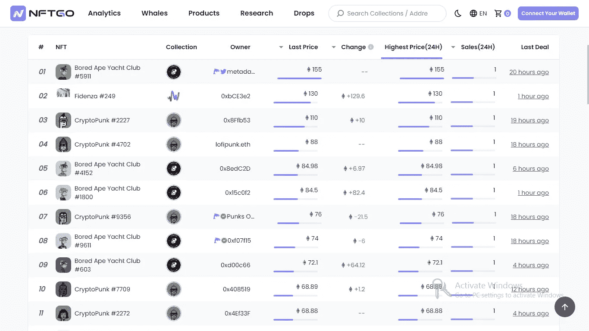
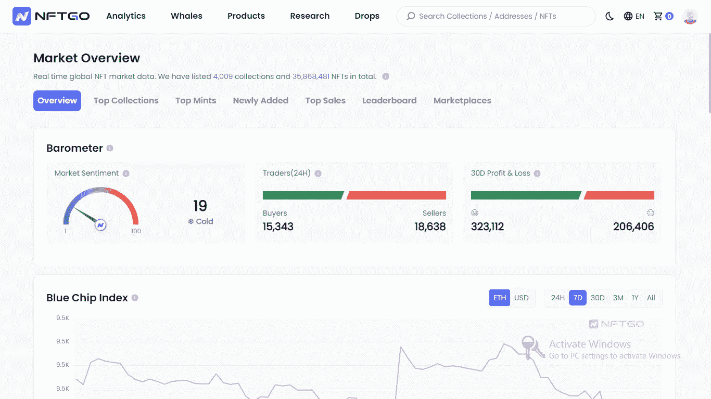
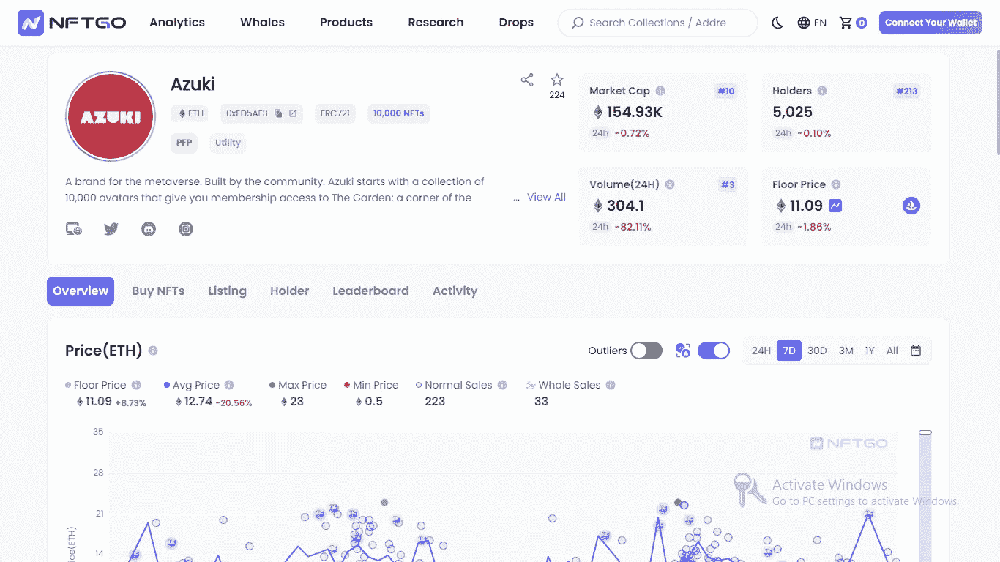
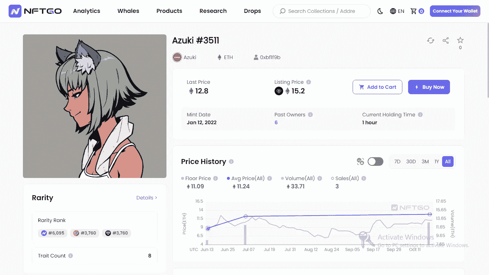
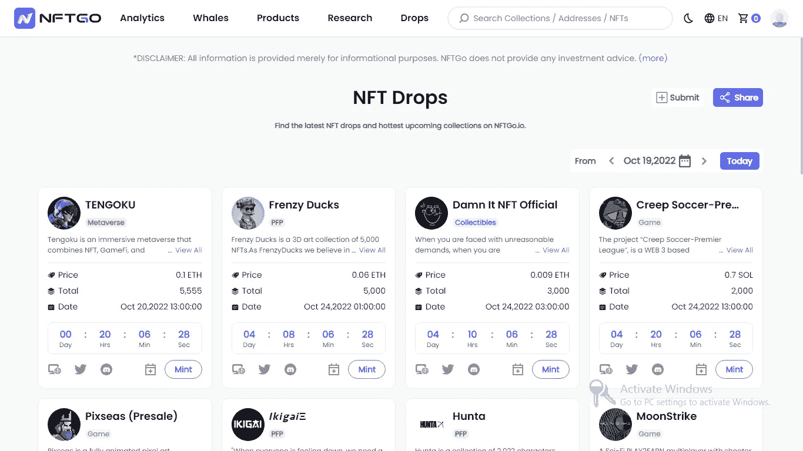
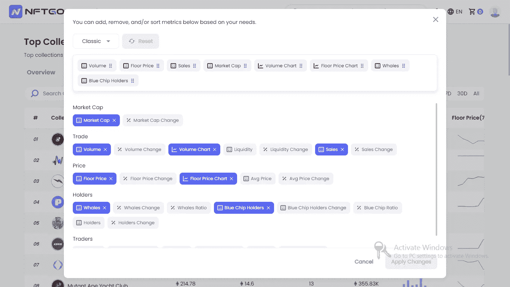
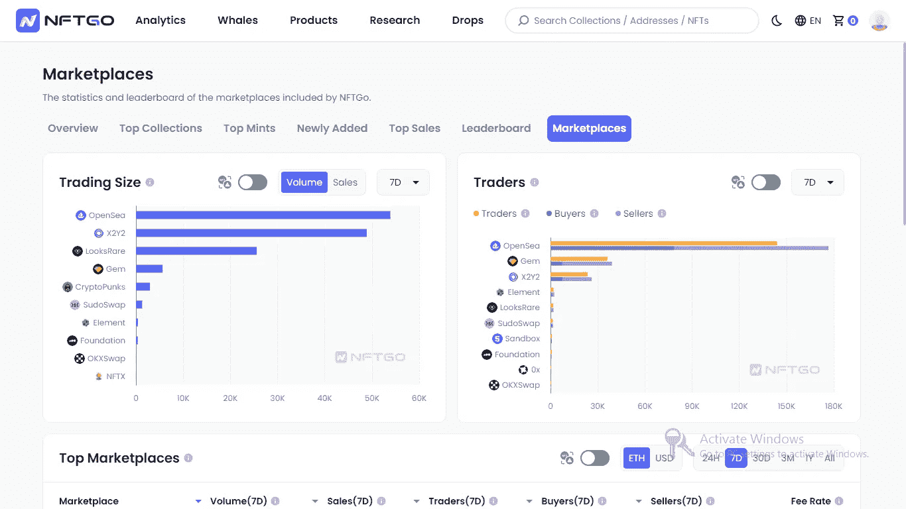
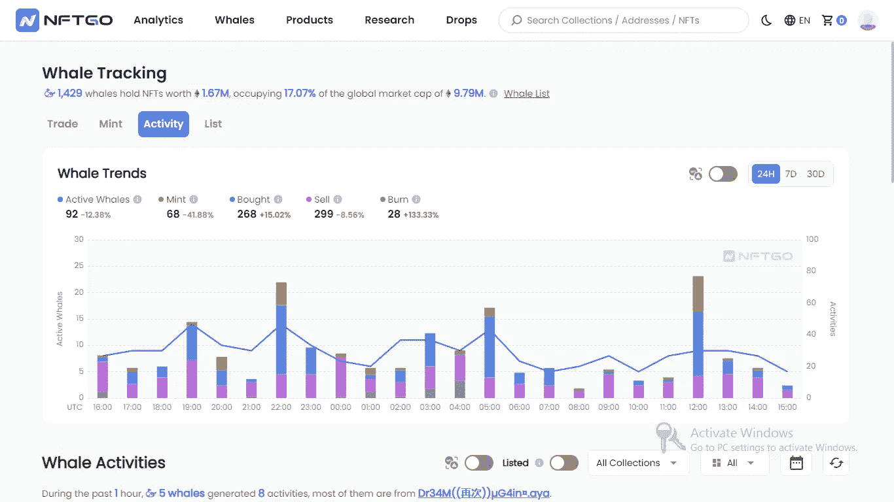
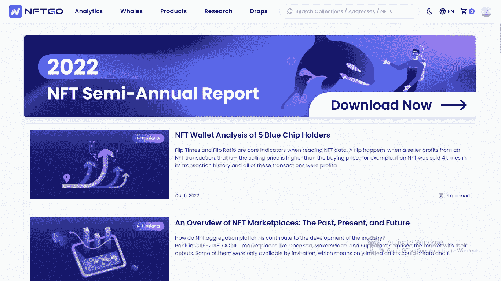

# NFTGo 的完整概述

> 原文：<https://medium.com/coinmonks/a-complete-overview-of-nftgo-7e642e1d3be1?source=collection_archive---------12----------------------->

nftgo.io

你依靠谁获得 NFT 的数据？
NFT 有影响力的人靠发推特赚钱？
或者你是否经历过使用多种 NFT 工具查找不同数据的痛苦过程，比如稀有度分数或顶级收藏？
或者支付昂贵的费用来使用一些 NFT 分析工具？

这些方法都不可靠。第一个往往是虚假和膨胀的，第二个太慢和繁琐，第三个是不可持续的，特别是对于新手和散户。

NFT 生态系统需要的是一个完整的一体化 NFT 解决方案，提供业内可访问的数据。一个具有用户友好界面的工具，可以分析 NFT 收藏，并以易于理解的可视化方式讲述故事。

那个工具就是 [NFTGo](https://nftgo.io/) 。

## 什么是 NFTGo

nftgo.io

NFTGo 是一个免费的 NFT 分析平台，收集并可视化 NFTs 的实时数据。通过 NFTGo，您可以全面深入地了解 NFT 藏品、市场趋势以及做出明智的购买和投资决策所需的任何其他指标。

NFTGo 支持以太坊区块链。它支持从 ERC721 和 ERC1155 智能合约收集交易。
NFTGo 在平台上列出了 3900 多个收藏；它连接了超过 33，000 个钱包，并汇总了来自超过 15 个 NFT 市场的交易。

根据其“关于我们”页面上的信息，NFTGo 的使命可以概括为以下三个方面:

*   *让我们的社区能够无缝地发现、过滤、购买和使用 NFT。*
*   *通过利用 NFTGo 的基础设施，让我们的社区能够创建并参与 NFT。*
*   *通过 NFTs 促进从 Web2 到 Web3 的迁移。*

NFTGo 于 2021 年 9 月作为一个数据聚合器推出，在短短一年多的时间里，它在 NFT 行业取得了重大进展。
已成功推出超过 20 款 NFT 工具，超过 370 万访客使用该平台，并拥有超过 100 家行业合作伙伴。NFTGo 也发展成为一个多元化的团队，拥有来自十多个国家的 70 多名成员。

## 您将从 NFTGo 中获得的见解

NFTGo 使用区块链数据收集引擎从区块链获得实时的链上交易细节，并将其转换为易于理解的数据。

您将在 NFTGo 上获得的一些见解是:

**市场宏观分析**

数据就是一切。就 NFT 而言，数据可能是购买潜在蓝筹股或一文不值的 jpeg 的区别。
NFTGo 通过收集和可视化 NFT 交易的实时数据，帮助您做出正确的决策。你将能够获得洞察力，做出明智的交易和投资决策。

NFTGo 还使用市场情绪、交易者等重要指标来可视化 NFTs 的总体受欢迎程度或采用情况。

他们可视化的其他重要指标有:

***蓝筹指数*** 蓝筹指数是跟踪蓝筹 NFT 的指数。

***市值和成交量*** 你可以看到 NFT 行业在一段时间内的整体市值和成交量。

***持有者、交易者、买家和卖家*** 这些是在选定的时间范围内持有、交易、购买或出售 NFT 的唯一地址的数量。

***类别市值、流动性、成交量*** 本部分可视化不同 NFT 类别的市值、流动性、成交量。

类别包括:

*   PFPs
*   陆地
*   摄影
*   比赛
*   收藏品
*   艺术
*   虚拟空间
*   挑战
*   互联网协议(Internet Protocol)
*   社会的
*   音乐
*   效用
*   域名
*   运动

**藏品分布** 这是在选定的时间范围内，在 NFTGo 上按数量或市值列出的顶级 NFT 藏品的百分比。你也可以在 NFTGo 上搜索任何你感兴趣的 NFT 收藏。你可以在 NFTGo 上对 NFT 系列进行排名，使用的重要指标包括:销量、市值、销售额、底价、鲸鱼、蓝筹股持有者、PnL、创造它的钱包数量、最高销售额等。
您可以根据自己的喜好，通过添加或删除任何人来自定义指标。

截至本文撰写之时，NFTGo 已经成功收录了 3，958 个 NFT 收藏和 35，598，976 个 NFT。因此，除非你在寻找一个不知名的无关紧要的 NFT，你会在 NFTGo 上找到你需要的一切。

**收藏分析**

nftgo.io

NFTGo 为每个 NFT 集合提供多维数据和图表，可以帮助您:

*   评估 NFT 收藏品和资产的价值；
*   发现该系列的 NFT 珍品；
*   找到持有人的趋势和收集的鲸鱼；
*   发现总利润排行榜和收藏的顶级交易商；
*   跟踪收藏活动。
*   找到该系列的项目链接、市场和关键指标。

除了提供 NFT 市场的宏观分析，NFTGo 还将网站上列出的所有 NFT 收藏的数据和图表可视化。使用 NFTGo 的数据，您可以跟踪藏品的趋势:市值和交易量、底价、均价、销售额、交易量、流动性、持有人数量等。在给定的时间内。你可以在收藏中搜索单个的 NFT，并根据价格、特征和稀有度进行筛选。
你得到的其他信息是:

*   持有人与上市、
*   挂牌数量，挂牌价格低于和高于底价
*   实时地板深度。
*   实时列表和最近的销售。
*   集合的活动，如转移等。

您还可以通过 PnL、购买量、销售量、发送量、接收量和铸造量等指标对集合中购买了 NFT 的地址进行排名。
有了这些数据，你将发现任何藏品所需的所有信息，并做出明智的投资决策。

**NFT 分析公司**

nftgo.io

NFTGo 分析集合中的单个 NFT，并让您了解重要信息，如给定时间范围内 NFT 的平均价格、销量和交易量的趋势。
你还可以深入了解 NFT 的活动，比如实时了解 NFT 的稀有度和列表信息。
评估完你想要的 NFT 后，你就可以在 NFTGo 上买卖它了。

**地址分析** 

*   NFTs，
*   估计持有价值，
*   累计损益，
*   在选定期间生成的交易价格。
*   相关地址(与该地址进行转让和交易的其他地址)

您可以找到该地址的活动，如销售、转让等
您也可以在 NFTGo 搜索栏上搜索任何地址。
有了这些数据，您将发现并跟踪鲸鱼的活动、智能资金的流动以及鲸鱼持有的 NFTs。这将帮助你跟随鲸鱼和专业人士的脚步，而不是做业余决定。

**滴**

nftgo.io

NFTGo 不仅仅提供关于现有 NFT 的信息；它们还会让您知道新的 NFT 何时会被删除。在他们的下拉页面上，你会发现即将推出的 NFT 系列，每个系列中 NFT 的数量，它们的造币价格，网站社交媒体和造币日期。

**观察列表**

nftgo.io

NFTGo 有一个观察列表功能，让你跟踪和追踪你拥有或感兴趣的 NFT 收藏。您可以跟踪地址和个人 NFT，并查看其他人的监视列表。
您还可以从其他 NFT 平台导出您的观察列表，并将其导入 NFTGo。为此，请遵循此处概述的[步骤。](https://docs.nftgo.io/docs/import-your-watchlist-on-nftgoio)

**自建市场数据整合** NFTGo 支持并跟踪 [OpenSea](https://opensea.io/) 、 [LooksRare](https://looksrare.org/) 、 [X2Y2](https://x2y2.io/) 等知名市场的数据。但为了确保每个 NFT 都有正确的最新市场价值，NFTGo 还整合了 NFTGo.io 上列出的项目自建市场的数据

## 如何在 NFTGo 上列出您的 NFT

在 NFTGo 这样的分析平台上列出你的 NFT 增加了它的受欢迎程度和成功。NFTGo 有一个自主的列表过程。这确保了 NFTGo 向其社区提供的信息反映了准确的 NFT 市场趋势。

自动在 NFTGo 上列出您的 NFT 需要满足两个条件

*   Etherscan 上的开源智能合约；
*   二级市场上的交易量应该在 50 ETH 以上。

注意:NFTGo 只支持以太坊区块链的项目，但将来会扩展到多个连锁店。在以下情况下，NFTGo 也保留删除您的项目的权利:

*   恶意行为，如垃圾邮件 NFT，数据伪造，并在合同代码中留下后门，都被标记出来。
*   该项目已经停止运行，NFT 数据资源无法访问。

## NFTGo 上的市场

nftgo.io

NFTGo 在其平台上整合了以下市场:

[OpenSea](https://opensea.io/)

[黄牛](https://www.0x.org/)

[超稀有](https://superrare.com/market)

[沙盒](https://www.sandbox.game/en/shop/)

[仿植物怪兽佐拉](https://zora.co/)

[稀有](https://rarible.com/)

[MagicEdenSwap](https://magiceden.io/)

[隐猫](https://www.cryptokitties.co/search?include=sale)

[精灵](https://www.genie.xyz/)

[NFTX](https://nftx.io/)

[基金会](https://foundation.app/)

[looks are](https://looksrare.org/)

[元素](https://element.market/ethereum)

[OKXSwap](https://www.okx.com/web3/nft/featured?channelId=ACE509064)

[X2Y2](https://x2y2.io/)

[SudoSwap](https://sudoswap.xyz/)

[宝石](https://www.gem.xyz/)

[隐朋克](https://www.larvalabs.com/cryptopunks/forsale)

## NFTGo 合作伙伴

以下是 NFTGo 的一些合作伙伴:

[X2Y2](https://x2y2.io/)

[OpenSea](https://opensea.io/)

[RSS3](https://rss3.io/)

[NFT 晚报](https://nftevening.com/)

[imToken](https://token.im/)

[特质狙击手](https://www.traitsniper.com/)

[令牌袋](https://www.tokenpocket.pro/)

[赛博通](https://cyberconnect.me/)

[稀有狙击手](https://raritysniper.com/)

[面具](https://mask.io/)

[推特扫描](https://twitterscan.com/)

[looks are](https://looksrare.org/)

[奔道](https://www.benddao.xyz/)

[。位](https://www.did.id/)

[温克里普托](https://winkrypto.com/)

[水库](https://reservoir.tools/)

## 是什么让 NFTGo 与众不同

除了上面解释的好处之外，还有一些让我觉得 NFTGo 与众不同的特性:

看到 NFTGO 提供的所有见解，当我意识到它是一个免费使用的平台时，我感到非常震惊和欣慰。没有 VIP 区，月租费或独家内容来换取订阅。所有东西都是免费给大家用的。你需要做的就是连接你的钱包。

**可疑不正当交易的过滤** 不正当交易是指交易者在短时间内进行非正规金融交易，目的是向市场提供误导性信息，以获取利润或从激励平台活动的平台获得奖励。
洗盘交易操纵交易量、价格等重要指标。这进而向其他交易者或投资者描绘了一幅误导 NFT 收藏的画面。
NFTGo 具有清洗交易过滤功能，允许他们过滤可疑的清洗交易。他们使用算法分析和涉及分析交易周期和交易闭环的策略来做到这一点。查看此[文档](https://docs.nftgo.io/docs/wash-trade-filter)以了解更多关于 NFTGo.io 过滤器如何清洗贸易的信息。

**NFTGo 稀有度模型** 在 NFT 空间中，NFT 的稀有度是指 NFT 相对于同一收藏中其他 NFT 的稀有程度。大多数 NFT 稀有度模型增加了每个 NFT 的特征和出现频率，而没有考虑特征如何影响 NFT 的独特性。这个缺陷导致不准确的预测和错误的稀有度分数。

NFTGo 开发了自己的复杂稀有模型，该模型遵循一种更科学的方法来计算 NFT 的稀有度。这叫做 Jaccard 距离。Jaccard 距离是一种度量标准，用于测量两个样本数据集之间的差异。在这种情况下，Jaccard 距离基于集合中 NFT 的属性来度量它们之间的不同，并给它们一个范围从 0 到 100 的稀有度分数。
要了解更多关于 Jaccard 距离的信息，查看这个维基百科[文章](https://en.wikipedia.org/wiki/Jaccard_index)；另外，点击这里查看 NFTGo [的这篇文章。](https://nftgo.mirror.xyz/kHWaMtNY6ZOvDzr7PR99D03--VNu6-ZOjYuf6E9-QH0)

**鲸鱼追踪功能**

nftgo.io

NFTGo.io 将 whale 定义为一个地址，其所有集合的 NFT 持有值为 1，000，000 美元以上。
NFTGo 有一个鲸鱼追踪功能，让你发现业内最大的鲸鱼，并跟踪它们的活动，如造币、购买、出售、焚烧等。，在给定时间范围内。你还可以算出大多数鲸鱼在特定时期交易的 NFT 藏品。
你可以根据持有价值、买入量、卖出量、PnL 等关键指标对鲸鱼进行排名。

**NFT 交易聚合器** NFTgo 不仅仅是 NFT 数据的平台，也是 NFT 一切的一站式平台。它是 NFT 生态系统的门户。考虑到这一点，它为您提供了一个交易聚合器。有了这个特性，您可以无缝地从分析数据到购买 NFT，而无需转到多个平台。你也可以把 NFT 装到你的购物车里，批量购买，节省油费。
他们的交易聚合器有两个令人兴奋的部分:

***安全模式*** NFTGo 提供安全模式，帮助您避免交易失败，保护您的隐私。
当你开启安全模式时，flashbots 拍卖功能会自动开启。
Flashbots 是 ETH 验证器和用户之间的私有通信通道，确保块内首选交易订单的高效通信。这有点技术性，超出了本文的范围。要了解更多关于 flashbots 的信息，请点击这里的[和这里的](https://docs.flashbots.net/flashbots-auction/overview)和。请注意，当您打开安全情绪时，您的交易会比平时花费更长的时间和更多的费用。

***可疑物品*** 有时 OpenSea 会将一些物品标记为可疑，因为怀疑有猫腻而无法交易或转让。NFTGo 从 OpenSea 收集这些数据，并在其平台上标记这些项目，以帮助您快速识别它们。可以决定继续在 NFTGo 上交易可疑物品。然而，这些物品在 OpenSea 上是不可交易或转让的。

**NFTGo 研究**

nftgo.io

NFTGo 的研究人员团队创作并发布了富有洞察力的[文章](https://nftgo.io/research/semi-annual-report-2022)，让用户了解 NFT 基本面，并告知他们市场趋势。推荐你全部看完，尤其是他们的 [2022 半年报](https://nftgo.io/research/semi-annual-report-2022)。

## NFTGo 可以改进什么

NFTGo 是市场上最好的免费 NFT 分析工具。但是总有改进的空间。这里有两种方法可以让它变得更好:

**支持其他区块链** NFTGo 只支持以太坊区块链。像 Polygon 或 Solana 一样将这种支持扩展到区块链将导致更多的 NFT 上市和与更多市场的集成。这将使 NFTGo 成为 NFT 一切的一站式平台。

**时事通讯** NFTGo 有一份月度时事通讯，他们在其中分享数据见解和新闻。然而，另一个可以考虑的选择是制作一份关于 NFT 趋势和即将推出的 NFT 系列的每周时事通讯。

## 最后的想法

据 NFTGo 称，该平台解决了 NFT 行业的四个问题:

*   难以评估 NFT 项目的真实价值
*   流动性差，交易成本高
*   缺乏关于 NFT 市场动态的信息
*   难以跟踪、识别和筛选数以千计的 NFT 项目。

但是它提供了第五种解决方案，那就是可访问性。NFTGo 让鲸鱼、散户、新手和有经验的收藏者都可以访问数据。它还提供详细的研究文章，当与平台的见解相结合时，给用户带来市场优势。

要了解更多关于 NFTGO 的信息，请查看他们的[网站](https://nftgo.io/)。还可以加入他们的[不和](https://discord.com/invite/38E4sEaFJr)、[推特](https://twitter.com/nftgoio)、 [Instagram](https://www.instagram.com/nftgo_io/) 、 [YouTube](https://www.youtube.com/channel/UCaDpaWVaRZDfdszfDCecfIw) ，或者[电报](https://t.me/nftgoofficial)。也可以在[镜](https://mirror.xyz/nftgoio.eth)上看他们的文章。

要了解更多关于 NFTGO 的信息，请查看他们的[网站](https://nftgo.io/)。你也可以加入他们的[不和](https://discord.com/invite/38E4sEaFJr)，[推特](https://twitter.com/nftgoio)， [Instagram](https://www.instagram.com/nftgo_io/) ， [YouTube](https://www.youtube.com/channel/UCaDpaWVaRZDfdszfDCecfIw) ，或者[电报](https://t.me/nftgoofficial)。也可以在[镜](https://mirror.xyz/nftgoio.eth)上看他们的文章。

> 交易新手？尝试[加密交易机器人](/coinmonks/crypto-trading-bot-c2ffce8acb2a)或[复制交易](/coinmonks/top-10-crypto-copy-trading-platforms-for-beginners-d0c37c7d698c)