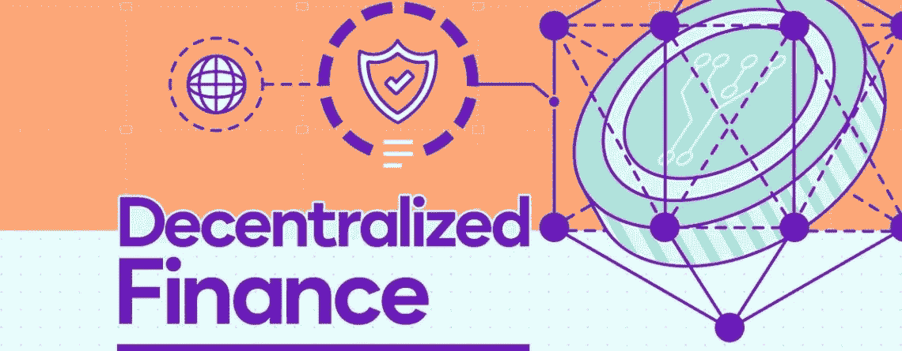
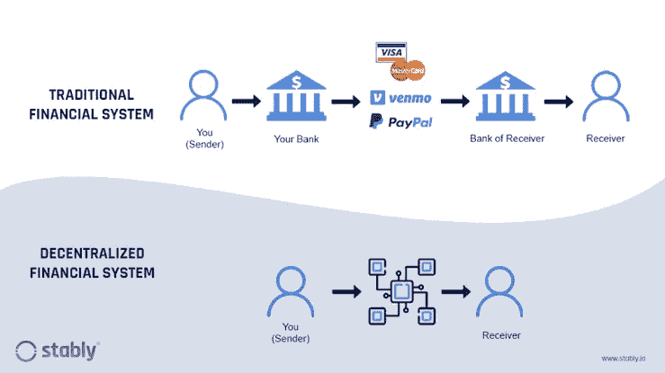
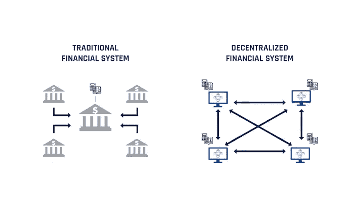
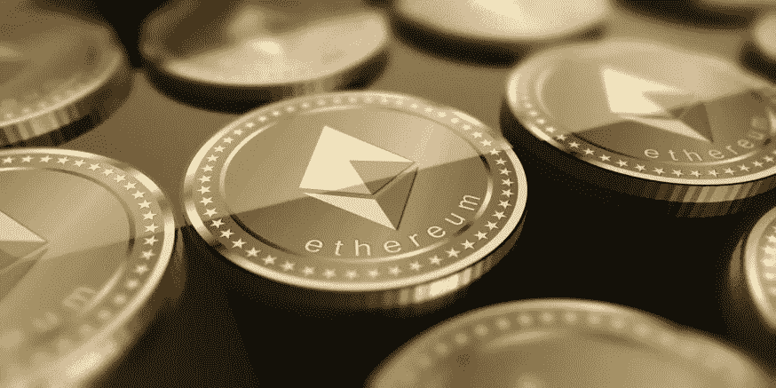

# 分散金融综合指南:金融交易的未来

> 原文：<https://medium.com/coinmonks/a-comprehensive-guide-to-decentralized-finance-defi-the-future-of-financial-transactions-7ca52daee145?source=collection_archive---------26----------------------->

Decentralized Finance… | [ValueWalk Premium](https://valuewalkpremium.com/2019/03/decentralized-finance-an-emerging-alternative-to-the-global-financial-system/)

分散金融(DeFi)是一个交易框架，它消除了在发起、促进和授权金融交易方面对中央机构的需要。

随着加密货币、区块链和智能合约的发展，去中心化的概念最近变得流行起来。

第三种也是最成熟的互联网模式，Web3，承诺对互联网上创建的内容拥有所有权。它与权力下放直接相关，权力下放将资产和金融实体的所有权交给合法所有者。

这不仅消除了对中央机构的需要，还支持匿名和促进投资。尽管这听起来是一个很有吸引力的新想法，但缺乏授权机构会危及所有数字交易所的用户资金。

当然，这不仅仅是去中心化、所有权和匿名。在本文中，我们将把分散金融视为金融交易和所有权的未来，以及它与分散化、智能合同等概念的关系。

## **关键要点:**

DeFi 是一项挑战当前银行体系的新兴金融技术。

它基于分布式分类账。

分散融资消除了买方和卖方之间交易所或银行等中介的存在。

该技术利用加密货币和智能合约来提供先进的解决方案。

它是金融交易的未来，因为它解决了传统金融系统中存在的问题。

## **分散金融:概述**

在中央集权或传统的银行系统中，货币由中央机构持有，如经纪公司、银行或交易所。为了在客户之间接收或转移资金，需要相关的中介来促进这一过程。

这不仅耽误了时间，还会导致借记卡/信用卡或电汇的手续费。为了解决传统系统的这些问题，一种被称为分散金融(DeFi)的新兴技术被引入作为替代方案。

分散融资，简称 DeFi，是一种消除银行、政府、经纪公司或交易所等中介机构的技术，从而给予基金所有者充分的机会。DeFi 的两个主要目标是减少进行交易所需的时间和增加获得金融服务的机会。

在一个点对点的金融网络中，个人可以无缝地借出、借入和交易金融工具。据福布斯的 Rakesh Sharma 称，DeFi 在运营中使用了安全协议、连接、软件和硬件的进步。它还集成了区块链技术和智能合约，使记录不可更改。

最重要的是，新的金融交易系统允许在分布式金融数据库中发送、接收、记录和验证金融行为。简而言之，它对照可用的汇总数据检查记录的数据，并使用共识机制验证它们。

DeFi 不仅消除了中介，还提供了更低的交易费用、更快的交易时间和更高的安全性。根据 CoinMarketCap 的预测，它不仅是传统银行系统的一种替代，而且是一种永久性的替代。

## **工作原理**

像加密货币一样，分散金融也使用区块链技术，因为它是安全的。它存储在网络上进行的每一个交易，并使其不可改变。为了执行交易，在区块链上开发并部署 dApp 来处理交易。

分散应用程序(dApps)是为执行分散财务而创建的软件。一旦交易启动，它就像一个块，一旦被另一个用户确认，就在链上存储和加密。

循环继续，直到验证者同意产生具有与第一个块相似信息的另一个块的事务。这些区块随后被组合起来，形成一个保护财务记录安全的连锁网络。一个区块的变更会影响到链中的其他区块，从而使其不可能。

## 【DeFi 真的要取代传统金融体系了吗？

这种说法是否成立是个时间问题，但正如多个消息来源所报道的那样，答案是肯定的。这是一项新兴技术，然而，它已经存在，并且很快就会被大量采用。

所有人都对在各方面使他们生活更轻松的服务感兴趣。他们会对任何节省时间、成本更低、工作效率更高的事情让步。这就是为什么远程工作在大多数工作场所都受到了大量的赞扬和称赞。

分散金融为银行/金融运营提供了更简单、更容易、更快速的解决方案。它降低了交易费用，提高了速度，并使服务随时可用。然而，它需要对其工作原理有一定程度的技术理解。

这个世界是否准备好与一个他们并不认同的人进行交易，这仍然是一个时间问题。除了其他因素之外，这也质疑了分散融资将完全取代传统体系的事实。

既然你显然打不过他们，那就加入他们吧。据《棕榈滩日报》的 Teeka Tiwari 报道，一个简单的方法就是拥有一些以太坊。

这是因为大多数分散化金融项目都是建立在以太坊区块链之上的，拥有区块链的本地令牌将是采用 DeFi 的第一步。

## **最后的想法**

在传统金融体系和整个 Web2 生态系统中；用户没有被授予对他们所拥有的内容的完全访问权限。中介和连接平台的存在使得人们很难完全拥有自己的资产。

在这种背景下，分散金融开始消除金融交易中对中介或中央当局的需要。除了其他好处之外，它还提供了更高级别的匿名性和安全性，降低了交易费用，提高了交易速率。

使用类似于加密货币的模型，并在智能合约的帮助下，分散金融提供了各种金融资产，而不依赖于任何中介。它允许用户和生态系统中的任何人借贷、储蓄、投资和交易金融工具。

值得注意的是，分散金融本身并不都是好的，即使是作为传统银行体系的替代品。匿名和身份已经引起了网络中的欺诈问题。用户的资金很容易被黑客攻击和窃取，最近有这样的报道。

最重要的是，当投资者为项目做出巨大贡献后，开发商忽视了 dApps，从而带走了用户的资产，分散的融资可能会成为绊脚石。没必要说 FTX 是最近的例子。

请分享你对分散金融(DeFi)的想法。**你认为最新的技术已经取代了我们的传统银行吗？**

点击[此处](/@abdulmuminsolihu/)关注我，了解更多关于加密货币、Web3、金融科技、区块链和元宇宙的内容。也可以在 [LinkedIn](https://www.linkedin.com/in/abdulmuminsolihu) 上联系我。

> 交易新手？尝试[加密交易机器人](/coinmonks/crypto-trading-bot-c2ffce8acb2a)或[复制交易](/coinmonks/top-10-crypto-copy-trading-platforms-for-beginners-d0c37c7d698c)