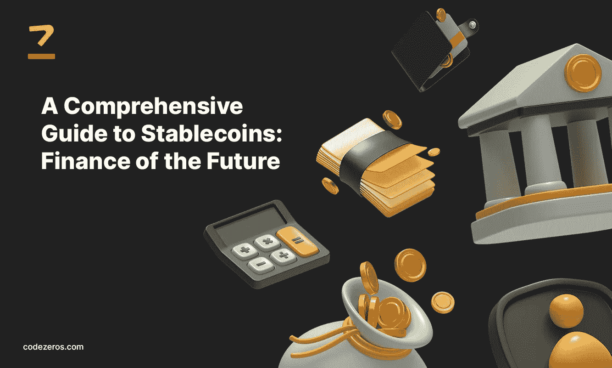

# Stablecoins 综合指南:未来金融

> 原文：<https://medium.com/coinmonks/a-comprehensive-guide-to-stablecoins-finance-of-the-future-47db4331d33?source=collection_archive---------16----------------------->

关于信息升级，有许多学派可以解释市场行为和情绪。许多曾经准确的思想流派，现在似乎不那么正确了。

但是有一个经受住了时间的考验，那就是有效市场假说。这也是一个极具争议的话题。

基本上，该假说认为市场总是“有效的”,因为市场的数字代表了所有公开信息的量化。

例如，股息前的股票抛售说明了股价本身价值的潜在增加；在所述股息之前，其中股价是股价和将收到的股息之和。

A Comprehensive Guide to Stablecoins: Finance of the Future

你可能已经注意到了它的几个缺点。很多人也是如此。一个主要问题是，所有人在任何时候都可以获得所有信息这一事实不一定是真的。更重要的是，投资者中的理性，这是该假说的一个主要假设，在现实世界中并不总是如此。

尽管如此，它在公众意识中仍然很受欢迎，并指导个人和机构以更简洁、可量化的方式解决波动性问题。它还引导政府关注影响上述信息供应链内波动性的变量。

波动是无情的，也是交易行为所必需的。波动性是区块链支持的加密货币获得如此大市值的主要原因。这就是为什么 [**区块链解决方案和**](https://www.codezeros.com/) 区块链服务的采用呈指数级增长的原因，在该技术流行的第一个十年内，已经有应用程序建立在它的基础上。像 [**NFT 发展服务**](https://www.codezeros.com/services/nft-development-services) 这样的东西都是建立在区块链技术之上的。波动性是这里的关键。

然而，法定货币长期有效的原因之一是，它们不仅是一种有效的、可分割的交换媒介，而且受到君主制、寡头制或政府等机构的支持。有稳定的。有一段时间，这是困扰加密货币的问题之一。

# **输入 stablecoins。**

## 什么是 Stablecoins？

稳定硬币是与另一种货币、商品或算法挂钩的硬币，它的价值来源于这种货币、商品或算法。把它想象成一种衍生品，就像法定货币是美元的衍生品，而美元是黄金的衍生品。

然而，stablecoins 比那些提供了更多的灵活性。看，不管你的友好的邻居政府有多好，你都不能去中央银行要求你的期票承诺支持的黄金数量。我也不知道为什么。

你可以用稳定的硬币做到这一点。事实上，与另一种货币“挂钩”意味着，如果你选择这样做，通过机构或二级市场，它将永远是一个固定的汇率。这一比率很少受到市场波动的影响，即使受到影响，市场参与者也有明显的套利动机，使其更接近这一比率。

这种承诺就像你的普通期票一样，不仅要有资产支持，还要能够与资产交换。这提供了稳定性，如果你愿意的话。为什么？

以 BTC 为例。2020 年 3 月，当我们进入疫情时，BTC 大约是$4K。到明年的同一时间，它大约是 32K 美元。同比增长大约 800%。大致如此。800%.

第二年的同一时间，在触及 6.9 万美元大关后，它在 4 万美元左右。在写这篇文章的时候，它大约是 19.6 万美元。你知道为什么了。

问题是，如果有效市场假说的任何部分是真的(事实就是如此！)，那么新信息就是价格变动的主要来源。广泛和全球性的货币的问题是，影响它的因素也是广泛和全球性的。这意味着图表上的剧烈运动，这对交易有利；但是当应用程序是一种可靠的货币时，它就不是一个真正有效的变量。稳定硬币旨在解决这一问题。

## Stablecoins 是如何工作的？

这里的想法是，除了传统市场的正常功能，如买入、卖出或停止，资产本身还具有额外的稳定性功能。

例如，泰瑟公司的 UST 以 1:1 的比例得到美元的支持。这意味着每流通一个 USDT 单位，就有一个美元的储备。理想情况下，但稍后会详细介绍。理想情况下，Tether 应在定期审计准备金的政府托管人和有效的 [**智能合同开发**](https://www.codezeros.com/services/smart-contract-creation) 的帮助下管理该抵押品，以维持所述准备金。

> 交易新手？试试[密码交易机器人](/coinmonks/crypto-trading-bot-c2ffce8acb2a)或[复制交易](/coinmonks/top-10-crypto-copy-trading-platforms-for-beginners-d0c37c7d698c)

然而，这是一种方式。稳定的货币可以由任何东西支持，甚至有稳定的货币进入这个空间，将由消费者价格指数和国家市场指数支持。通常，它们是以三种方式之一创建的。

**1。**

顾名思义，法定抵押的稳定货币由法定货币储备或一篮子储备支持。它也可以得到其他储备的支持，例如黄金等贵金属或原油等大宗商品。然而，在实践中，它通常是美元或美元等值。例子包括系绳的 UST 和真正的美元(TUSD)

**2** 。**加密排序的 Stablecoins:** 虽然名字很容易理解，但由加密货币支持的 Stablecoins 确实面临一点安全问题。加密货币的波动性很大，这意味着任何一方的运动都有较大的偏差，当你有一个“稳定”的硬币时，这些偏差都必须考虑在内。因此，加密支持的 stablecoins 必须进行过度排序。有时，整理率甚至高达 200%；每发行一枚稳定币，就有 2 枚加密币储备。由于强制持有资金，这导致了巨大的机会成本，这就是为什么公司通常更喜欢加密和法定的组合。著名的例子包括 MakerDAO 的 DAI 和 EOSDT token。

**3** 。**算法稳定货币:**它们有点像银行，因为它们不持有储备，但它们通过 [**智能合约创建**](https://www.codezeros.com/services/smart-contract-creation) 来调节和维持货币供应。前面提到的索引支持的稳定点数也是算法稳定点数的例子。然而，稳定的硬币并不总是有效的。

# Terra 坠毁

Terra 基本上是 dApp 开发服务****，**的区块链，然而他们的大部分分散式应用程序仅限于人们交易的基础架构应用程序。泰拉有两个稳定的兄弟，UST 和露娜。**

**为了创造 UST，你必须先烧掉露娜。例如，如果月神的价值为 20 美元，那么将会产生 20 个 UST，而月神令牌将会被销毁；从稳定性的角度来看这是有道理的。被烧毁的 Luna 的美元价值将被用来支持 UST，这可以进一步用于贷款等业务。**

**为了激励用户创建 UST，Terra 提供了 19.6%的赌注收益率，即 19.6%的押款收益率。约 70%的资金存放在他们的这个计划。**

**这个想法是，如果 UST 在市场上跌破 1 美元大关，套利者可以购买它，并用它交换 Luna，直到价格回升到 1 美元。如果情况是在光谱的另一端，你可以只烧卢娜得到一美元的 ust，解散它来赚钱。**

**然而，有一个条件，一天只能烧掉价值约 1 亿美元的 Luna，这听起来很多，但实际上不是。5 月 7 日，价值超过 20 亿美元的 UST 被公开出售，数亿美元被立即出售。**

**这些抛售给 UST 带来了通货紧缩的压力，将价格推低至 90 美分。当交易者无法平仓时，他们开始抛售，以至于 UST 的价格跌到了 20 美分以下。卢娜的命运更糟糕，只有 1 美分。**

**就像上面的一颗樱桃，随后纽约总检察长指控泰瑟公司谎报其储备。不管是真是假，通货紧缩的压力确实已经形成。**

# **结论**

**有报道指出，这是来自 crypto 的菲亚特对手的联合攻击。那是否是真的还有待发现。然而，这并不意味着稳定币是一项失败的投资，因为每当加密货币变得过于波动时，交易者就会涌向稳定币。到目前为止，这可能是一项不完美的技术，但这并不意味着它不是一个有效的解决方案。**

> **加入 Coinmonks [电报频道](https://t.me/coincodecap)和 [Youtube 频道](https://www.youtube.com/c/coinmonks/videos)了解加密交易和投资**

# **另外，阅读**

*   **[霍比评论](https://coincodecap.com/huobi-review) | [OKEx 保证金交易](https://coincodecap.com/okex-margin-trading) | [期货交易](https://coincodecap.com/futures-trading)**
*   **[麻雀交换评论](https://coincodecap.com/sparrow-exchange-review) | [纳什交换评论](https://coincodecap.com/nash-exchange-review)**
*   **最好的[加密税务软件](/coinmonks/best-crypto-tax-tool-for-my-money-72d4b430816b) | [CoinTracking 评论](/coinmonks/cointracking-review-a-reliable-cryptocurrency-tax-software-5114e3eb5737)**
*   **[Stackedinvest 评论](https://coincodecap.com/stackedinvest-review) | [北海巨妖评论](/coinmonks/kraken-review-6165fc1056ac) | [bitFlyer 评论](https://coincodecap.com/bitflyer-review)**
*   **最佳[加密借贷平台](/coinmonks/top-5-crypto-lending-platforms-in-2020-that-you-need-to-know-a1b675cec3fa) | [杠杆代币](/coinmonks/leveraged-token-3f5257808b22)**