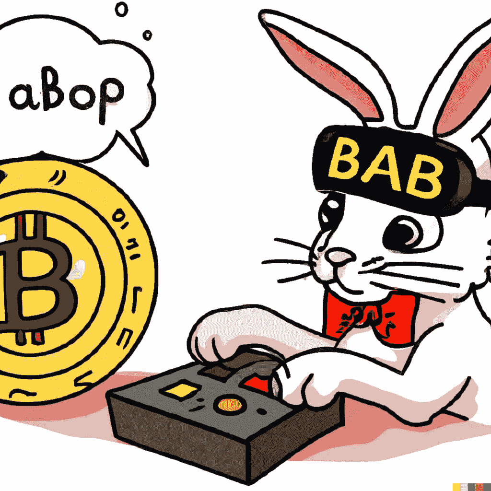

# 利用 NFTs 实现业务转型的全面指南

> 原文：<https://medium.com/coinmonks/a-comprehensive-guide-to-transforming-your-business-with-nfts-66bd1f92667a?source=collection_archive---------22----------------------->

秘密营销是市场营销中的热门新事物，它不会很快停止。事实上，它可能比以往任何时候都更加重要。多亏了比特币、以太坊和莱特币等加密资产，各种规模的企业开始以全新的方式看到区块链技术的潜力。以下是你如何利用这个令人兴奋的新市场机会

**什么是秘密营销**

NFT 是代表资产和交易的数字令牌。它们最初是由比特币社区在 2014 年开发的，作为一种保护和验证网络交易的方式。NFT 目前有多种货币，包括比特币、以太坊、Ripple、莱特币和 Dogecoin。

**NFTs 是如何工作的**

为了让企业在营销中使用 NFT，他们必须首先创建适配器，使其能够与传统的金融系统进行交互。适配器可用于在线支付商品或服务、预订交通工具或在账户间转账。一旦创建了适配器，企业就可以使用 NFTs 在其网站或社交媒体平台上表示资产和交易。

**秘密营销如何让你的企业受益**

通过在加密营销中使用 NFTs，您的企业可以利用数字资产作为营销活动的一部分这一日益增长的趋势。通过以数字形式呈现资产和交易，您可以接触到更广泛的受众，并从每次访问您的网站或社交媒体渠道中获得更多。此外，通过将加密资产作为营销策略的一部分，您可以保持领先地位，最大限度地提高业务曝光率，同时降低与传统营销方法相关的成本。

**如何利用秘密营销来发展你的业务**

秘密营销可以帮助企业成长，为他们提供一个以数字格式销售产品和服务的机会。这可能涉及与基于加密的公司发展合作伙伴关系，针对对加密感兴趣的消费者投放广告，甚至推出关于加密货币使用和业务发展的在线课程或研讨会。

**加密营销策略**

秘密营销就是利用数字货币和区块链技术创造一种商业模式，奖励客户的推荐和/或购买。为了加密市场，你需要了解加密货币系统如何工作，如何建立区块链营销活动，以及如何从推荐中赚钱。

要开始加密营销，你首先需要了解加密货币系统及其工作原理。一旦你了解了基本知识，你就可以开始建立自己的区块链营销活动。你还可以使用 CoinMarketCap 或 Blockchain Stats 等在线资源来帮助你了解更多关于不同加密货币及其潜在市场的信息。

**如何通过秘密营销赚钱**

一旦你了解了秘密营销的基本知识，是时候开始从中赚钱了！你可以通过向他人推荐你的业务，或者通过销售与加密货币相关的产品或服务来赚钱。你也可以通过参与 ico(初始硬币发行)来赚钱，ico 是指新的加密货币被创造出来并在公开市场上出售。如果你对区块链技术和加密货币有很好的了解，这些是你赚钱的好方法！

**结论**

秘密营销是接触更多受众和促进销售的有效方式。通过了解 NFTs 如何工作，规划你的营销策略，并成功地使用加密营销，你可以增加你的业务潜力。

> 加入 Coinmonks [电报频道](https://t.me/coincodecap)和 [Youtube 频道](https://www.youtube.com/c/coinmonks/videos)了解加密交易和投资

# 另外，阅读

*   [TraderWagon 回顾](https://coincodecap.com/traderwagon-review) | [北海巨妖 vs 双子星 vs BitYard](https://coincodecap.com/kraken-vs-gemini-vs-bityard)
*   [如何在 FTX 交易所交易期货](https://coincodecap.com/ftx-futures-trading)
*   [OKEx vs KuCoin](https://coincodecap.com/okex-kucoin) | [摄氏替代品](https://coincodecap.com/celsius-alternatives) | [如何购买 VeChain](https://coincodecap.com/buy-vechain)
*   [ProfitFarmers 点评](https://coincodecap.com/profitfarmers-review) | [如何使用 Cornix 交易机器人](https://coincodecap.com/cornix-trading-bot)
*   [如何匿名购买比特币](https://coincodecap.com/buy-bitcoin-anonymously) | [比特币现金钱包](https://coincodecap.com/bitcoin-cash-wallets)