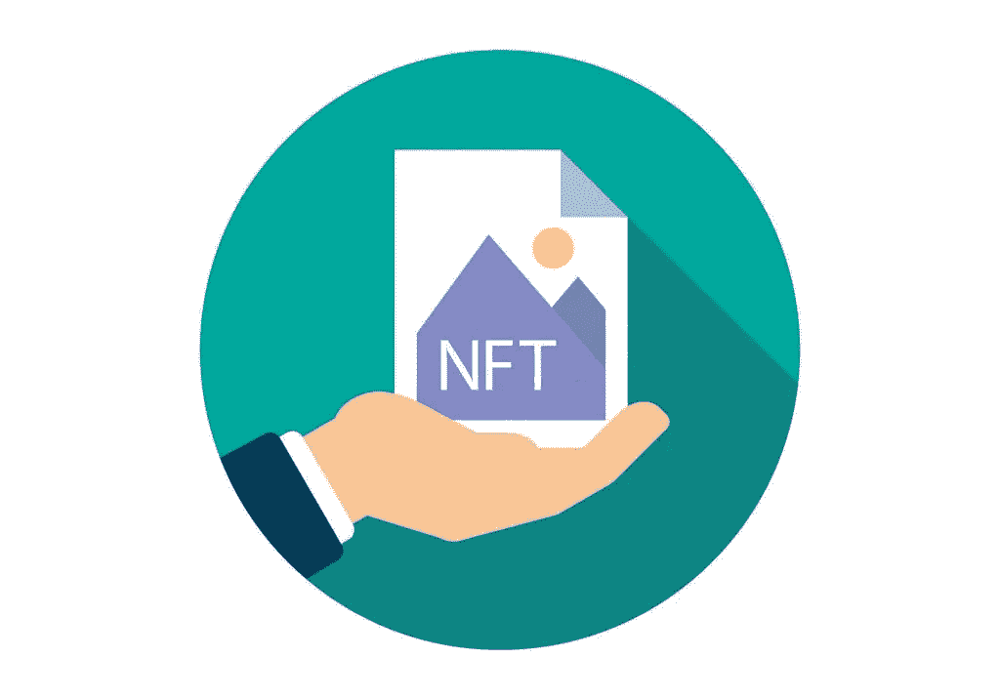

# 探索 ERC-721 令牌开发的综合工具

> 原文：<https://medium.com/coinmonks/a-comprehensive-tool-to-explore-erc-721-token-development-8c343b31f306?source=collection_archive---------37----------------------->

Source: getty images

随着多个垂直行业对非功能性技术的需求不断增长，竞争和基准测试也在增加。随后，有信誉良好的公司和区块链产业提供不可替代的令牌开发服务。今天，令人费解的 NFT 以加密空间和加密世界为荣。由于可编程性的限制，交易者产生了购买的紧迫感，因此非功能性交易非常稀缺。因此，评估关键的好处和特权，你不能跳过这个博客不知道以下内容。

企业负责人和业主希望开创像 NFT 发展这样的企业。同样，你也可以获得这篇博客的真知灼见，启动你的创业轨迹。允许自己打开并浏览这一页。拥有最佳亮点来发展您的 [NFT 代币发展](https://www.appdupe.com/non-fungible-token-development?utm_source=google&utm_medium=medium&utm_campaign=monika)方面，并提高您的成果。

# 🏷️ **不可替代的令牌——深刻的洞察力**

不可替换的令牌是使用特定算法和代码来表征物理实体的数字图标。这些 NFT 有一个永久标签，该标签提到了一个唯一的数字证书，因为它们是不相同的，所以具有唯一性。没有密码爱好者会错过 NFT 收藏品及其精彩的功能。建立在以太坊和 Tron 协议上的 NFT。因此称它们为 ERC-721 令牌和 TRC- 721 令牌效果很好。

# 🏷️ **可替代和不可替代代币**

可替换令牌和不可替换令牌之间有一些关键区别。可替换代币是可交换的，而 NFT 不能与任何加密货币或其他 NFT 交换。这种令人钦佩的特征吸引了企业家的目光，从而创造出这些不可替代的代币。此外，与可替换的代币不同，交易 NFT 只能在市场上进行。最后，还有智能合约来注册 NFT 的有价值的信息，这些信息对于可替换令牌来说并不重要。

Source: getty images

> 有一些突出的垂直行业强调 NFT 代币开发服务:
> 
> 🔥博彩业
> 
> 🔥艺术作品
> 
> 🔥媒体和娱乐实体
> 
> 🔥不动产
> 
> 🔥运动

# 🏷️ **区块链以太坊上的 nfts**

以太坊区块链站从其他网络中脱颖而出，其惊人的功能提供了最佳的可用性。类似地，NFT 最优选地基于以太坊协议创建，如 ERC- 721 和 ERC-1155。为了确保 NFTs 的最佳功能和有效部署，这些标准是可以接受的。最终，以太坊区块链允许集成像 Metamask 和 MyEtherWallet 这样的钱包。

🔓 **ERC-721** :这个令牌标准在 2017 年给出了它的入口。它通常表示不相同且不同的特定 NFT 资产。该标准也有助于创建信息出现在智能合约中的 NFTs。此外，它还有助于维护信息的透明度和安全性。

🔓 **ERC- 1155** :这种令牌标准可以是 ERC-721 令牌的前身。尽管具有 ERC-721 令牌，为了避免复杂性，ERC-1155 令牌也是优选的。此外，为可替换应用程序和 NFT 应用程序开发这种令牌标准也很常见。

 [## 通过 IDO Token Launchpad 开发促进顺利众筹

### 今天，商业爱好者欣赏分散平台中筹款模式的存在。他们无疑…

medium.com](/crypto-universe/facilitate-smooth-crowdfunding-with-ido-token-launchpad-development-21fb9cee18df) 

# 🏷️ **不可替代代币的额外津贴**

✔️ **稀缺性**:有一些特定的可编程性限制，对 NFT 的数量施加了限制。这些非功能性交易在用户的头脑中制造了很多紧迫感，让他们想办法进行交易。

✔️ **非互操作性**:这些非功能性测试不能用于交换或任何目的。因为它们严格遵循 ERC-721 令牌标准。

✔️ **唯一性**:NFT 是独一无二的，任何其他的 NFT 都不可能彼此相似。这些 NFT 是 solidity 开发人员用一套代码进行的改革，这些代码是永久唯一的。

✔️ **不可分割**:非功能性贸易是不可分割的，因为人们不能将非功能性贸易分割成不同的部分和行业。这种不可分割性在不可替换的令牌中很常见，因为它们没有预先确定的价值。

✔️ **安全**:nfts 的信息总是出现在区块链，因此不用担心安全问题。这些信息保持不被删除，并避免第三方的干扰。

Source: getty images

# 🏷不可替代令牌开发的️️️Attributes

有许多特性是不可计数的，并且显示出你必须意识到的重要性:

🔷由于您采用的令牌标准，潜在的市场效率会吸引大量的用户。

🔷流动性的增加是另一个令人担忧的方面。因为代币本位也保持了流动性，以保证高效运转。

🔷没有第三方干预和无权限控制。

🔷智能合约基于您喜欢的令牌标准和区块链。

🔷开发不可替代的代币可以获得更高的投资回报。

> 交易新手？尝试[加密交易机器人](/coinmonks/crypto-trading-bot-c2ffce8acb2a)或[复制交易](/coinmonks/top-10-crypto-copy-trading-platforms-for-beginners-d0c37c7d698c)

## 🏷️ **结论**

因此，总结我的想法，你已经来到了正确的目的地来接收你的解决方案。正如您所知，不可替代令牌开发的显著亮点及其范围。在这个博客中了解 [ERC-721 令牌开发](https://www.appdupe.com/non-fungible-token-development?utm_source=google&utm_medium=medium&utm_campaign=monika)的特点和额外津贴。用这个惊人的想法推动你的业务超越你的期望。从最优秀的人那里获得不可替代的令牌开发服务是明智的。在专家的帮助下变得有竞争力并提高您的成果，并让自己每天都被 NFTs 升级的趋势所包围。