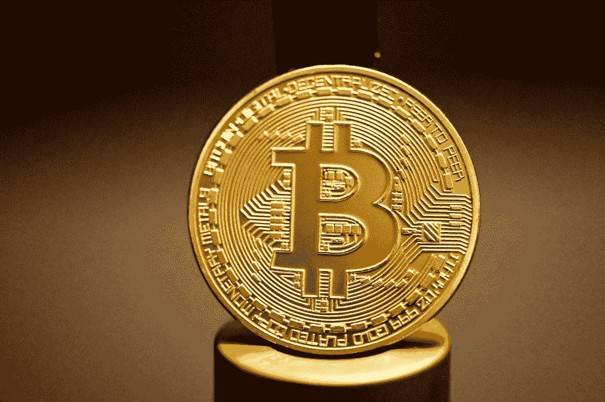

# 比特币的批判性分析

> 原文：<https://medium.com/coinmonks/a-critical-analysis-of-bitcoin-a352197e09d3?source=collection_archive---------35----------------------->

这是真的吗，危险吗？cryptos 的世界充满了炒作。围绕 crypto 有各种各样令人惊讶的故事和预测，但我们所能做的就是静观其变，等待炒作逐渐平息。这就是我们今天的处境。那么我们如何解释这次事故呢？他们真的相信泡沫吗，还是说 crypto 里有很多疯狂的人？