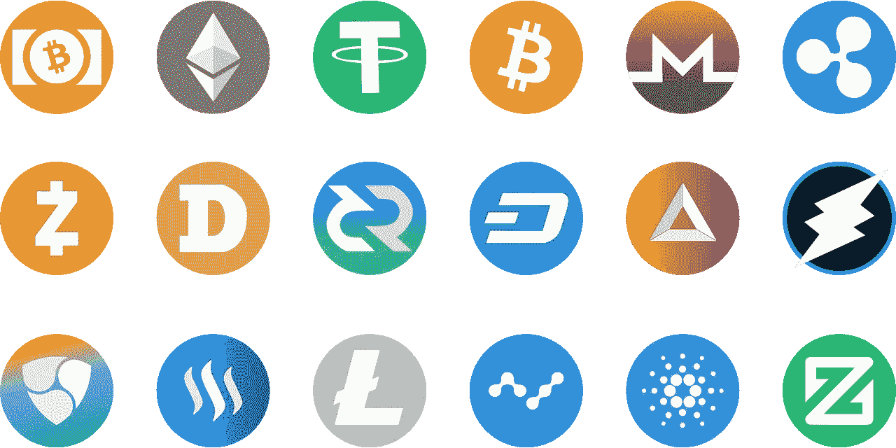
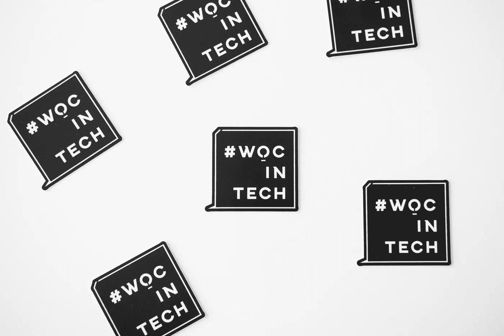
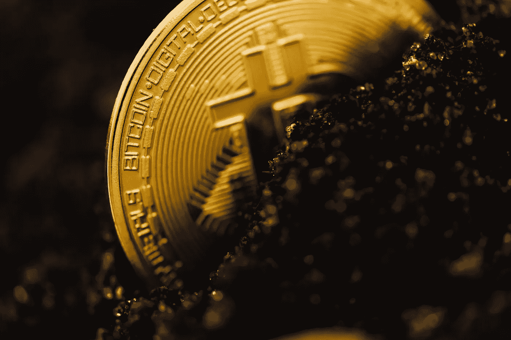
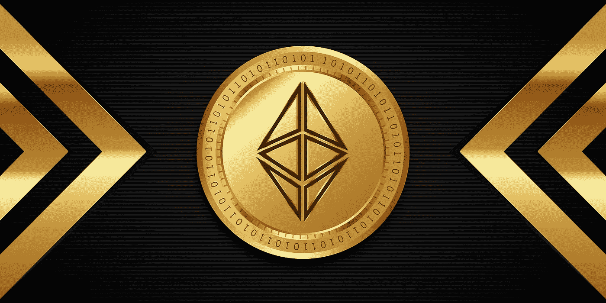

# 一个蹒跚学步的孩子

> 原文：<https://medium.com/coinmonks/a-crypto-toddler-56efe8501375?source=collection_archive---------32----------------------->

所以，不久前我决定开始投资加密技术。

crypto is awesome but it is not miraculous

为什么？嗯……首先，因为这是一个非保守的场景，我通常不喜欢任何最不保守的东西，从政治到社会生活，从哲学到投资。此外，作为一个数字流浪者，加密是一个伟大的冒险之路。它们就像我的日常工作一样不稳定，就像我一周后的生活一样不可预测。

然而，流动性不一定是享乐主义的同义词。尽管 crypto 的波动性吸引了我，但我并非无关紧要。因此，在我陷入这种困境之前，我做了每个数字游牧研究者最擅长的事情:学习。我买了一些关于我特别感兴趣投资的资产的书，还跟踪了一群鲸鱼(这是他们给那些在加密世界中加载的人的名字)和…不，埃隆·马斯克不在其中。我注册了三门课程，比如 Crypto 101，订阅了至少十几个新闻博客，加入了许多 Reddit subs 和滚动 tweeter。很多推文。

在所有的研究之后，我明白了像我这样的菜鸟永远不应该关注外面众多的硬币价格预测。首先，因为加密通常实际上是不可预测的，最后对于像我这样的凡人来说。此外，人们甚至可以“猜测”任何给定硬币——代币或 NFT——的未来趋势，但尽管你经验丰富，你也应该对预测持保留态度。预测在某些时候可能会有所帮助，但它们可能永远不会决定我们将血汗钱投资在哪里，至少在加密方面是这样。最后，你会在网站和博客上找到很多“文章”，告诉你一个默默无闻、仍不为人知的新 NFT 的奇迹，它会让你成为下一个密码百万富翁。嗯，很抱歉给你的游行伙伴泼冷水，但更多的时候，他们是付费文章或“公关”(新闻稿)。所以……在阅读有关加密的内容时保持谨慎是任何加密 101 课程第一天的第一课。如果他们告诉你某件事好得不像真的…那很可能是真的。

我学到的另一个教训是，我必须大量学习——我的意思是一个加密项目必须提供的所谓“白皮书”的 L-O-T(如果没有白皮书，运行！).起初，人们认为这些文献中的大部分内容听起来像梵语。不要害怕。甚至梵语也有在线免费的词典。*【Fo sor】*。所以，这就是我所做的。我读了 10、20、30 份这样的文件，直到我习惯了他们的语言，标出了在大多数文件中重复出现的术语，查找它们并记在“密码日志”中..呃…不，不是这个。另一本日记)。毕竟，这不就是那些学习新语言的人的*工作方式*吗？或者你真的相信你会搬到冰岛，比如说，两个星期后，你会在冰岛讲授认识论？

因此，我阅读了白皮书、书籍和基本面(这是硬币团队告诉你他们是谁，他们想用你的钱做什么的地方)，并决定不要投资什么:*比特币*。

喔，喔，喔！等等！BTC(比特币)不是加密货币中最接近避风港的吗？金币？所有硬币之母？没错，的确如此。然而，我想要一些新的，不同的东西。毕竟，当 BTC 第一次推出时，它被认为是可疑的东西，或者至少是黑暗网络中的人使用的东西，他们的意图并不总是那么撒马利亚人。这并没有错。但是 BTC 不仅如此。然而，越来越多的保守派选择在平静的水面上航行，远离 BTC。那些不怕冲浪大浪的人接受了它。嗯，你知道 BTC 现在意味着什么。

所以，我想找些新东西。实际上，不是全新的。我在寻找一些新的东西。那时我找到了我一直在寻找的东西，那就是一见钟情。

我找到以太坊(ETH)。

> 交易新手？试试[密码交易机器人](/coinmonks/crypto-trading-bot-c2ffce8acb2a)或者[复制交易](/coinmonks/top-10-crypto-copy-trading-platforms-for-beginners-d0c37c7d698c)