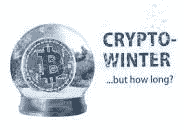

# 七月的秘密冬天？

> 原文：<https://medium.com/coinmonks/a-crypto-winter-in-july-2b0392e8f0b3?source=collection_archive---------32----------------------->

istock

我几乎想不出比秘密的冬天更好的方式来跟进一篇关于 7 月 4 日的文章！(开个玩笑，我能想到很多更精彩的文章——但事实就是如此！)

那些比我更久的人指出了另外两个秘密冬天(尽管我只发现了一个)。2018 年 1 月，比特币市值缩水超过 50%。接下来是为期三年的冬天，于 2021 年 1 月结束。

随着比特币的发展，加密货币也在发展。比特币仍然是加密货币的基准。当投资组合被红色覆盖(表明价值损失)时，这种证据每天都会出现。双子星座的首席执行官兼总裁泰勒和卡梅隆·文克莱沃斯在六月份的时事通讯中宣布了一个秘密的冬天。

cryptoverse 正受到裁员、裁员、收入损失和加密公司倒闭的困扰。比特币、以太坊、卡尔达诺、多边形都在感受损失。Coinsbase 和 Gemini(加密交换平台)也未能幸免。随着韩国政府调查该公司，Terraform Labs 面临未知的指控。

> 交易新手？试试[加密交易机器人](/coinmonks/crypto-trading-bot-c2ffce8acb2a)或者[复制交易](/coinmonks/top-10-crypto-copy-trading-platforms-for-beginners-d0c37c7d698c)

隐秘的冬天——所谓的热门剧集《权力的游戏》(Game of Thrones)在熊市中上演，价格趋势下跌，市场阻力创下新低。

全球事件在这个隐秘的冬天扮演了一个角色。尽管法定货币的主导地位在全球事务中发挥着巨大作用，但投资者(理应如此)谨慎。不要让恐惧主宰一天或毁掉机会。要在这个冬天取得成功，需要尽职、警惕和敏锐的目光。

**强者生存。**

大多数专家都认为加密货币会继续存在。他们一致认为，弱势货币将会失败，而强势货币将会胜出。

克赖顿大学海德尔商学院的金融学教授罗伯特·约翰逊认为，加密货币不会像 2021 年那样强势回归。然而，教授认为加密货币市场将会盛行。他认为美联储的货币政策是“资产类别的逆风”

跟着我学；也许你会学到。或许，我们可以一起探索隐密体。