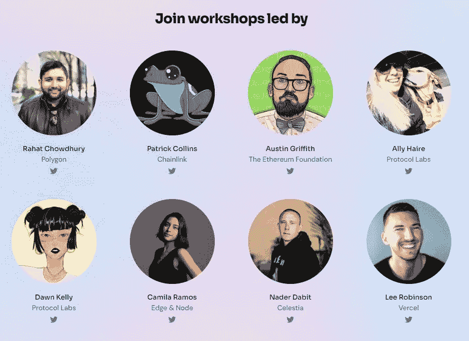

# 在 2022 年成为一名智能合同开发员/审计师—第 19 周

> 原文：<https://medium.com/coinmonks/a-day-by-day-to-become-a-smart-contract-developer-auditor-in-2022-week-19-cbf82b8f6174?source=collection_archive---------10----------------------->

Industry referents led 30 Days of Web3 workshops.

第 19 周:Web3 的 30 天，这是一个为期 30 天的在线课程，涵盖了基本的区块链开发和 web3 堆栈。

由 Women Build Web3 运营的课程是对我承诺的回应。它涵盖了设置环境和编写脚本来测试、运行和部署 dApp，还涵盖了如何连接区块链和 web3 stack APIs。他们带你通过链接后端与前端和 web3 分散服务来托管和存储数据。他们也非常支持通过导师回答不和谐的问题。我对构建全栈 dApp 的理解到处都有漏洞，但本课程填补了这些空白。

我参加了 Buildspace N&W 演示日，这种体验是独一无二的。这是一个游戏化的会议。你走进元宇宙，探索不同项目的不同展位。当你接近某人时，你可以通过他们的摄像头和声音与他互动。一旦你到达一个展位，就像进入一个与参观该展位的其他人的缩放会议。

很容易找到新的“机会”和路径，但是如果我没有一个清晰的想法，我想去哪里，我可以同时去任何地方和任何地方。学习资源丰富，重要的是坚持一个计划，实现里程碑才有真正的进步。顺便说一下，这一周，我在管理时间方面做得更好了。

## 8 月 2 日> 6 小时

*   与 Peace.io 团队进行冲刺规划通话。
*   尝试了 9 级和 10 级以太挑战的不同解决方案。
*   了解[发送、转移和调用方法](/daox/three-methods-to-transfer-funds-in-ethereum-by-means-of-solidity-5719944ed6e9)。
*   研究过[的规格调用](https://solidity-by-example.org/call/)的低级功能。
*   参加了 Blue DAO 举办的关于如何设置电脑的研讨会。

## 8 月 3 日> 6 小时

*   根据导师的反馈，与我的 NFG 队友一起修改代码。
*   阅读关于[向 Ethers.js 的智能合约发送静态调用](https://betterprogramming.pub/sending-static-calls-to-a-smart-contract-with-ethers-js-e2b4ceccc9ab)
*   与 Nader dabi tan 一起参加了由 Women Build Web3 开设的为期 30 天的 Web3 课程，了解 Web3 架构。
*   与和平项目团队进行视频通话。
*   对加密资产的遗产做了研究。

## 8 月 4 日> 4 小时

*   与 Rahat 一起参加了由妇女建设网络 3 组织的为期 30 天的网络 3 项目。
*   继续进行 [30 天的 Web 3 课程](https://www.30daysofweb3.xyz/en/curriculum/3-writing-your-smart-contract/3-defining-functions)。
*   阅读[Web3/智能合约黑客路线图](/@sm4rty/roadmap-for-web3-smart-contract-hacking-2022-229e4e1565f9)文章。
*   调整了我的台式电脑和笔记本电脑的一些安全设置。

## 8 月 5 日> 5 小时

*   参加了研讨会[与 Patrick Collins](https://www.youtube.com/watch?v=FyjRTH760gk) 一起深入了解 30 天 Web3 计划。
*   与和平项目团队进行视频通话。
*   致力于项目推介的安全主题。
*   从事智能和平契约的工作。

## 8 月 6 日> 5 小时

*   参加了 Buildspace N&W 演示日。
*   继续学习 [30 天的 Web 3 课程](https://www.30daysofweb3.xyz/en/curriculum/3-writing-your-smart-contract/3-defining-functions)。
*   再次阅读一篇关于[可靠性的文章——传输 vs 发送 vs 调用函数](/coinmonks/solidity-transfer-vs-send-vs-call-function-64c92cfc878a)。
*   调查如何[移除和添加 Git 遥控器](https://linuxize.com/post/how-to-remove-git-remotes/)。

> 交易新手？尝试[加密交易机器人](/coinmonks/crypto-trading-bot-c2ffce8acb2a)或[复制交易](/coinmonks/top-10-crypto-copy-trading-platforms-for-beginners-d0c37c7d698c)