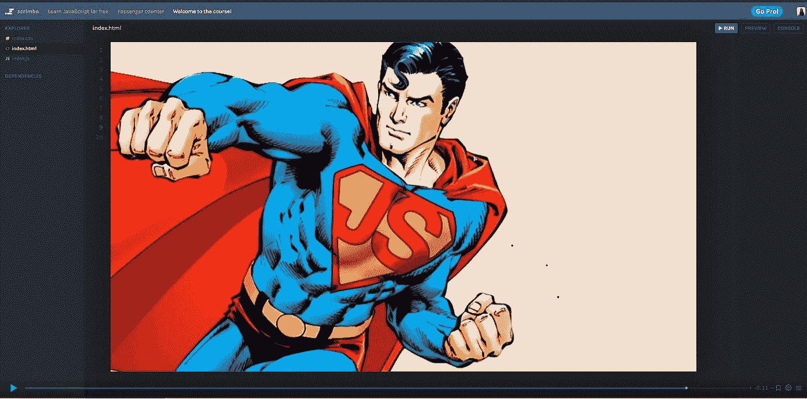

# 在 2022 年成为一名智能合同开发员/审计师—第 13 周

> 原文：<https://medium.com/coinmonks/a-day-by-day-to-become-a-smart-contracts-developer-auditor-in-2022-week-13-19615051771f?source=collection_archive---------4----------------------->

A screenshot of the Javascript Scrimba Course, which is a 10!

第 13 周:我想要的圣诞礼物就是成为一名白帽黑客。

凤凰会正在教授一个 Javascript 训练营；我申请了，并被选为新的一批。它首先通过 HTML 和 CSS 我已经从我和 Le Wagon 一起参加的第一次训练营中获得了一些知识，但是现在我对 web 开发如何工作有了更好的理解，将获得更坚实的基础。

区块链范围巨大；甚至 Solidity 开发也是一个很大的领域。幸运的是，我认为自己是一个聪明的合同审计员。从现在开始，我将把我的学习放在审计师的道路上，旨在缩短学习曲线；我的愿望是找到一份实习，一个导师，或者一个训练营，在指导下让我更接近实际的审计。

在联系某人之前，我会使用网上的学习资源。我先从以太坊虚拟机上玩的基于 aWeb3/Solidity 的 war game Open Zepellin 的 Ethernaut 说起。每一层都是需要“破解”的智能合约。

Discord 上有一个服务器发布了许多用于 Secuerem 训练营的资源；我也会谈到这些材料；也许他们会重新开设审计课程，我也可以申请，我希望！

终于有机会恢复无限机器的阅读了，嗯哼！

## 6 月 21 日> 3 小时

*   报名参加 HTML CSS Scrimba 速成班。
*   报名参加 [JavaScript Scrimba 课程](https://scrimba.com/learn/learnjavascript)。
*   我参与了 [HTML Scrimba 课程](https://scrimba.com/learn/htmlcss)的前 8 堂课。
*   组织我的日程去上凤凰公会的 Javascript bootcamb 课程
*   我看了一个对来自 CoinFabrik 的智能合同审计员 Ariel Waissbein 的采访。

> 交易新手？尝试[加密交易机器人](/coinmonks/crypto-trading-bot-c2ffce8acb2a)或[复制交易](/coinmonks/top-10-crypto-copy-trading-platforms-for-beginners-d0c37c7d698c)

## 6 月 22 日> 5 小时

*   我参与了 HTML Scrimba 课程的第 9 到 18 课。
*   阅读由 [code4rena](https://code4rena.com/) 的排名第一的审计员撰写的文章[‘如何成为智能合同审计员’](https://cmichel.io/how-to-become-a-smart-contract-auditor/)。
*   我解决了以太者的挑战 0 和挑战 1。

## 6 月 23 日> 6 小时

*   加入[secure em](https://secureum.substack.com/)Discord 服务器，阅读他们新审计员训练营的教学大纲。
*   我参与了 [CSS Scrimba 课程](https://scrimba.com/learn/htmlcss)的第 1 至第 8 课。
*   我查看了 [Immunefi 网站](https://immunefi.com/learn/)和智能合同资源的安全性。
*   我解决了以太战士战争游戏[的挑战 2 和挑战 3。](https://ethernaut.openzeppelin.com/)

## 6 月 24 日> 5 小时

*   我在 CSS Scrimba 课程[的第 9 到 16 课中工作。](https://scrimba.com/learn/htmlcss)
*   解决了[以太人](https://ethernaut.openzeppelin.com/)战争游戏的挑战 4 和 5。
*   重新开始读取无限机器。

## 6 月 25 日> 4 小时

*   我继续读无限机器。
*   解决了[以太人](https://ethernaut.openzeppelin.com/)战争游戏的第 6 和第 7 个挑战。
*   阅读回退函数、自毁、委托和委托调用方法。

## 6 月 26 日> 5 小时

*   我继续读无限机器。
*   解决了[以太战士](https://ethernaut.openzeppelin.com/)战争游戏的第 8 和第 9 个挑战。
*   了解如何从约定存储中获取输入、随机数以及 msg.sender 和 tx.origin 之间的差异。

> 加入 Coinmonks [电报频道](https://t.me/coincodecap)和 [Youtube 频道](https://www.youtube.com/c/coinmonks/videos)了解加密交易和投资

# 另外，阅读

*   [霍比评论](https://coincodecap.com/huobi-review) | [OKEx 保证金交易](https://coincodecap.com/okex-margin-trading) | [期货交易](https://coincodecap.com/futures-trading)
*   [麻雀交换评论](https://coincodecap.com/sparrow-exchange-review) | [纳什交换评论](https://coincodecap.com/nash-exchange-review)
*   最好的[加密税务软件](/coinmonks/best-crypto-tax-tool-for-my-money-72d4b430816b) | [硬币追踪评论](/coinmonks/cointracking-review-a-reliable-cryptocurrency-tax-software-5114e3eb5737)
*   [Stackedinvest 评论](https://coincodecap.com/stackedinvest-review) | [北海巨妖评论](/coinmonks/kraken-review-6165fc1056ac) | [bitFlyer 评论](https://coincodecap.com/bitflyer-review)
*   最佳[加密借贷平台](/coinmonks/top-5-crypto-lending-platforms-in-2020-that-you-need-to-know-a1b675cec3fa) | [杠杆令牌](/coinmonks/leveraged-token-3f5257808b22)