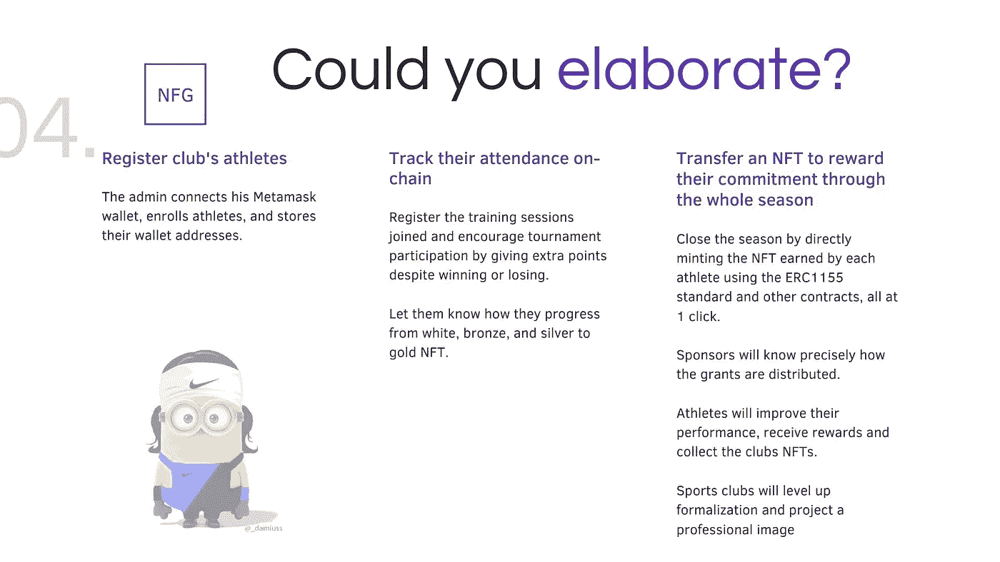

# 2022 年成为智能合约开发人员的一天—第 12 周

> 原文：<https://medium.com/coinmonks/a-day-by-day-to-become-a-smart-contracts-developer-in-2022-week-12-bd330258551f?source=collection_archive---------10----------------------->

NFG’s project presentation on the Demo day

第 12 周:对 Solidity 训练营的结果感到满意。

这个星期是关于我们项目的单元测试，它和 interesting、Hardhat、web3.js 以及其他新东西一样具有挑战性。项目结束后，我将投入其中。我们从一个大的脚本开始，在我们的导师和团队领导的一些建议、更好的理解和一些尝试之后，我们最终得到了一个非常简洁的脚本，几行代码测试了智能合同的大多数功能。

我每天与团队领导进行 2 次视频通话，我们进行对等编码，检查每一项进展，并不断部署以避免意外崩溃。她很有耐心，并致力于自己的角色和项目。在她的领导下，我体会到了强有力的沟通可以减轻负担，提高工作效率。

我最后的贡献是项目的演示视频和演示，根据我的经验，这是交流和提升项目认知的独特机会。

> 交易新手？试试[加密交易机器人](/coinmonks/crypto-trading-bot-c2ffce8acb2a)或者[复制交易](/coinmonks/top-10-crypto-copy-trading-platforms-for-beginners-d0c37c7d698c)

前端是分开写的，由于队友的技能和努力工作的态度，它是有前途的。可悲的是，在关键时刻，它不起作用，我们不得不建立一个最后的基本用户界面，以便能够显示我们的 dApp 工作。在对后端不够熟悉的情况下，这种简单的构建方式是有风险的。毫无疑问，确保单个部分可以与整体连接，并就要使用的堆栈达成一致是值得花时间的。

最后，我们交付了这个项目，以及其他一些很酷的项目。演示日棒极了。我需要睡觉，我的头被烧坏了。我会利用周末来恢复。

## 6 月 13 日> 8 小时

*   早上与团队视频通话，回顾单元测试。
*   中午与团队进行视频通话。
*   处理测试失败。
*   晚上跟团队视频后续通话。

## 6 月 14 日> 8 小时

*   上午与团队进行视频通话，以调整合同。
*   中午与团队进行视频通话。
*   做项目演示。
*   晚上跟团队视频后续通话。

## 6 月 15 日> 7 小时

*   上午与团队进行视频通话，以调整合同。
*   从事该项目的错误测试案例。
*   做项目演示。
*   晚上跟团队视频后续通话。

## 6 月 16 日> 8 小时

*   上午与团队进行后续视频通话。
*   为项目演示录制演示视频。
*   已编辑完演示文稿的幻灯片。
*   晚上跟团队视频后续通话。

## 6 月 17 日> 5 小时

*   训练营最后项目的演示日。
*   研究了像桥和网络这样的 DeFi 技术栈。
*   研究了 DeFi 投资协议，如产量农业、赌注和分散交易。