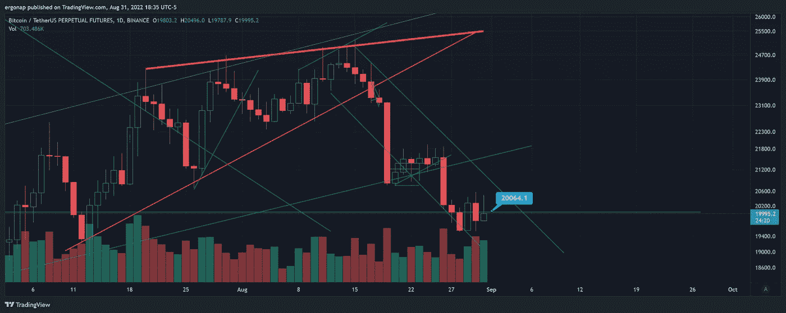
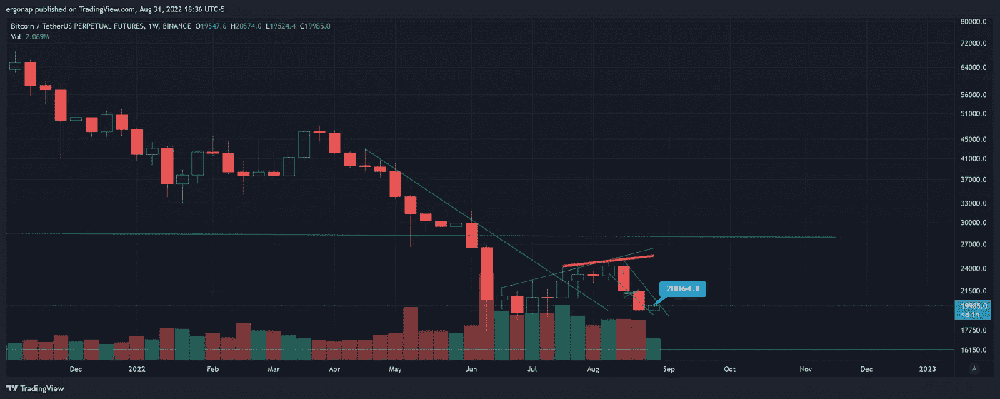
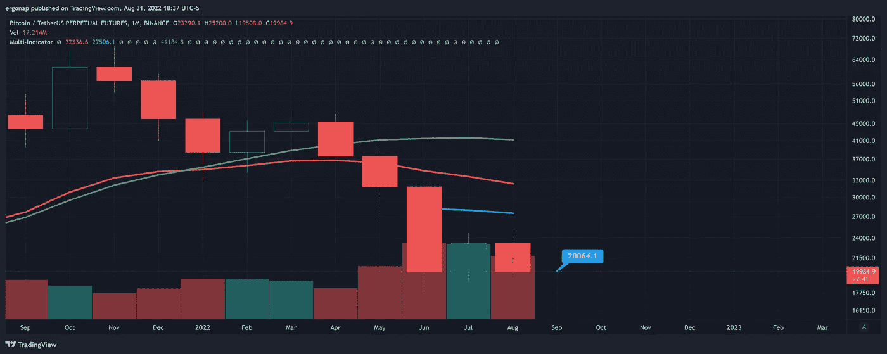
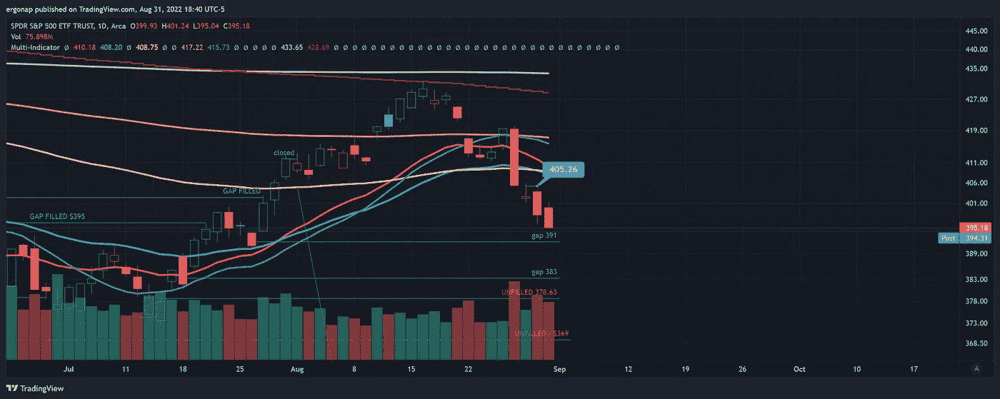

# 月末犹豫不决的一天。

> 原文：<https://medium.com/coinmonks/a-day-of-indecision-on-month-close-26dab1a953c9?source=collection_archive---------42----------------------->

加密货币市场/比特币分析 8/31

优柔寡断的一天——加密货币市场/比特币分析 8/31。

一切首先看起来像合并。总的来说，这就是今天的 TLDR。事情看起来非常非常复杂。然而，我们正在考虑期货溢价，这意味着看跌。即:现货低于期货。

不管怎样，让我们来看看市场，好吗？真正丑陋的一维大头针酒吧，暗示较低，明确。

[https://www.tradingview.com/x/FB6FnlYx/](https://www.tradingview.com/x/FB6FnlYx/)

嗯，一周怎么样？也许我们会看到一些向上的运动？不保证，但当你考虑到我们在宏观熊市中谈论 20k 的 BTC 时，这是一个明显的可能，而且可能是短期的。

[https://www.tradingview.com/x/u98YGhdU/](https://www.tradingview.com/x/u98YGhdU/)

1 个月？明天问我。不管怎样，这个月很快就要结束了。在特定的环境下，新的一个月会有很多方式。

[https://www.tradingview.com/x/ScPc4EgI/](https://www.tradingview.com/x/ScPc4EgI/)

可能性无处不在，但我们也即将迎来假日周末，在此之后通常会发生一些激烈的争论。我敢肯定，这下面，并不完全是一个导致看涨。

$SPY 显然将对市场产生重大影响，并可能很快填补空白。

[https://www.tradingview.com/x/4U4d3qtQ/](https://www.tradingview.com/x/4U4d3qtQ/) . We’re pretty close to the first of the gaps, so if it happens this week at all that’s going to set the stage for the next month entirely.

这很清楚有多少宏观的东西是一个问题。应对通胀将是痛苦的，但会帮助债务，因为它也会影响赤字。债务排名第二的是中国。

不确定我们什么时候会看到定向运动继续，但可能是下周。

> 交易新手？试试[加密交易机器人](/coinmonks/crypto-trading-bot-c2ffce8acb2a)或者[复制交易](/coinmonks/top-10-crypto-copy-trading-platforms-for-beginners-d0c37c7d698c)