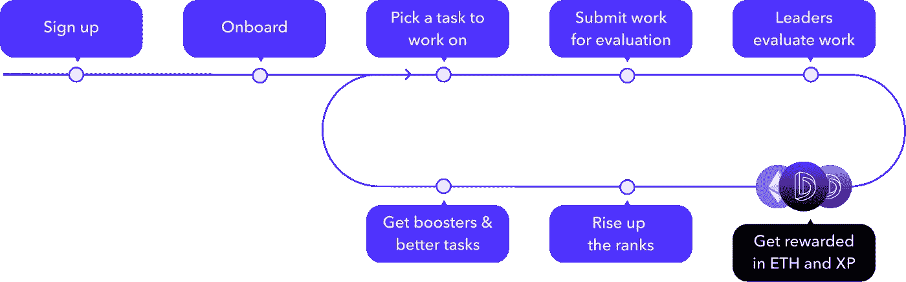

# 您的下一个项目需要的分散式 Oracle！

> 原文：<https://medium.com/coinmonks/a-deep-dive-into-dia-dao-ef7470e230c0?source=collection_archive---------9----------------------->

## 神谕刀你大概没听过吧！

# DIA 简介

当你像我一样探索道的空间时，你可能会遇到许多激发你兴趣的组织。虽然有些人比其他人做得更多，但他们都试图解决自己的问题。其中一个问题是链上和链下产生的大量数据，这些数据漂浮在互联网上，随时可以被使用或遗忘。尽管这些数据在合适的人手里非常有价值，但是收集这些数据需要大量的工作，并且如果没有适当的翻译通常是没有价值的。

# 输入直径刀

这就是直径想要介入的地方。DIA 的愿景是创建一个分散的 oracle，收集链上和链下发生的一切。然后，它处理和操作这些数据，最终将其作为 oracle 提供给相关方、流程和智能合同。他们的 oracle 从集中和分散的交易所、dApps、借贷平台以及元宇宙数据等来源收集数据。通过从多个链收集和交付所有这些数据，it 能够为许多应用程序提供它们需要的信息！

> **可靠、开放和分散的神谕的重要性**
> 
> 还记得露娜的崩溃吗？当 luna 的价格犯下双重谋杀罪时，向主要分散式贷款平台提供价格的 Chainlink oracle 停止了工作。虽然 Luna 的价格稳步下降到 0，但这些平台的智能合约的 Chainlink 价格在 0.10 美元的价格停止。这意味着恶意行为者可以在这些平台上倾倒毫无价值的令牌，用它们作为抵押来借入数百万的加密资产，而他们不必偿还这些资产…

# 刀

国防情报局正慢慢地从一个集权的组织转变为一个分权的组织。随着向 DAO 的过渡，出现了某些挑战，例如 DAO 结构、完成任务和治理。让我们快速浏览一下这些话题，看看 DIA 是如何处理的。

The vision and execution of DIA

## 结构

DIA 希望为所有利益相关者创造价值。为了实现这一点，它正在开发其 DIA oracle，希望创建一个社区来帮助实现其目标，分布治理，并创建意识和曝光。为了实现这些目标，DIA 正在通过(分包)雇佣能够承担不同职责的个人来利用不断增长的 Web3 工作空间。

## 为国防情报局工作

为了给帮助 DIA 实现其去中心化和开放的 oracle 目标的个人授权，它为贡献者创建了一个复杂的内部结构。刀被分成 6 个不同的公会，都在各自的职业中朝着一个目标努力。这可以是从设计和开发到写作的任何事情。为了给 DIA 做贡献，一个人应该在你被提升并获得带薪奖金之前完成一项入职任务。比如说；这篇文章是进入作家协会的入门任务！

DIAs onboarding workflow!

虽然入职结构对我来说有点过于复杂，但它确实过滤掉了许多可能抑制高质量工作的低工作量提交。干得好 DIA！DIA 的工作空间也分为 3 个职业。第一个是领导者，他负责管理任务。第二个是大使，他持续承担责任。最后，还有贡献者，他们用自己的工作为道加油。相当令人兴奋的东西，对不对？！

## 治道

DIA 令牌用于奖励所有贡献者的工作，以及服务于治理的目的。您可以投票并创建有利于 DAO 的提案，该令牌在所有主要的 CEX 和 DEX 上列出。你可以通过贡献来获得治理，或者从交易所购买治理！

# 最后

迪亚绝对是一把有趣的刀。以及他们的产品，但更重要的是他们如何设计他们的刀。这是我见过的设计更复杂的组织之一，但不要让这欺骗了你。他们知道自己在做什么，也知道自己做得对。我唯一的批评点是散布在许多不同网站上的大量数据和信息。申请一个公会，遵循所有的步骤并按照正确的顺序去做是一场噩梦，在那里我不断地怀疑自己这样做是否正确，以及我是否必须做其他事情。幸运的是，不和谐的管理员非常友好，乐于助人……:)

**其他链接:**

*   为了让我的故事对每个人都免费，请给我买杯咖啡吧！https://ko-fi.com/igormd
*   如果你想开始交易，可以考虑用我推荐的库币！【https://www.kucoin.com/r/rf/1de5d 
*   想成为页面上的特色吗？给我发邮件！

> 交易新手？尝试[加密交易机器人](/coinmonks/crypto-trading-bot-c2ffce8acb2a)或[复制交易](/coinmonks/top-10-crypto-copy-trading-platforms-for-beginners-d0c37c7d698c)