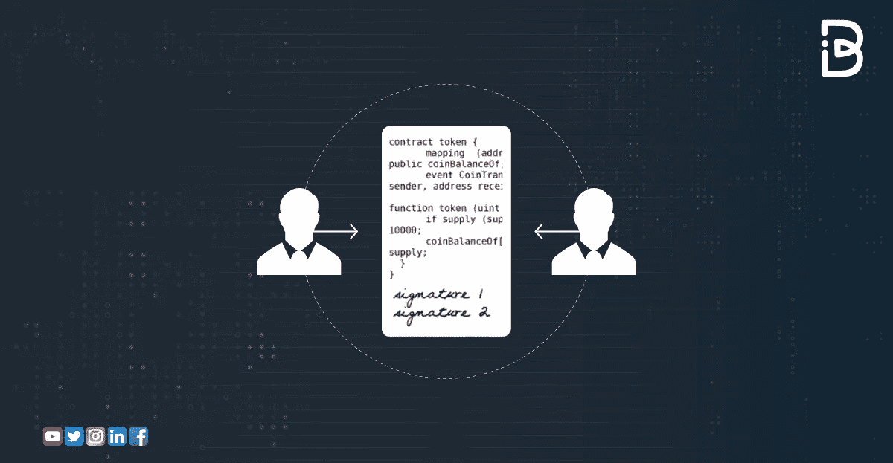

# 深入探究智能合约及其运作方式？

> 原文：<https://medium.com/coinmonks/a-deep-dive-into-smart-contracts-and-how-they-work-4c27d2501539?source=collection_archive---------24----------------------->

**目录:**

1.  什么是智能合约
2.  智能合同是如何工作的
3.  智能合同的局限性
4.  智能合约的用例？
5.  结论

今天的世界让每个人都更加熟悉应用和应用商店。你搜索，下载你想要的应用程序，然后继续寻找另一个。在移动设备吸引人的 UX 和 UI 界面背后，这些应用程序通过执行一组特定的指令来工作。

在 Web3 应用程序的世界中，通常被称为分散式应用程序，这组指令被称为**智能合同**。

*今天的文章讨论了智能合约的基础，它们是如何工作的，等等。坚持读到最后学习！*

## 简单地说

*   智能合同是自动执行的合同，其中买方-卖方协议的内容直接写入代码行。
*   Dapps，或分散式应用程序，本质上是一系列链接的智能合同。
*   智能合同正被用于支持数百种流行的 [**DeFi 协议**](/coinmonks/defi-protocols-and-liquidity-f5d80f103e43) 。

现在，让我们看看什么是智能合约。

# 什么是智能合约？

用最简单的话来说，智能合同是一段代码**，用于执行一组指令。**

**智能合同是两个人或两个实体之间以计算机代码形式达成的协议，通过编程自动执行**。现代计算机科学的先驱 Nick Szabo 在 20 世纪 90 年代提出了智能合同的概念。他将它们定义为一系列虚拟的承诺，以及执行这些承诺的相关协议。

***智能合约和区块链；从来都是缺一不可的！***

*为什么如此？让我们来了解一下！*

智能合约是由区块链实现的，它是一个计算机网络，在没有任何中介的情况下共同工作来执行网络规则。智能合约在区块链 T21 号上执行，这意味着指令存储在分布式数据库中，不能被修改。交易也在自动支付和交易对手的区块链上处理。

记录支付证明的比特币协议可以被视为智能合约的原始版本。自从以太坊出现以来， [**智能合约**](https://blog.immunebytes.com/what-is-a-smart-contract-audit/) 的基础已经被精简，因为复杂的交易可以被编程到以太坊协议中。

智能合同**消除中间商**。没有人或公司持有你的信息或核实它。区块链为您验证和保存信息。维塔利科·布特林和以太坊社区认为这是区块链的未来。

经常引用，“ ***如果说比特币是商业世界的黄金，智能合约就是商业世界运转的石油。”***

智能合约如此之多，那么它们是如何工作的呢？

# 智能合约是如何工作的？

智能合同是一种程序，它对业务逻辑进行编码，并在嵌入区块链或其他分布式分类帐的专用虚拟机上运行。它使得自动化数字任务成为可能，例如转账、购买/出售资产，甚至玩游戏，而不需要中央实体来管理和批准交易。

智能合约的工作原理是简单的“如果/当…那么…”语句，写在区块链的代码中。当预定条件得到满足和验证时，计算机网络执行这些动作。这些行动可以包括向适当的一方发放资金、登记车辆、发送通知或开罚单。然后，当交易完成时，更新区块链。

为了客观地看待它，下面是它遵循的步骤:

1.  定义了智能合约响应特定事件或环境的预期行为的标准。
2.  然后，开发人员使用智能合同编写平台来创建和测试逻辑。
3.  一旦代码编写完成，它将被发送到一个单独的团队进行安全性测试。任命内部专家或专门审查 [**智能合约安全**](https://www.immunebytes.com/) 的公司。
4.  一旦获得授权，智能合约就被部署在现有的区块链或其他分布式分类帐基础设施上。
5.  智能合约配置为侦听来自" **oracle** "的事件更新，这实际上是一个加密安全的流数据源，部署后。
6.  一旦它从一个或多个 oracles 获得了必要的事件组合，智能契约就会执行。

**一些著名的 dapp**

*   **MakerDAO** —一款分散式金融(DeFi)应用，用户无需中间人即可借出和借入加密货币。
*   uni swap——一个基于以太坊的交易所，允许任何人交换 ERC-20 代币。
*   **Axie Infinity**——一款玩家收集并繁殖以 [**NFTs**](https://blog.immunebytes.com/why-is-getting-a-security-audit-for-your-nft-important/) 为代表的怪物，并与之对战的游戏。
*   **Argent** —一种以太坊钱包，它使用智能合约抽象出地址和私钥等概念。

数以千计使用智能合约的应用已经成功上线运行。流行的以太坊应用程序 **MakerDAO** 和 **Compound** 在其核心使用智能合同进行借贷，并允许用户赚取利息。除了金融，许多行业也可以从使用区块链智能合同作为供应链的一部分中受益。

# 智能合同的局限性

尽管被认为是一种“不可信”的执行协议和逻辑的方式，智能合同也不是没有问题。

首先，智能合约是不可变的。这意味着一旦部署，它们就不能被修改或升级，如果代码包含潜在的问题，这可能导致灾难性的后果，通常以投资者赔钱而告终。

尽管智能合约试图消除第三方的参与，但不可能完全消除它们。第三方承担的角色与他们在传统合同中承担的角色不同。例如，将不需要律师准备个人合同；然而，开发人员需要它们来理解为智能合约创建代码的术语。

# 智能合约的用例？

智能合约是整个去中心化金融(DeFi)革命的核心，用于支持数百种流行的 DeFi 协议。然而，也有大量的公司，甚至一些政府采用。

智能合同适用于当前签订传统合同的所有领域，例如:

**记录**

智能合同可以促进记录的存储和维护。例如，维护需要安全存储和更新的数百万份机密病历。

**贸易**

大多数商业活动依赖于对其资金的批准，这是一个耗时耗力的过程。有了智能合约，这个时间可以大大减少。

**供应链**

物联网设备可以用于整个供应链，记录产品的每一个步骤，并提高其可追溯性。通过这种方式，可以消除错误、盗窃和丢失。

**抵押贷款**

基于智能合约的抵押贷款交易可以变得更便宜、更快捷、更安全。这将允许买家更早地访问财产，并自动更新记录。

**楼市**

智能合同可以用来更有效地登记财产所有权。此外，它们的用途可以延伸到公寓、建筑物或土地之外，并登记所有类型的资产。

一些最突出的例子包括:

*   育碧(Ubisoft):视频游戏巨头育碧(Ubisoft)大举拥抱区块链；它已经起草了专门设计的智能合同，允许用户拥有、转让和要求基于其受欢迎的 Rabbids 游戏特许经营权的稀有 NFT。
*   **ING** :荷兰银行 ING 联合创建了 **Fnality** ，这是一个基于区块链的使用智能合约的贸易结算系统。
*   **瑞典政府**:瑞典政府已经测试了一个**位于区块链的土地登记处**，用于证明土地所有权，该登记处建立在智能合同的基础上。

*但是……总有但是，嗯？*

**智能合约并不总是完美的……**

# 结论

如今，大多数区块链采用智能合同。随着活跃的开发人员社区使用智能合约创建 DeFi 和 Web3 应用，智能合约功能的范围从非常简单的基于比特币或莱特币的东西，到更高级的基于 dApp 的区块链，如以太坊和 Polkadot。

然而，我们仍然处于智能合约潜在价值的早期阶段。但是有公司甚至政府在试验他们的潜力。在未来几年，我们可以期待行业更深入地挖掘智能合同的数百万种可能性！

# 关于免疫字节

ImmuneBytes 为企业和初创公司提供全面的智能合同审计解决方案，让他们的应用程序有一个安全的开端。我们的旅程始于促进即将到来的区块链世界的安全，提高大规模系统的性能。

[**ImmuneBytes**](https://www.immunebytes.com/) 管理严格的智能合同审计，采用静态和动态分析，检查合同的代码和 gas 优化，不给 bug 留下任何逃脱途径。

> 交易新手？试试[加密交易机器人](/coinmonks/crypto-trading-bot-c2ffce8acb2a)或者[复制交易](/coinmonks/top-10-crypto-copy-trading-platforms-for-beginners-d0c37c7d698c)