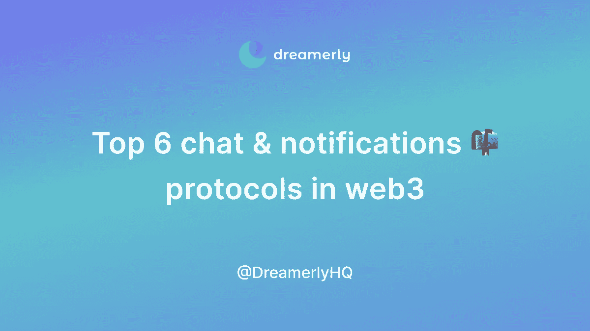

# 深入了解 web3 2022 中的顶级聊天和通知协议

> 原文：<https://medium.com/coinmonks/a-deep-dive-into-the-top-chat-notifications-protocols-in-web3-2022-e779131f713c?source=collection_archive---------23----------------------->

你听说了吗？聊天和通知将传入#web3。这里深入探讨了使链上通信成为现实的协议。

但首先，让我自我介绍一下:

**大家好，我是 Linh，Dreamerly(Twitter:**[**@ DreamerlyHQ**](https://twitter.com/DreamerlyHQ)**)的业务拓展。我们帮助 web3 开发者将 NFTs 集成到 iOS 应用中，只需要几行代码。关注我们的 Twitter，了解更多关于 crypto 的最新消息。**

或者，你可以在我们的 Twitter 上阅读这篇文章:

事不宜迟，让我们来看看 web3 中最常用的聊天和通知协议。

# **1/推送协议—以太坊领导者**

数字不会说谎:100+ DeFi、NFT 以及以太坊和 Polygon 上的新闻项目都在使用 Push(以前的 EPNS)向他们的用户发送通知。最终用户可以安装浏览器扩展和移动应用程序来接收实时消息。

Push Protocol

# 2/方言—智能消息传递愿景

有两点让 Dialect 与众不同:1)它专注于 Solana 生态系统，整合了 27 个项目，2)它的愿景是释放定制的媒体嵌入消息(例如，用您钱包中的权利接收和响应 NFT 拍卖出价)。

Dialect

# 3/Notifi——索拉纳挑战者号

Notifi 是 Dialect 在 Solana 和 Aptos 生态系统中的直接竞争对手。该项目为最终用户提供了一个设计精美的一体式收件箱，供他们阅读信息、管理订阅以及与其他钱包聊天。

Notifi

# 4/XMTP——崛起的新贵

XMTP 仍处于早期阶段，但该协议有很多令人喜欢的地方。它旨在为加密开发者建立一个安全和开放的消息传递体验。XMTP 有 a16z 这样的顶级投资者做后盾，所以绝对值得关注。

XMTP

# 5/Hashmail——电子邮件协议

Hashmail 为任何钱包地址提供了一个电子邮件收件箱，但它更侧重于 dapp 事件通知。通过 Hashmail，用户可以轻松接收重要的信息，包括交换确认、ENS 提醒、NFT 提醒等等。

Hashmail

# 6/ Skiff —用于加密的 Google Workspace

Skiff 的愿景是天作之合:Google Workspace 的全部功能——电子邮件、存储、文档——加上 web3 的开源、隐私优先、去中心化的额外津贴。Skiff Mail 为任何以太坊或索拉纳地址提供了一个私人收件箱。

Skiff

**在 Twitter 上关注我们**[**@ DreamerlyHQ**](https://twitter.com/DreamerlyHQ)**获取有用的&有趣的内容这样！**

> 交易新手？试试[加密交易机器人](/coinmonks/crypto-trading-bot-c2ffce8acb2a)或者[复制交易](/coinmonks/top-10-crypto-copy-trading-platforms-for-beginners-d0c37c7d698c)