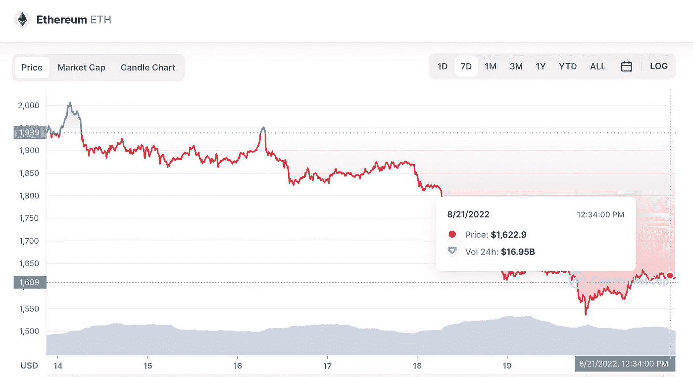
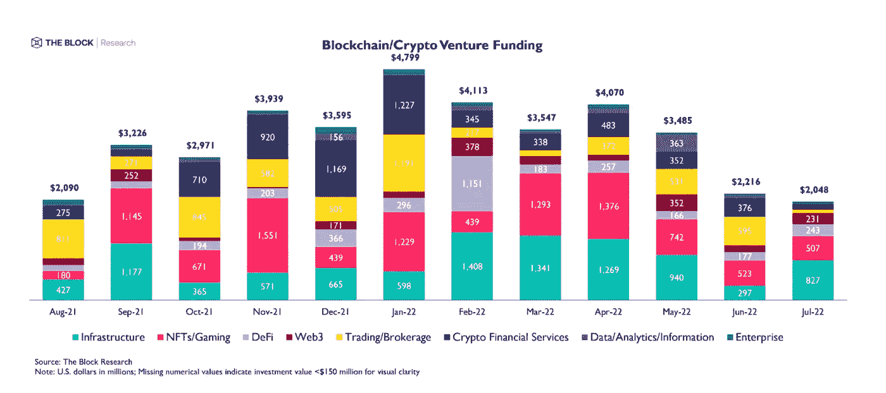

# 📉Crypto 和 Web3 惨淡的一周

> 原文：<https://medium.com/coinmonks/a-dismal-week-in-crypto-and-web3-68298571a9de?source=collection_archive---------60----------------------->

# 内容(4 分钟阅读):

*   📖**总结-**

> 比特币下跌
> 
> 以太坊的融合与价值
> 
> **梅塔的狞元宇宙**
> 
> 摄氏新闻
> 
> 梅尔卡多的硬币。

*   **👭🏽NFTs 的状态**
*   👨‍👩‍👧‍👧Startupy——社区管理的搜索引擎
*   💸风险投资
*   🏖️个人退休帐户，避税帐户
*   📰热门阅读
*   🙏🏻感激…

# 📖摘要

> ***比特币本周下跌约 14%****受美联储 7 月会议纪要以及美国零售销售弱于预期的影响。*

美国中央银行本周早些时候公布了其 7 月会议的会议纪要，这表明政策制定者打算在收紧货币政策以应对通货膨胀时坚持到底。与此同时，官员们也担心过于激进会损害经济。

即将发布的数据显示，**市场认为 9 月份加息的概率为 75%**[**约为 60%**](https://twitter.com/biancoresearch/status/1559884782095503366)**据宏观市场研究员 [**Jim Bianco**](https://thedefiant.io/i-try-to-tell-people-about-defi-it-will-come-here-and-completely-flatten-you-jim-bianco) 。**

**Yaro on Tech、Blockchain 和 Web3 是一份读者支持的出版物。为了接收新帖子和支持我的工作，考虑成为一个免费或付费用户。**

> *****以太坊在过去 7 天内下跌约 16.1%。Whales 和整个加密领域继续看好定于今年 9 月 15 日进行的历史性合并。然而，ETH 的峰值约为 2000 美元，但在鹰派美联储的影响下，已经冷却至 1600 美元左右。*****

****

**[Coinmarketcap.com](http://coinmarketcap.com)**

**在推出 ETH 2.0 阶段 0 和信标链 18 个月之后，[以太坊](http://ycobitcoin.com/)终于在今年 9 月 15 日从工作证明(PoW)转向利益证明(PoS)。但鲸鱼一直在积累 ETH，近期呈现看涨信号。这一点在 Goerli Testnet 成功推出后的巨额交易中显而易见，其价格飙升至 1880 美元以上的两个月高点。**

> **[***Meta 用一张狞截图***](https://url-e.coinmarketcap.com/ls/click?upn=3XGtgU0aTcvSIJEH-2F-2B3WuJkIhkYd79WXDZ3slvXMJhsOMlj0gMvmn6-2BH91MDv4lPNLuspqXfW6wFSRepVJHmAUZyJsM-2F4OK-2B2BGSHsvupDl3ku4-2Bzuf5fUdVDCjmInvHtGUHq8TYoIry7-2FtJQp5XrQsgXkinscWH88StjM3Wefg-3DyWur_uYqL4p72S3BV1QzvSAJ8EqylmF8Q7x3AgZrHIqFEc2-2F9oGZ80P932XQ2R-2FFPdsM2TZlmlBAC8S4v35hwhInEo6zHoCKVZvC86Tn-2FeuNYzIyT4FZAeb6-2FnNkZoVhBc-2FpUBK0yAV5IUCWCUCIKH-2Bxseg3zSlLA-2FkDNCwjrIVbjzcsFHmo5zncNSfXHdXAedyEqVNyshO6bcuVQ1fUgy-2BfhuRtiV-2F535Oo675Jf3tWlK1mn-2FKUTRqcsjwpUGDm2KKYBiqztvqmLLkU6YZEpVNJEVUkYlbdUYmpYOLebugLP2BzkYTpndp6aax52UXAwQwbl85Tjnolnr32wNJXeyUKhXVSwArC5olJf1TvK47KCeAukhs2fiaVFB424utkkpBkCE0aDYA-2BKakxFVXn-2FjSyQsUIrK3ReGiUGTnpyiqEPGjQ5wg-2B34F69MIbCTfbgWARg3ksX23TlPThhQZTPbk8P-2B0WUYudGUViwuANMmGn7Ue698dlCKFSRqk1JRRLF3u5aYnsLmkL78h-2BpDSuGVaST3dhuoXbAyq553CM2mif-2BVugwxoc03UtfanfU1fv4n7w6-2BoCiAr6oWTbwCwaWaDrUst2kXBjqsrwYJYg25W8eZSOQsyvN8qjLwLI0l-2Fpt-2FT5CxxSHKrYTdj1enfe4vZRYTydm-2FKmALmb8jUIr8NtjyAya-2B4-2BBYOZZRWb5h3tTjyP5wI8qm9RSkAGwPwDFV0C2qdjkr2G-2BQIbPabIqzgtfwDOzu9fgW4mDgvYU5d36YUvn2ZNKezeoD-2FAJWKMPhF3zE11C4VWCpzPCcICyk83uJaUc3BrGuVt-2B8Fv-2B2CicLGj-2BcgMWZVJLqf4wWN3afJRkZoRy91sXEF5hVlQcr8GtALflRG7Y2arpIKjCgDEgRXOuQT4xmyIuks-2FYoOeU-2Fu1WQtEfy7YVYMJ9XR0PEzV6mrW4BCtnotxp0Tb2hJ0cTDr9XsLai9HpQk9LagEfNVtfUg5VNTgZnBO8euEMrLplM5Zi97F2wPB6t0v2ODK84iKs) *。Meta 的元宇宙地平线世界在法国和西班牙发布了一张* ***非常简单的截图*** *，这引起了 Twitter 上技术和加密人群的嘲笑。他们甚至懒得把它翻译成西班牙语来发布。***

**[**摄氏案可能得到独立审查员**](https://url-e.coinmarketcap.com/ls/click?upn=3XGtgU0aTcvSIJEH-2F-2B3WuJkIhkYd79WXDZ3slvXMJhsOMlj0gMvmn6-2BH91MDv4lPjkskrBEcX-2BzM5wDcJZPXYkSgzeUAu5JN-2Brsn5PLNKFpWrEPpRCaWdm-2BuDBiKxF4v-2F3tRU64mauZrcscYzjllCnlRiIE366qtMJydZa-2BYdYMhngXApQAwup-2BU1OqoQiGuB3L1_uYqL4p72S3BV1QzvSAJ8EqylmF8Q7x3AgZrHIqFEc2-2F9oGZ80P932XQ2R-2FFPdsM2TZlmlBAC8S4v35hwhInEo6zHoCKVZvC86Tn-2FeuNYzIyT4FZAeb6-2FnNkZoVhBc-2FpUBK0yAV5IUCWCUCIKH-2Bxseg3zSlLA-2FkDNCwjrIVbjzcsFHmo5zncNSfXHdXAedyEqVNyshO6bcuVQ1fUgy-2BfhuRtiV-2F535Oo675Jf3tWlK1mn-2FKUTRqcsjwpUGDm2KKYBiqztvqmLLkU6YZEpVNJEVUkYlbdUYmpYOLebugLP2BzkYTpndp6aax52UXAwQwbl85Tjnolnr32wNJXeyUKhXVSwArC5olJf1TvK47KCeAukhs2fiaVFB424utkkpBkCE0aDYA-2BKakxFVXn-2FjSyQsUIrK3ReGiUGTnpyiqEPGjQ5wg-2B34F69MIbCTfbgWARg3ksX23TlPThhQZTPbk8P-2B0WUYudGUViwuANMmGn7Ue698dlCKFSRqk1JRRLF3u5aYnsLmkL78h-2BpDSuGVaST3dhuoXbAyq553CM2mif-2BVugwxoc03UtfanfU1fv4n7w6-2BoCiAr6oWTbwCwaWaDrUst2kXBjqsrwYJYg25W8eZSOQsyvN8qjLwLI0l-2Fpt-2FT5CxxSHKrYTdj1enfe4vZRYTydm-2FKmALmb8jUIr8NtjyAya-2B4-2BBYOZZRWb5h3tTjyP5wI8qm9RSkAGwPwDFV0C2qdjkr2G-2BQIbPabIqzgtfwDOzu9fgW4mDgvYU5d36YUvn2ZNKezeoD-2FAJWKMPhF3zE11C4VWCpzPCcICyk83uJaUxx2s5pKNu75iSBFVjJrpqb2dS-2FRf1hLG4Lly4JZ0SESbcpKbjyDZXmxIY-2BcLY0dKSONIkBT15GvEHT6exSnU7M0V3Ef4yve7Hado-2FkQ-2B8EgF2x5qdLqV3m3IcmxfEm09AvlQKa57FKCCzqsdk67uazcPZ9qeN64uyfgvvgECWtuEvxHouO41W83sMFYsfP-2BYrTxusEWZZFhX5X9XOGHeq) 。CeFi 贷款人的流动性只能维持到 10 月底，5 月**将接受一家独立审查机构**的审查，类似于雷曼兄弟的破产案。**

**在巴西，电子商务巨头 Mercado Libre's 推出了一种名为“Mercado Coin”的新加密货币 ，允许客户使用该货币进行购物和收取现金。**

# **👭🏽NFTs 的状态**

**周二，OpenSea 的交易量跌至 13 个月以来的最低水平，这表明 NFT 市场正在经历一个严酷的冬天。**

**根据来自 [**DappRadar**](https://dappradar.com/ethereum/marketplaces/opensea) 的数据，排名第一的 NFT 市场 [**OpenSea**](http://opensea.com/) **处理了价值 650 万美元的交易，是 2 月**高峰时 2 . 04 亿美元的零头。**

**在过去的六个月里，该网站的交易量也下降了三分之二。至于活跃的交易者，市场上的交易者数量也大幅下降，只有 15，220 人，比 2 月份的高峰时期下降了 70%。**

****

**女性的世界——NFTs**

# **[启动-](https://beta.startupy.world/membership/?ref=yarocelis)**

> ***我很高兴地宣布，我已经成为 Startupy 的策展人和会员。一个社区管理的搜索引擎。零 SEO BS。* [***我邀请你加入这个为漫游、研究和思考而设计的知识和见解的令人愉快的图书馆。***](https://beta.startupy.world/membership/?ref=yarocelis)**

# **💸风险投资**

**每个领域的风险投资都在逐月下降。正如我们在下面看到的，作为“加密金融服务”行业的“NFT 空间”受到的冲击最大，因为流入这些领域的资金减少了。**

****

**交易/经纪类别的投资数量也有所下降，这一数据与我们在加密行业看到的大规模裁员密切相关。**

****根据**[**Crunchbase**](https://www.crunchbase.com/)**的分析，截至 7 月底，仅美国就有至少 32000 名科技行业的员工被各公司解雇，作为缩减员工规模努力的一部分。****

**仅在 7 月份，加密交易所 CoinFlex 解雇了 50-60%的员工，Blockchain.com 减少了 25%的员工，NFT 最重要的平台 OpenSea [裁员 20%](https://watcher.guru/news/opensea-fires-20-of-its-staff-as-crypto-winter-cripples-the-nft-marketplace) 。**

> *****结论:*** *许多伟大的 crypto 和 WEB3 项目将继续吸引投资者，但以什么样的速度？此外，只要经济继续萎缩，人们继续失业，投资于新技术和加密项目的资金就会减少。***

****

**[itrust](https://itrustcapital.com/referral100?utm_source=partner&utm_medium=youtube&utm_campaign=partner637&oid=10&affid=637)**

**加密货币是这些天每个人都在谈论的东西之一。有各种不同的交易所可以进行 e crypto 交易，但是许多人没有意识到他们在税费上损失了多少。**

**[iTrustCapital](https://itrustcapital.com/referral100?utm_source=partner&utm_medium=youtube&utm_campaign=partner637&oid=10&affid=637) 允许其客户通过个人退休账户或个人退休账户投资 crypto，而不必担心税收或费用。**

**IRA 是避税账户，这意味着你所有的加密交易都是免税的，并且可以随着时间的推移免税。**

**没有隐藏的费用。[要了解更多信息，请点击此处并开设免费账户。](https://itrustcapital.com/referral100?utm_source=partner&utm_medium=youtube&utm_campaign=partner637&oid=10&affid=637)**

**[分享 Yaro 的技术& WebX 简讯](https://yarocelis.substack.com/?utm_source=substack&utm_medium=email&utm_content=share&action=share)**

# **📰热门阅读**

*   **[CryptoPunk 以太坊 NFTs 底价 5 个月来首次翻转无聊的猿类](https://decrypt.co/107911/cryptopunk-ethereum-nfts-floor-price-flips-bored-apes-for-first-time-in-5-months)**
*   **[浪人黑客将偷来的 6 . 25 亿美元转移到比特币网络:报道](https://cryptopotato.com/ronin-hackers-have-moved-the-stolen-625m-to-bitcoin-network-report/)**
*   **[顶级密码分析师预测以太坊(ETH)将在年底崩溃——这是他的目标](https://dailyhodl.com/2022/08/21/top-crypto-analyst-predicts-brutal-ethereum-eth-collapse-toward-end-of-year-heres-his-target/)**
*   **[比特币的[BTC]跌破 22000 美元，这对这些行业的需求意味着什么](https://ambcrypto.com/bitcoins-btc-fall-below-22000-and-what-it-means-for-demand-in-these-sectors/)**
*   **[FTX 的 Sam Bankman-Fried 和 Brett Harrison 回应 FDIC 对“虚假陈述”的指控](https://dailyhodl.com/2022/08/21/ftxs-sam-bankman-fried-and-brett-harrison-respond-to-fdics-allegations-of-false-statements/)**
*   **[MicroStrategy 的迈克尔·塞勒希望埃隆·马斯克购买更多比特币](https://zycrypto.com/microstrategys-michael-saylor-signals-elon-musk-to-purchase-more-bitcoin/)**
*   **[随着鲸鱼交易数量激增至三个月来的最高水平，XRP 网络突然活跃起来:分析公司](https://dailyhodl.com/2022/08/21/xrp-network-abruptly-comes-to-life-as-number-of-whale-transactions-surges-to-three-month-high-analytics-firm/)**
*   **[扎克伯格嘲笑地平线世界的元宇宙图形](https://beincrypto.com/zuckerberg-mocked-for-horizon-worlds-metaverse-graphics/)**

> **交易新手？尝试[加密交易机器人](/coinmonks/crypto-trading-bot-c2ffce8acb2a)或[复制交易](/coinmonks/top-10-crypto-copy-trading-platforms-for-beginners-d0c37c7d698c)**