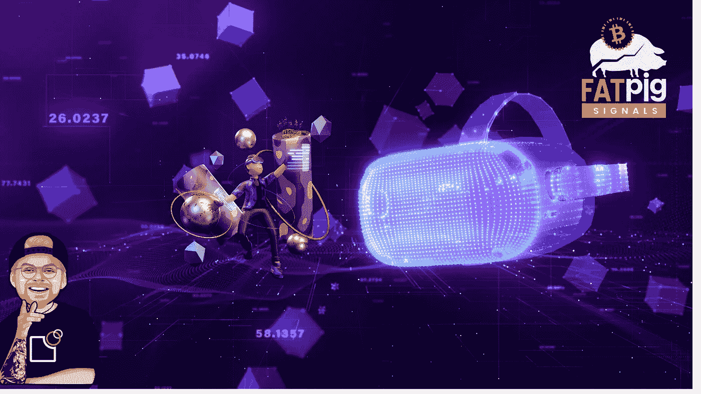

# 元宇宙分权制的全面指南

> 原文：<https://medium.com/coinmonks/a-full-guide-into-the-decentraland-metaverse-2c7e14603a33?source=collection_archive---------17----------------------->

在过去的几个月里，分散土地和魔法硬币被几个大肆宣传的流行词汇所包围:**区块链游戏**、元宇宙、超真实、不可替代代币和玩即赚。乍一看，这是一个看起来很无辜的游戏，图形很简单。但通常情况下，第一印象可能具有欺骗性。本指南解释了项目背后的内容。

# 什么是分权制…