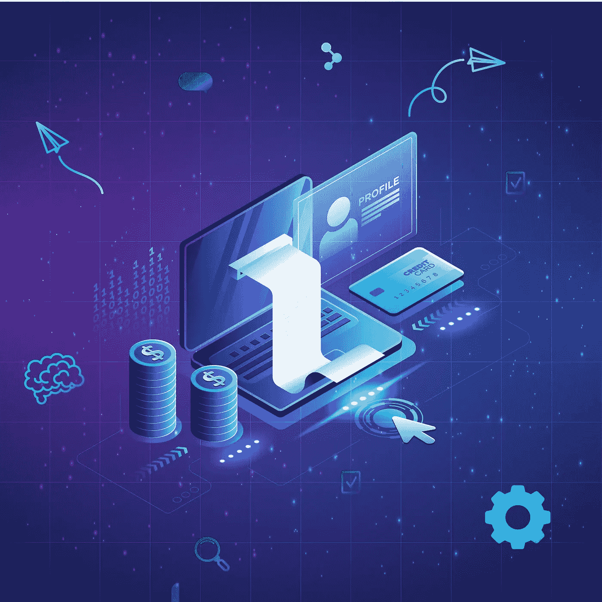
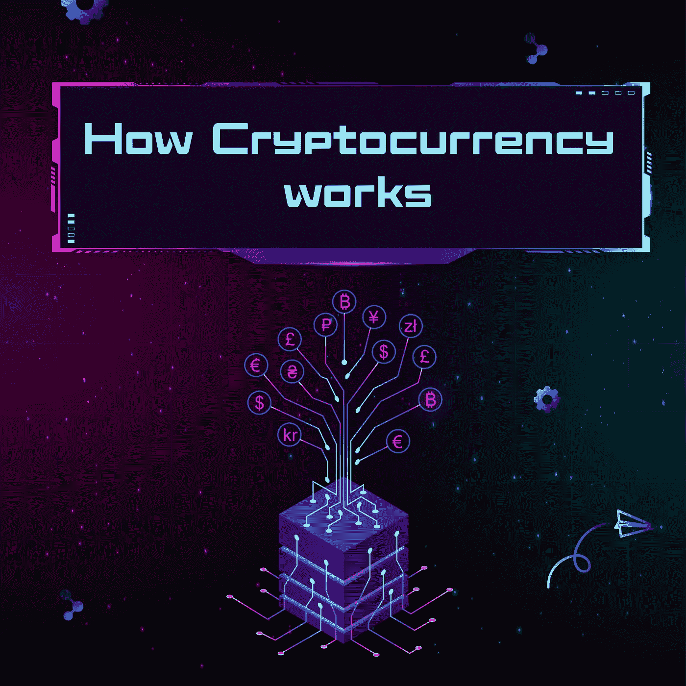
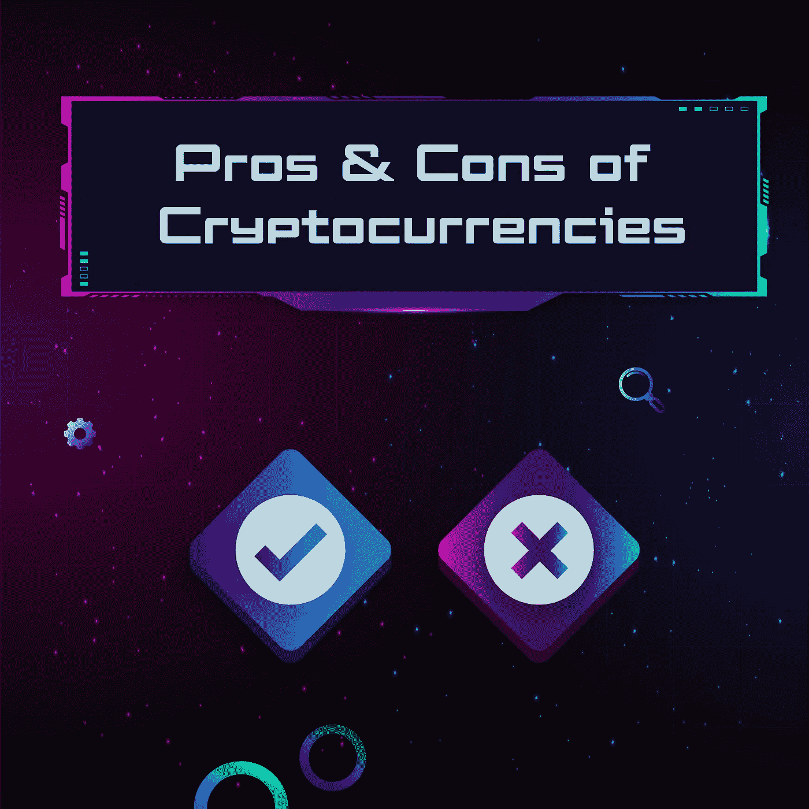
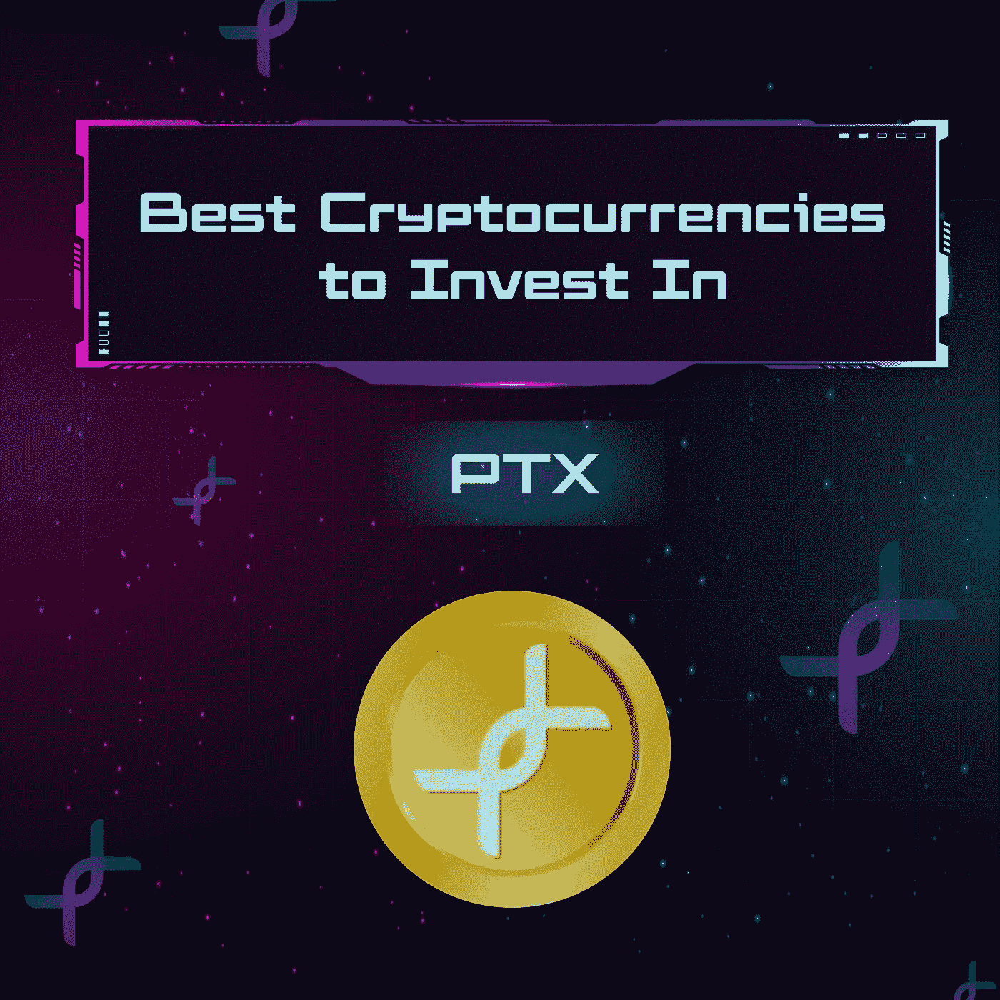
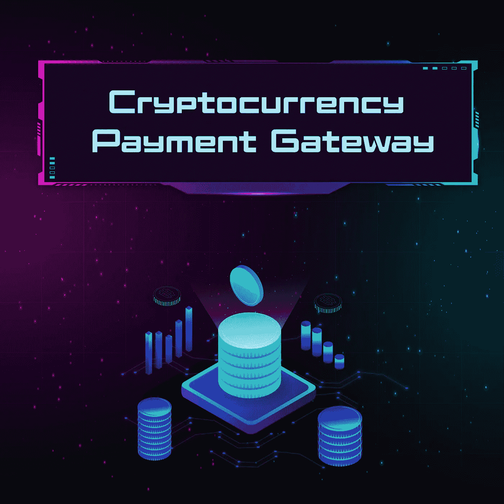
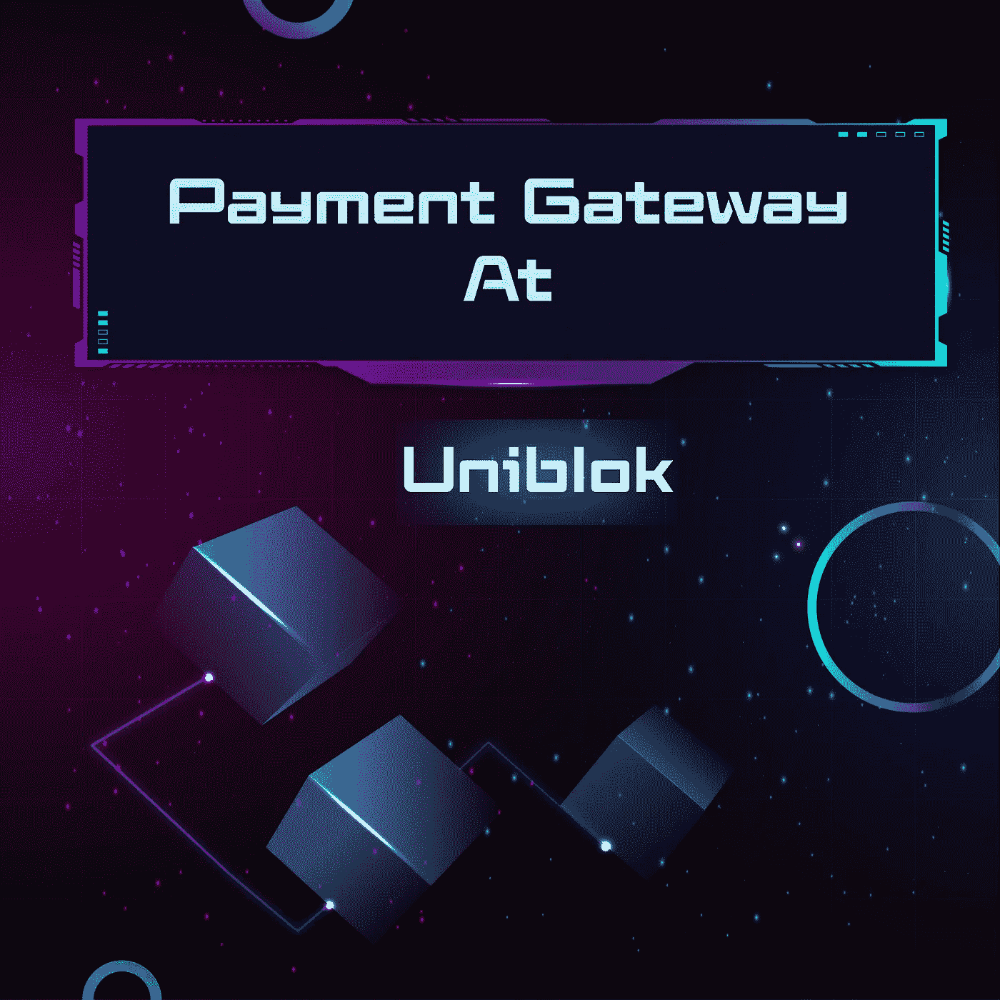

# 理解加密货币的完整指南

> 原文：<https://medium.com/coinmonks/a-full-guide-to-understand-cryptocurrency-502f55273ba6?source=collection_archive---------36----------------------->

A Full Guide to Understand Cryptocurrency

# 加密货币全指南

## **什么是加密货币**

加密货币是由加密系统支持的数字或虚拟货币。通过这种方式，可以在不需要第三方充当中介的情况下进行安全的在线支付。

术语“**加密**”指的是保护这些条目的各种加密算法和加密技术，如椭圆曲线加密、公钥-私钥对和哈希函数。

有几种方法可以获得加密货币，包括挖掘或从加密货币交易所购买。一些电子商务网站不允许购买加密货币。事实是，加密货币，即使是比特币等热门货币，也很少用于零售交易。

由于价值飙升，加密货币作为交易工具已经变得很受欢迎。它们还被用来在有限的程度上便利跨境转移。

## **加密货币如何工作:**

How Cryptocurrency Works

加密货币基于一个名为区块链的分布式分类账，由货币持有者更新和持有的所有交易记录组成。

加密货币是通过挖掘过程创建的，这涉及到使用计算机能力来解决复杂的数学问题。加密钱包也可供用户从经纪人那里购买货币，然后储存起来，随心所欲地消费。

加密货币没有任何有形价值。本质上，您拥有一个密钥，它使您能够在个人之间移动记录或度量单位，而无需可信第三方的参与。

## **什么是加密挖掘？**

加密货币挖掘是创建新的数字代币的过程。然而，这就是它的简单程度。为了找回这些硬币，必须解决复杂的难题，必须在区块链网络上验证加密货币交易，并且必须将这些交易记录在分布式账本上。

## **区块链加密货币关联:**

[**区块链**](/coinmonks/blockchain-marketplace-blockchain-technology-problems-solution-e4ee5eeeac60) 网络为加密货币提供基础。区块链本质上是一个由不断扩展的信息块组成的数字分类账。

在区块链中，记录保存在连接到网络的多台计算机上。每台计算机被称为一个节点，这些节点验证和存储数据。每个新事务被添加到一个“数据块”中，然后这个数据块被添加到链中。随着新交易的记录，整个分类账可以更新。

有人认为，区块链技术可能会支撑互联网的下一次发展，有时被称为 web3。区块链技术可用于各种应用，如游戏、金融等。此外，为了完成交易，您必须能够以相应的加密货币支付适当的费用。

## 加密货币的利弊；

Pros & Cons of Cryptocurrency

## 加密货币的优势:

自我管理:管理和维持一种货币也是其发展的关键因素。开发者和矿工将加密货币交易存储在他们的硬件上，他们为此获得交易费作为奖励。因为矿工现在拥有加密货币，他们保持最新和准确的交易记录，确保加密货币的完整性。

**去中心化:**加密货币主要是去中心化的，这是其主要优势之一。大多数加密货币由使用它们的开发者和拥有大量硬币的人控制，或者由在硬币发行前开发硬币的公司控制。正是这种去中心化控制了货币垄断，所以没有人能够决定流通，从而决定硬币的价值，这反过来将确保它们的稳定性和安全性，与政府控制的法定货币相反。

**更快捷的支付方式:**加密货币一直是交易目的的最佳解决方案。无论是国际还是国内，加密货币交易都快如闪电。这样做的原因是验证过程只需要有限的时间，因为只有几个障碍需要克服。

## **加密货币的缺点:**

**一旦丢失就不可恢复:**对于开发人员来说，让 ASCII 文档变得几乎不可追踪、强大的黑客防御和难以穿透的认证协议是非常重要的。将钱放在加密货币中比放在银行金库或实物现金中更安全。然而，如果用户丢失了他们的私钥，他们将永远无法找回它。除了钱包内的硬币数量之外，钱包将保持锁定状态。可能会造成用户的流失。

**可能被黑客攻击:**尽管加密货币非常安全，但交易所似乎并不安全。大多数交易所存储其用户的钱包数据，以便准确地确定他们的用户 ID。黑客经常窃取这些数据，让他们能够访问大量账户。

**非法交易:**由于加密货币交易的高度隐私性和安全性，政府很难通过钱包地址追踪任何个人或监控其个人数据。

## **10 月最佳投资加密货币:**

Best Cryptocurrency to invest in October 2022

这是 10 月份你不会后悔投资的 5 种最佳加密货币；

**以太坊:**以太坊平台既是一种加密货币，也是一个区块链平台，因其潜在的应用而受到程序员的喜爱，如满足特定条件时自动执行的智能合约，以及不可替代的令牌(NFT)。

以太坊的发展也是惊人的。其价格从 2016 年 4 月的约 11 美元上涨到 2022 年 3 月初的 3000 多美元，涨幅超过 27000%。

**XRP :** 它是由数字技术和支付处理公司 Ripple 的一些创始人创建的。它可以在同一网络中使用，以促进多种货币的交换，包括法定货币和其他主要的加密货币。

2017 年初，XRP 的价格为 0.006 美元。2022 年 3 月，其价格达到 0.80 美元，涨幅超过 12600%。

**Solana :** 作为一个分散式财务系统(DeFi)、分散式应用程序(DApp)和智能合同平台，Solana 利用一种混合的利益证明和历史证明机制来快速、安全地处理交易。该平台由 SOL 提供支持，Solana 的本地令牌。

它的起价是 0.77 美元& 2022 年 3 月，价格达到了 100 美元左右。

**Tether :** 与传统的加密货币不同，Tether 由法定货币支持，如美元和欧元，并且具有与这些货币之一相等的价值。

这意味着 Tether 的价值应该比其他加密货币更稳定，这也是为什么它受到对其他加密货币的极端波动性保持警惕的投资者的青睐。

**Pando Token(PTX):**[**PTX**](/@uniblok/ptx-economy-and-background-5f28906acb3c)是一种代表 PandoLab 开发的技术的加密货币。通过使用区块链技术，该技术可将视频流成本降低 70%之多。该应用程序将 IPFS、私有计算和流技术与区块链技术结合使用。

PTX 在这里将所有未来的解决方案整合到一个平台，从 P2P 资金到视频分散式基础设施，到最终用户隐私和所有用户的奖励机会。

2022 年 9 月，其价格为 0.01332 美元，现在其价格已达到 0.048 美元，一个月内增长了 261.8%。现在是投资 PTX 的时候了，否则你将来会后悔你的决定。

如果你仍然不清楚如何投资，那么阅读我们的 [**投资指南**](https://uniblok.io/investment-guide-how-to-pick-the-best-cryptocurrency/) 来挑选最好的加密货币。

## **加密货币支付网关:**

Cryptocurrency Payment Gateway

加密货币支付网关的功能类似于接受信用卡作为支付方式的支付处理器、网关和收单银行。使用加密货币网关，您可以接受数字支付，并立即兑换成法定货币。

通过与这些公司合作，您将能够为您的客户提供更多支付选择，并消除您对加密货币的任何不确定性或保留意见。

不需要数字货币支付网关。使用您的个人钱包接受加密货币支付是完全可以接受的；然而，网关消除了交换加密货币和管理钱包的负担。

## **加密货币支付网关中的支付流程:**

**加密货币网关中的 4 步工作流程；**

1.  结账时，您的消费者可以选择用加密货币支付(店内、网上或应用程序中)。
2.  在交易过程中，他们向你支付数字货币的公平市价。
3.  加密货币支付服务将您的支付实时转换为您选择的货币。
4.  您的提供商按照服务合同规定的时间间隔将资金存入您的银行账户。

## 加密货币支付网关的利与弊；

**加密货币支付网关的优势:**

1.  通过使用支付网关，您可以消除交易的匿名性，同时保持客户的偏好。
2.  如果付款有问题，你可以找人联系。
3.  可以在世界任何地方接受支付，使用您的提供商接受的任何加密货币。

**加密货币支付网关的缺点:**

1.  加密货币最初是为了规避支付网关等第三方。
2.  为了收到来自世界各地不同时区的付款，您需要依靠提供商来保持不间断的服务。
3.  当网关提供服务时，它们以一种让你看起来需要它们的服务的方式推销自己。

## **Uniblok 的加密货币支付网关；**

Cryptocurrency payment gateway at Uniblok

**什么是 Uniblok :**

Uniblok 提供了一个平台，让创新者找到最合适的团队或资源来实现他们的想法。

**Uniblok 的支付网关:**

目前，现有的一代在工作市场支付有困难，这就是为什么在 Uniblok，客户和人才可以使用加密货币和法定货币支付。通过这种方式，用户将能够更方便、更快地进行跨境支付。

**在 Uniblok 付款的逐步指南:**

不浪费您的时间，让我快速解释一下每当人才提出发票时，客户如何支付人才。

**第一步**

点击“立即支付”按钮后，客户可以选择用法定货币或加密货币支付。

**第二步**

如果你喜欢用法定货币支付，你可以用你的借记卡或信用卡来支付。如果你想用加密货币支付，你需要先连接 Metamask 钱包。如果你没有，那就创建一个。

**第三步**

Metamask 钱包将允许您在连接时使用 PTX、以太坊、多边形和 USDT 支付。如果你选择 PTX，你会得到折扣或回扣。

**第四步**

选择您希望使用的加密货币。现在，将显示您选择的加密货币的钱包余额，以及您必须支付的金额。

**第五步**

metamask wallet 将被通知已请求付款，一旦收到付款，交易将完成。

# 结论:

通过这篇文章，您将全面了解什么是加密货币，如何选择最佳的加密货币，以及 Uniblok 如何作为一个分散的市场运营，为其用户提供使用加密货币支付的能力，以便通过该平台更快地接收支付。

## **检查**[**Uniblok**](https://uniblok.io/)**外出于:**

[Instagram](https://www.instagram.com/uniblok_techpvtltd/) | [脸书](https://www.facebook.com/Uniblok-Tech-Pvt-Ltd-115934447782742/)|[Linkedin](https://www.linkedin.com/company/uniblok-tech-pvt-ltd)|[Twitter](https://twitter.com/UniblokPVTLTD)|[Pinterest](https://in.pinterest.com/UniblokTechPvtLtd/)

> 交易新手？尝试[加密交易机器人](/coinmonks/crypto-trading-bot-c2ffce8acb2a)或[复制交易](/coinmonks/top-10-crypto-copy-trading-platforms-for-beginners-d0c37c7d698c)