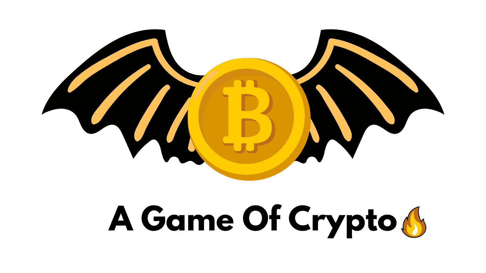

# 加密游戏:加密投资的过山车之旅

> 原文：<https://medium.com/coinmonks/a-game-of-crypto-the-rollercoaster-ride-of-crypto-investing-94e5a6b9136d?source=collection_archive---------31----------------------->

## 因为市场是黑暗的，充满恐惧！

加密货币投资很像看《权力的游戏》。

有起有落，每个角落都有惊喜，偶尔，你最终会支持错误的球队。但如果你能忍受波动，总有可能获得巨额回报。

> 在一个琼恩·雪诺一无所知的世界里，你可能会认为加密货币的波动性不会如此令人震惊。

唉，即使是龙之母也可能被突袭。所以，对于所有的加密投资者来说，这里有一个快速回顾为什么加密如此不稳定。

就像《权力的游戏》中一样，死亡总是在密码世界中隐约出现。交易所可能会被黑客攻击(Mt. Gox)，硬币可能会消失在空气中(撕裂比特币现金)，ico 可能会被证明是骗局(看看你，Centra Tech)。

即使是最善意的项目也可能因运气不好或管理不善而失败(我们仍在等待 Tron Mainnet，Justin Sun)。

> 但是就像琼恩·雪诺被他的守夜人同伴刺死后复活一样，crypto 有从最具毁灭性的挫折中恢复过来的习惯。

Mt. Gox 破产后，比特币价格受到冲击，但很快恢复。尽管发生了多起 ICO 丑闻，以太币和莱特币等替代硬币仍继续蓬勃发展。

**当然，并不是 crypto 和 GOT 之间的每个类比都是完美的。**首先，在密码世界中有超过七个王国。

尽管人们都在谈论权力下放，但仍有少数关键人物掌握着很大的权力(咳……维塔利克·布特林……咳)。但总的来说，我认为这种比较很合理。

我们甚至可以比较《权力的世界》和普通加密投资者日常生活中的关键时刻。

# 红色婚礼

在密码世界里，**红色婚礼类似于价格的突然大幅下跌。**

就像罗柏·史塔克和他的家人在《红色婚礼》中被无情屠杀一样，当价格意外暴跌时，投资者往往会感到被出卖了。

这种价格暴跌通常在没有任何警告的情况下发生，往往是由某个影响者的负面推文这样简单的事情引起的。

为了避免像罗柏·史塔克那样措手不及，时刻关注任何可能影响价格的负面消息是很重要的。

# 临冬城之战

临冬城战役是电视史上最史诗般的战役之一。

在密码世界里，临冬城之战堪比一段高度动荡的时期。就像《权力的游戏》中的角色不得不忍受一场令人难以置信的漫长而残酷的战斗一样，crypto 的投资者经常不得不经受长时间的波动。

这些时期可能会持续几天、几周甚至几个月，对投资者来说压力很大。

然而，就像《权力的游戏》中的角色最终取得胜利一样，经历过这些时期的投资者通常会看到他们的投资呈指数增长。

# 从王位到硬币

加密货币的波动性可以与《权力的游戏》相比，因为两者都充满了惊喜。

就像没有人预见到红色婚礼的到来一样(除非你读过书)，没有人能预测价格会在什么时候突然下降。然而，通过关注新闻和监控社交媒体，你可以有机会在趋势展现之前看到它们。

只是不要忘记分散你的投资组合…也许你可以投资一两个硬币。冬天来了！

# 重要的🚨

我不是财务顾问、心理学家或任何形式的专业人士。因此，这不是财务建议，我没有资格或许可提供任何类似的东西。这些内容是一群来自人类同胞的想法，仅用于教育和喜剧目的——仅此而已。

> 交易新手？试试[密码交易机器人](/coinmonks/crypto-trading-bot-c2ffce8acb2a)或者[复制交易](/coinmonks/top-10-crypto-copy-trading-platforms-for-beginners-d0c37c7d698c)