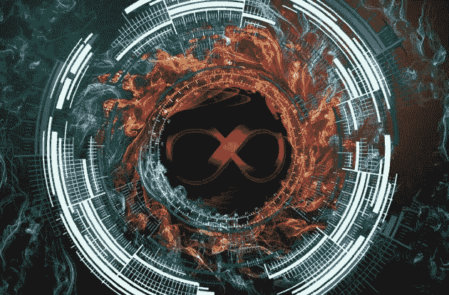

# 未来一瞥:元宇宙、中央银行和加密货币

> 原文：<https://medium.com/coinmonks/a-glimpse-into-the-future-the-metaverse-cbdcs-cryptocurrency-88eecdd0d6d3?source=collection_archive---------14----------------------->

## 元宇宙和加密货币

## 虚拟经济的兴起

Pixabay images combined ([image1](https://pixabay.com/photos/fire-ring-burning-flame-heat-6998810/), [image2](https://pixabay.com/photos/circles-technology-abstract-6998838/), [image3](https://pixabay.com/illustrations/circle-technology-abstract-digital-3041437/), [image4](https://pixabay.com/illustrations/character-infinity-symbol-icon-4852542/))

互联网对全球经济的几乎每一个方面都产生了巨大的影响，并将在这十年中再次迅速转变。