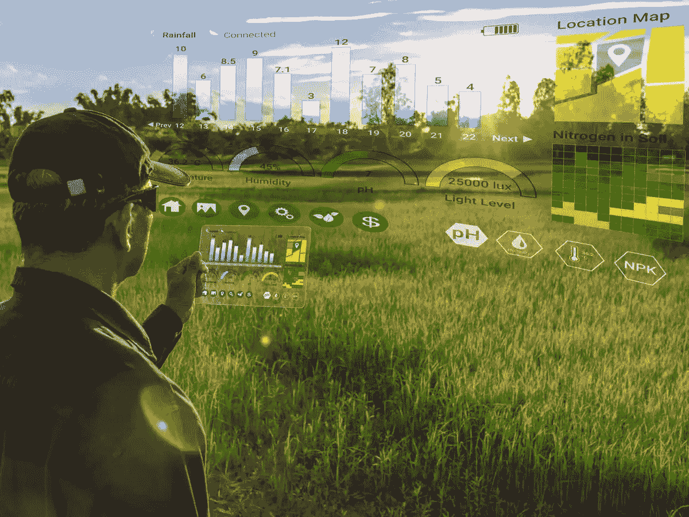
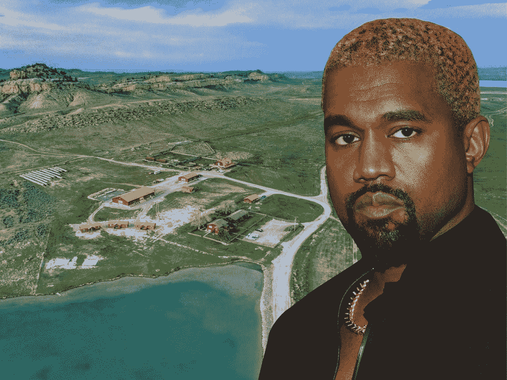
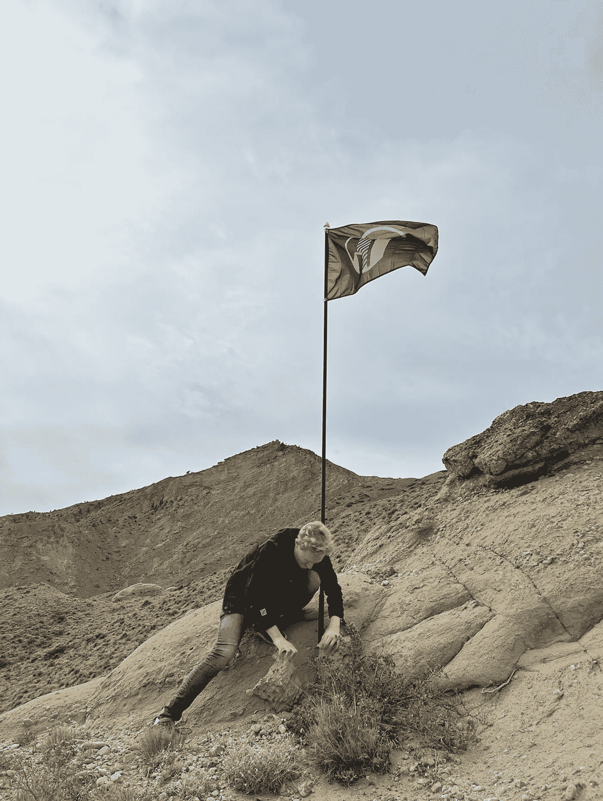
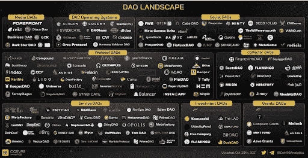

# 一群陌生人刚刚在 Kanye West 附近买了 40 英亩的土地。

> 原文：<https://medium.com/coinmonks/a-group-of-strangers-just-bought-40-acres-of-land-near-kanye-west-d60df4ecfa48?source=collection_archive---------16----------------------->

**CityDAO** is building a city on the ethereum blockchain, starting by collectively buying land in Wyoming using the new Wyoming DAO LLC law.

我第一次听说 CityDAO 是在一月份，当时黑客进入了 Discord 的管理员账户，从用户那里骗取了大约 10 万美元。

自那时以来，它走过了漫长的道路。

什么是城道？

想象一下，整个城市完全属于 NFT 持有者。

谁拥有 NFTs，谁就拥有城市的一部分。

我必须说这是一个非常有趣的概念。

请记住，这是一个新颖的想法，当它首次推出。

在 web3 的几个月就像一生。

从那以后，人们试图把所有东西都细分，放在一个区块链上。

从拥有披萨店到炸毁的兰博基尼。

我们生活在一个野蛮的世界。

CityDAO 在怀俄明州靠近 Kanye West 农场的地方买了 40 英亩土地。

Yep Kanye has a ranch in Wyoming and has just listed it for sale at $11M.

为什么是怀俄明州？

那里有什么？

首先，怀俄明州是第一个拥有 DAO 法律的美国城市之一，该法律承认有限责任公司的 DAO 治理。

有限责任公司可以拥有土地，因此这为土地所有权的细分创造了一个绝佳的机会，将土地所有权放在区块链上，并民主化给之前被排除在外的全新投资者群体。

其次，怀俄明州以黄石国家公园、岩层、间歇泉和野牛闻名。

可爱吧。

我仍然记得第一次见到野牛的情景。

它非常雄伟…闻起来像一周前洗好的衣服。

任何人都可以在 OpenSea 市场上买卖 NFT。

NFT 的所有者可以作为决策者参与。

他们可以贡献新的想法，设计城市的每一个部分，投票表决法律法规等等。

看起来确实很严重。

Not a joke, but this is how the land looked like when they first bought it.

每周都有电话打来，不和谐的声音不绝于耳，人们似乎真的对利用区块链和 NFT 科技的力量拥有和管理一座城市感兴趣。

然而要明确的是，拥有 NFT 并不意味着你拥有土地。

你只拥有对发生在上面的事情投票的权利。

很奇怪，但是为什么他们不能解决这个问题？

如果我要买 NFT，我肯定希望直接拥有土地所有权。

对于这样一个概念来说，现在肯定还为时尚早。

建造一座城市绝非易事。

需要考虑和计划的事情实在太多了。

DAOs have exploded into the scene over the last year, but has the hype run out?

我并不完全相信像城市这样复杂的东西可以通过互联网上的分散实体来有效管理。

有一点是肯定的，去中心化的代价是你牺牲了速度。

CityDAO 正在做出决策并试图采取行动，但在一个分散的世界里，达成共识并让所有人团结起来需要时间。

他们在 2021 年 11 月获得了怀俄明州的一块土地，到目前为止，还没有具体的计划来处理它。

任何拥有 CityDAO NFTs 或密切跟踪它的人，请让我知道它的进展情况。

-

你会买一个 NFT 来拥有一个城市的一部分吗？

-

# startups # business # startupx # growth # success # social media # culture # web 3 # strategy # city Dao # Dao # land # Wyoming # NFTs # eth # BTC # crypto

> 交易新手？试试[加密交易机器人](/coinmonks/crypto-trading-bot-c2ffce8acb2a)或者[复制交易](/coinmonks/top-10-crypto-copy-trading-platforms-for-beginners-d0c37c7d698c)