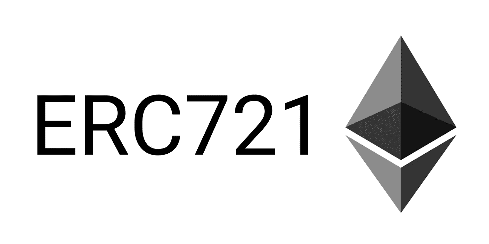
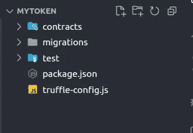

# 编写 ERC721 可升级智能合同、使用 truffle 对其进行测试并将其部署到李二测试网的指南

> 原文：<https://medium.com/coinmonks/a-guide-for-writing-an-erc721-upgradeable-smart-contract-testing-it-with-truffle-and-deploying-it-ff515249208c?source=collection_archive---------0----------------------->



## ***先决条件***

*   *开发智能合同需要熟悉 Solidity 编程语言。*
*   *以太坊及其如何处理交易的知识。*
*   *对气体概念的理解。(Gas 是对在 EVM 上执行给定操作所需的计算工作量的度量，并以以太(ETH)支付。根据合同的复杂程度和网络的当前需求，天然气的成本可能会有所不同。)*
*   *了解如何使用 Metamask、Truffle 和 Ganache 等开发工具在本地测试和部署合同。*

ERC721 是以太坊区块链上*不可替换令牌* (NFTs)的标准。不可替换令牌是唯一的数字资产，不能一对一地与其他令牌或资产交换。它们通常用于表示数字艺术、收藏品和游戏项目。

开始之前，请确保您的计算机上安装了以下工具:

*   这是一个 JavaScript 运行时，允许你在你的计算机上运行 JavaScript 代码。你可以从官方网站([https://nodejs.org/en/](https://nodejs.org/en/))下载。*我使用的是节点版本 16*
*   ***npm*** (节点包管理器):这是一个 Node.js 的包管理器，它允许你轻松地安装和管理你可以在你的 JavaScript 项目中使用的包(即库或模块)。安装 Node.js 时会自动安装 npm。

安装好这些工具，让我们开始安装**松露**。打开终端并运行以下命令:

```
npm install -g truffle
```

这将在你的计算机上全局安装 Truffle，允许你从任何目录使用它。一旦松露安装完毕，我们就可以建立一个新的项目。为您的项目创建一个新目录，将其命名为`MyToken`，在终端中导航到该目录，并运行以下命令:

```
npm init -y
```

```
truffle init
```

这将在您的项目中创建一个 *package.json* 文件、 *truffle-config.js* 文件和`contracts/` 、`migrations/`、`test/`目录。在这个项目中， *truffle-config.js* 作为索引文件，就像节点项目中的 index.js 一样。因此在 package.json 文件中， *index.js* 应该替换为 t *ruffle-config.js* 作为“主”键。文件夹结构的示例如下:



将这些依赖项安装到我们的项目目录中:

```
npm install @openzeppelin/contracts-upgradeable
```

```
npm install @truffle/hdwallet-provider
```

```
npm install dotenv 
```

```
npm install --save-dev @openzeppelin/truffle-upgrades
```

接下来，我们需要编写我们的智能合同。在`contracts/`目录下创建一个名为 *MyToken.sol* 的新文件。我们名为`MyToken`的样本契约如下所示:

```
// SPDX-License-Identifier: MIT
pragma solidity ^0.8.10;

import "@openzeppelin/contracts-upgradeable/token/ERC721/ERC721Upgradeable.sol";
import "@openzeppelin/contracts-upgradeable/access/OwnableUpgradeable.sol";
import "@openzeppelin/contracts-upgradeable/proxy/utils/Initializable.sol";
import "@openzeppelin/contracts-upgradeable/proxy/utils/UUPSUpgradeable.sol";

contract MyToken is
    Initializable,
    ERC721Upgradeable,
    OwnableUpgradeable,
    UUPSUpgradeable
{
    function initialize() public initializer {
        __ERC721_init("MyToken", "MTK");
        __Ownable_init();
        __UUPSUpgradeable_init();
    }

    function safeMint(address _to, uint256 _tokenId) public onlyOwner {
        _safeMint(_to, _tokenId);
    }

    function _authorizeUpgrade(address _newImplementation)
        internal
        override
        onlyOwner
    {}
}
```

您可以根据自己的需求添加任意多的功能。参见 [*openzeppelin*](https://docs.openzeppelin.com/contracts/4.x/) 开发安全智能合约。

在`truffle-config.js`中，添加以下代码片段:

```
const HDWalletProvider = require('@truffle/hdwallet-provider');
const fs = require('fs');
require('dotenv').config({
    path: '.env',
});

var mnemonic = fs.readFileSync('.secret.development').toString().trim();
var build_directory = './build-dev/contracts';

module.exports = {
    networks: {
        development: {
            host: '127.0.0.1',
            port: 8545,
            network_id: '*',
        },
        goerli_testnet: {
            provider: () =>
                new HDWalletProvider(
                    mnemonic,
                    `https://eth-goerli.g.alchemy.com/v2/YOUR_API_KEY`
                ),
            network_id: 5,
            confirmations: 2,
            timeoutBlocks: 200,
            skipDryRun: true,
            timeout: 5000,
        },
    },
    compilers: {
        solc: {
            version: '0.8.10', 
            settings: {
                optimizer: {
                    enabled: true,
                    runs: 1000,
                },
            },
        },
    },

    contracts_build_directory: build_directory,
};
```

确保用你的替换掉`YOUR_API_KEY`和`mnemonic`。为了便于记忆，将您的*私钥*(来自 Metamask)添加到`.secret.development` ，并且不要忘记将该文件添加到`.gitignore`。添加后，运行以下命令:

```
truffle compile --all
```

我们合同的 **ABI** 文件将在一个新的目录`build-dev`中生成。***ABI 是应用二进制接口。它们定义了智能合约中可用的方法和变量，我们可以使用这些方法和变量与智能合约进行交互。***

接下来，我们将在`migrations/` 目录中创建一个名为 *1_initial_migration.js* 的迁移文件。将以下片段添加到您的迁移文件中:

```
const { deployProxy } = require('@openzeppelin/truffle-upgrades');

const MyToken = artifacts.require('MyToken');

module.exports = async function (deployer) {
    await deployProxy(MyToken, {
        deployer,
        kind: 'uups',
    });
};
```

我们的合同接下来应该有测试用例。在我们的`tests/`目录中，创建一个名为`MyToken.test.js`的文件。该文件看起来像:

```
const { deployProxy } = require('@openzeppelin/truffle-upgrades');

const MyToken = artifacts.require('MyToken.sol');

contract('MyToken', function (accounts) {
    beforeEach(async function () {
        //Deploy a new contract for each test
        this.factory = await deployProxy(MyToken, {
            kind: 'uups',
        });
        this.userOne = accounts[1];
    });

    it('Successful: Minting', async function () {
        // userOne balance should be zero before minting
        var userOneBalance = await this.factory.balanceOf(this.userOne);
        assert.equal(userOneBalance, 0);

        // Mint tokenId 1 to userOne
        await this.factory.safeMint(this.userOne, 1);

        // userOne balance should not be zero after minting
        userOneBalance = await this.factory.balanceOf(this.userOne);
        assert.equal(userOneBalance, 1);
    });
});
```

安装一个本地以太网:你需要一个本地以太网来测试你的合同。你可以使用像 *Ganache* 或 *ganache-cli* 这样的工具在你的机器上建立一个本地以太坊网络。要安装，请运行此命令:

```
npm install -g ganache
```

打开两个终端，在其中一个上运行以下命令:

```
ganache
```

在另一台终端上运行以下命令:

```
truffle test test/MyToken.test.js
```

如果我们所有的测试用例都通过了，输出应该是这样的:

```
 Contract: MyToken
    ✔ Successful: Minting (131ms)

  1 passing (321ms)
```

使用`ctl+c`，我们可以在测试完成后关闭 ganache。

*在开始迁移之前，请确保您的帐户中有足够的 goerli 测试醚，因为迁移需要一些气体。你可以从* [*这里*](https://goerlifaucet.com/) *得到。*

一旦我们的测试用例通过，我们就可以开始了。因为我们已经配置了我们的`truffle-config.js`和`1_initial_migration.js`，运行这个命令:

```
truffle migrate --network goerli_testnet
```

输出如下所示:

```
Compiling your contracts...
===========================
> Everything is up to date, there is nothing to compile.

Starting migrations...
======================
> Network name:    'goerli_testnet'
> Network id:      5
> Block gas limit: 30000000 (0x1c9c380)

1_initial_migration.js
======================

   Deploying 'MyToken'
   -------------------
   > transaction hash:    0x61c049f1ffef6429a45c235eced73eb2a66176f9b7b2a77315b8564ca538e6d3
   > Blocks: 1            Seconds: 10
   > contract address:    0x16e876F6Ea4737AF03022A82a4a684989aB151D0
   > block number:        8231576
   > block timestamp:     1672474488
   > account:             0x3738d816E3D630C42Ca337278f40446343E8FFAb
   > balance:             1.689119818493581037
   > gas used:            2147609 (0x20c519)
   > gas price:           2.500000009 gwei
   > value sent:          0 ETH
   > total cost:          0.005369022519328481 ETH

   Pausing for 2 confirmations...

   -------------------------------
   > confirmation number: 1 (block: 8231577)
   > confirmation number: 2 (block: 8231578)

   Deploying 'ERC1967Proxy'
   ------------------------
   > transaction hash:    0x0cc67bafe88cdcec68357c5d9e9500626a188a80406fc8cb675cb85a7dd040f3
   > Blocks: 2            Seconds: 21
   > contract address:    0xdD743626C508d08578842BC8FF0Bd00497fA76b5
   > block number:        8231580
   > block timestamp:     1672474536
   > account:             0x3738d816E3D630C42Ca337278f40446343E8FFAb
   > balance:             1.688266153490507843
   > gas used:            341466 (0x535da)
   > gas price:           2.500000009 gwei
   > value sent:          0 ETH
   > total cost:          0.000853665003073194 ETH

   Pausing for 2 confirmations...

   -------------------------------
   > confirmation number: 1 (block: 8231581)
   > confirmation number: 2 (block: 8231582)
   > Saving artifacts
   -------------------------------------
   > Total cost:     0.006222687522401675 ETH

Summary
=======
> Total deployments:   2
> Final cost:          0.006222687522401675 ETH
```

在这里，我们可以看到正在发生两个事务。

1.  *第一笔交易是将智能合约的初始版本部署到区块链。该事务在区块链上创建一个新合同，并设置合同的代码和存储。*
2.  *第二个事务是创建一个指向初始契约的新契约实例。这称为“代理合同”，用于管理初始合同的升级。代理协定存储初始协定的地址，并将调用转发给它。当您想要升级契约时，您可以简单地更新代理契约以指向该契约的新实现，并且对该契约的所有调用都将被转发到新实现。*

我们现在已经将我们的 MyToken 合同部署到了 Goerli testnet。你可以通过访问 [goerli.etherscan](https://goerli.etherscan.io/address/0xdD743626C508d08578842BC8FF0Bd00497fA76b5) 来检查这一点

假设你想修改合同。对协定进行更改后，您必须编译协定并再次运行单元测试。一旦这两个步骤完成，在`migrations/`目录中创建另一个名为 *2_upgrade_MyToken.js，*的文件。升级文件看起来像:

```
const { upgradeProxy } = require('@openzeppelin/truffle-upgrades');

const MTK = artifacts.require('MyToken');

module.exports = async function (deployer, network, accounts) {
    const mtk = await MTK.deployed();
    console.log('Existing', mtk.address);
    await upgradeProxy(mtk.address, MTK, {
        deployer,
        kind: 'uups',
    });
    console.log('Upgraded');
};
```

运行以下命令:

```
truffle migrate -f 2 --network goerli_testnet
```

只要合同在更改后按预期工作，您就可以认为升级是成功的。

最后，为了与部署的契约进行通信，创建一个名为`scripts/`的新目录并添加必要的脚本，然后运行以下命令:

```
truffle exec scripts/<file_name>.js --network goerli_testnet
```

在本文中，我们介绍了使用 *minting* 功能创建一个简单的 ERC721 可升级合同、使用 truffle suit 测试我们的合同、将合同部署到 Goerli 测试网络以及升级已部署的合同的过程。

感谢阅读，下次见。再见！

> 交易新手？在[最佳加密交易](/coinmonks/crypto-exchange-dd2f9d6f3769)上尝试[加密交易机器人](/coinmonks/crypto-trading-bot-c2ffce8acb2a)或[复制交易](/coinmonks/top-10-crypto-copy-trading-platforms-for-beginners-d0c37c7d698c)