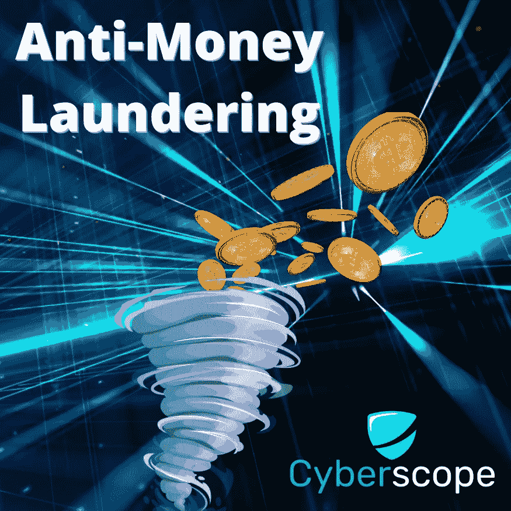
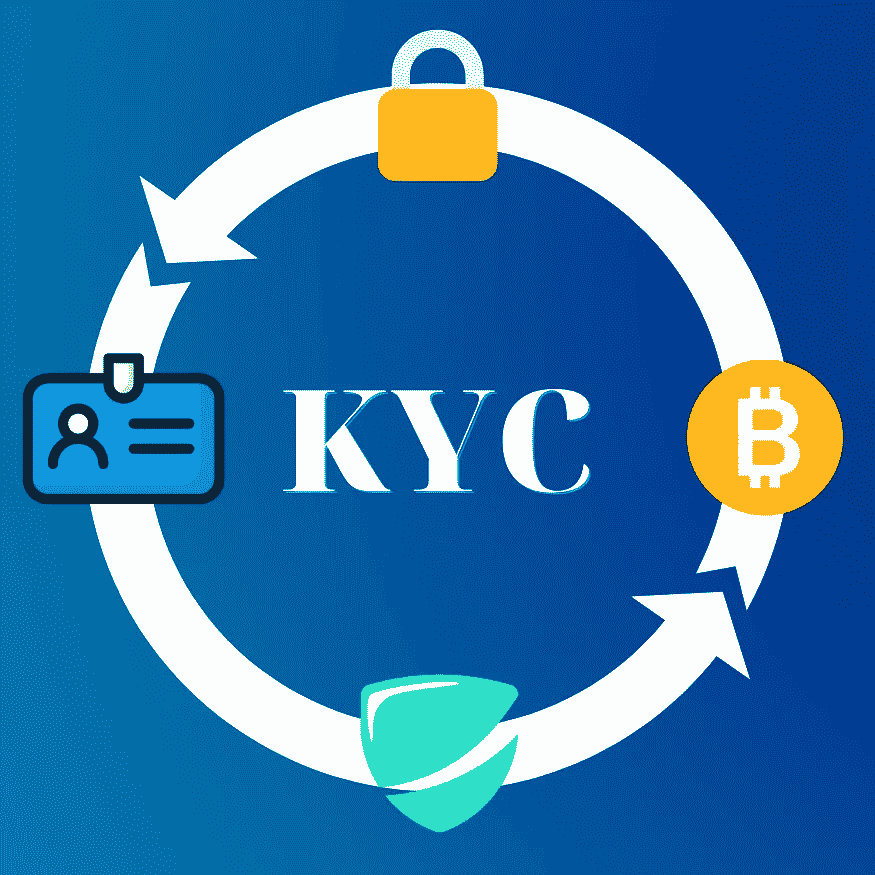
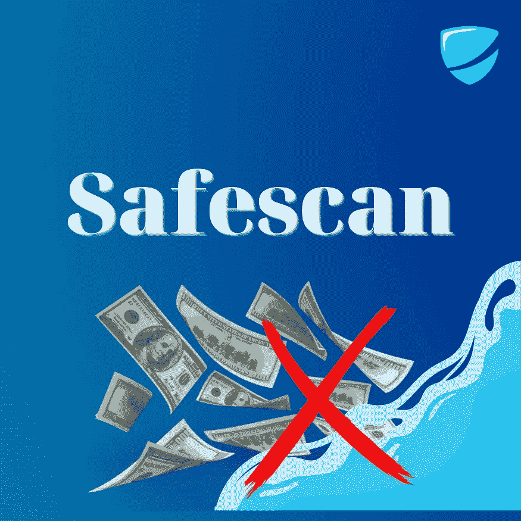

# 反洗钱指南

> 原文：<https://medium.com/coinmonks/a-guide-to-anti-money-laundering-aml-bcff7fdde5c3?source=collection_archive---------54----------------------->

最近的技术进步创造了一个环境，全球数百万人使用虚拟货币，包括加密货币和加密令牌。这些发展也导致了新的犯罪方法，通过这些方法可以进行金融交易。虽然虚拟货币仍然不在大多数国际洗钱标准的范围内，但越来越多的人一致认为，这些市场需要监管和监督，以解决其固有的风险。

《反洗钱法案》不仅仅是一部涵盖加密行业的法律，它还涵盖了其他形式的数字货币。《反洗钱法》既可以用来对付出于非法目的使用密码的人，也可以用来对付出于合法目的使用密码的人。

# 什么是洗钱？

洗钱是通过一系列交易隐瞒非法获得资金来源的行为。这是一个将非法资金转化为干净资金的过程，其来源的存在可能对当局是隐藏的。

在加密货币领域，有许多方法可以做到这一点。一种方法是在不同的交易所创建多个账户，然后用它们来买卖比特币或其他加密货币。这可以通过没有联网的纸质钱包甚至数字钱包来实现。

另一种清洗加密货币的方式是通过 ShapeShift 这样的服务，用户可以用一种加密货币交换另一种加密货币，而无需将他们的身份与交易联系在一起。这可以快速方便地完成，根本不需要任何个人信息或身份证明。

洗钱也可以通过 LocalBitcoins 和 Paxful 等第三方服务在网上进行，用户可以亲自找到想要将现金兑换成比特币或相反的买家，不需要注册或身份验证。

# 什么是反洗钱法案？

**反洗钱法**于 2001 年生效。该法案的目的是打击洗钱和资助恐怖主义行为。

该法要求所有金融机构，包括银行和其他金融服务提供者，执行发现和防止罪犯和恐怖分子利用其服务的政策和程序。该法还要求这些金融机构向当局报告可疑交易。

根据《反洗钱法》第 4 节设立了金融情报股，以收集关于可疑交易的信息，并与其他政府机构和执法机构分享。

# 加密货币的反洗钱要求是什么？

联邦反洗钱要求适用于被财政部指定为“金融机构”的金融机构和其他实体。金融机构包括银行、经纪人/交易商、货币服务企业(msb)、信用合作社、共同基金等。《银行保密法》及其实施条例要求这些金融机构收集客户信息；维护某些活动的记录；提交任何一天超过 10，000 美元的现金交易报告；当他们怀疑或有理由怀疑某项交易可疑时，提交可疑活动报告(SAR ),以保护自己不协助和教唆恐怖融资或洗钱等犯罪活动；采用核实客户身份的程序；采用解决 BSA 合规风险领域的政策。

# 加密货币交易的洗钱风险高吗？

由于虚拟货币的假名和分散性，加密货币市场被视为潜在的洗钱风险。尽管如此，反洗钱指令不适用于加密货币，结果是任何人都可以创建加密货币来清洗非法资金，而无需提供任何身份证明。此外，通过一些虚拟交易所和钱包，匿名也是可能的。

现在，**了解您的客户(KYC)** 验证如何发挥作用？它是如何成为帮助金融机构识别和降低洗钱和恐怖融资相关风险的重要工具的？

# KYC 流程在反洗钱中的作用是什么？

就**反洗钱(AML)** 而言，**了解你的客户(KYC)** 的主要目的是对持有银行账户和使用金融交易的个人实行登记和验证程序。它有助于确保进入工作场所的外部或第三方得到适当的识别、评估和管理。这包括承包商、顾问和分包商。因此，当另一个机构需要知道谁是交易的幕后黑手时，它可以通过检查存储在他们系统中的客户资料来进行调查。

但是那些没有获得 KYC 证书的项目呢？你如何确保你在与合法的人打交道，而不是从事欺诈交易？那么，像 **SafeScan** 这样的工具正是你所需要的。

# Cyberscope 的 SafeScan 有什么用？

[**Safescan**](https://www.coinscope.co/safescan) 是一款针对加密钱包的反洗钱和 KYC 工具。该软件不需要编程技能或加密货币的高级知识，因为你所要做的只是填写一张带有钱包地址的表格，然后点击“搜索”。然后，该工具将从给定的地址开始搜索交易，识别任何可能可疑的交易，并将它们与已知黑名单或可疑钱包的数据库进行交叉引用。它还将与洗钱应用进行交叉引用，如 CEX 热钱包、流行的桥牌网络和[龙卷风现金](https://tornado.cash/)。最终的分析报告将包括任何有助于您了解钱包过去历史的发现。

# 结论

《反洗钱法》不仅涵盖加密行业，还涵盖其他形式的数字货币。《反洗钱法》既可以用来对付出于非法目的使用密码的人，也可以用来对付出于合法目的使用密码的人。

正如您从上述文章中所看到的，有许多方法可以帮助您保护自己免受洗钱活动的侵害。对任何公司或个人来说，最重要的是确保他们制定了有效的反洗钱政策。

[*cyber scope*](https://www.cyberscope.io/)*是密码行业领先的智能合同审计& KYC 公司之一，已经审计了 700 多个区块链项目和 NFT。所有主要发射台的官方合作伙伴。*

*…*

*原载于*[*www . cyber scope . io*](http://www.cyberscope.io/)

> 交易新手？尝试[加密交易机器人](/coinmonks/crypto-trading-bot-c2ffce8acb2a)或[复制交易](/coinmonks/top-10-crypto-copy-trading-platforms-for-beginners-d0c37c7d698c)