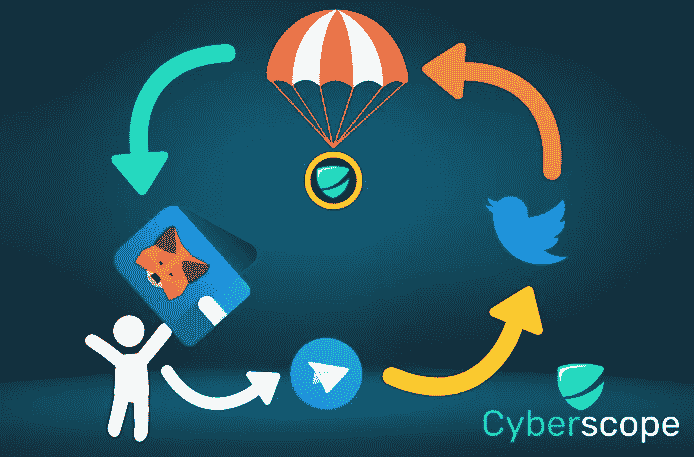

# 加密空投指南

> 原文：<https://medium.com/coinmonks/a-guide-to-crypto-airdrops-dc230bb06f63?source=collection_archive---------10----------------------->

# 介绍

随着新加密货币的数量不断增加，用户不断试图发现有前途的硬币进行投资， [airdrops](https://www.coinscope.co/airdrop/active) 开始为双方提供援助。投资者，不管是新手还是有经验的，都有机会通过赚取代币作为奖励来尝试新代币。

在下面的指南中，你会发现你需要了解的所有空投类型，它们是如何工作的，以及如何避免诈骗企图，甚至可能掏空你的钱包。

# 什么是加密空投？

简而言之，它是一种被密码项目用来向公众分发代币或硬币的营销策略。空投可以有效地激发人们对新项目的兴趣。它们也可以作为正在进行的活动的一部分，以保持令牌持有者、投资者和用户对项目的高度重视。

代币是免费发放的，但通常情况下，用户需要完成一些任务才能获得奖励，例如参与项目的社交媒体。

# 加密空投是如何工作的？

尽管有几种类型，但描述空投的最佳方式是作为一种赠品，向特定数量的钱包分发大量加密货币令牌。

当项目团队宣布赠品时，参与者必须在团队自己定义的时限内完成项目团队要求的任何任务。用户必须遵循的要求可能是通过社交平台传播项目信息或加入他们的官方电报组和 Twitter 页面。

当时间框架结束时，项目加密货币的承诺金额将分发到少数幸运获奖者的钱包中。

# 为什么加密项目应该创建空投？

空投是一种很好的方式来提高对特定项目的认识和需求。如前所述，为了参与其中，你必须关注该项目的社交媒体账户，加入他们的 telegram 组，并将钱包地址添加到他们的个人资料中。

作为结果，上述动作还将使用户将项目推广到他们自己的网络，以这种方式增加加密令牌的信誉。进一步推广，持有人的数量越多，加密项目的统计数据就越好。

# 空投的类型

我们通常会遇到 4 种:**标准、** **赏金、专属**和**持有者**空投

## 标准

承诺的金额将在不要求参与者采取进一步行动或完成任务的情况下分发。

## 邦蒂号

这就像加密货币世界中的悬赏活动一样。它们通常要求用户完成某些任务——如前所述——例如在 Twitter 上分享关于该项目的帖子，加入该项目的官方 Telegram 组，或者在 Instagram 上创建帖子并标记几个朋友。此外，用户可能会被要求填写他们的钱包地址，并提供他们完成任务的证明，以申领空投。

## 独家的

它通常只授予与项目建立了联系的人，例如在项目早期是活跃的社区成员或支持者。

## 持有人

免费代币分发给钱包里一定数量数字货币的持有者。在特定时间拍摄快照，项目团队将确认参与者的钱包余额是否满足最低要求。在这种情况下，接收者可以根据他们在快照时间内的持有量来申请免费令牌。

# 如何申请空投？

申请空投的流程因项目而异。然而，各种方法中的标准和强制资产是诸如 MetaMask 的加密货币钱包。创建一个后，您可以检查您的钱包是否收到免费令牌。如果没有，你很可能不得不前往主办网站，连接你的钱包，检查你是否是赢家之一，并要求奖励

# 空投骗局和如何避免他们

如果你想加入空投，你首先要考虑的是它是合法的还是骗局。你可以在加密世界中找到各种类型的骗局，空投也不例外。它们通常被分发，以便通过吸引大量注册用户然后向他们发送垃圾消息来接触新用户。

重要的是在你报名之前做好自己的研究，并确保你对比赛的要求感到满意。尽量选择有[审核](https://www.cyberscope.io/#audit)和 [KYC](https://www.cyberscope.io/#kyc) 认证的项目。空投可能是有益的，但如果你不考虑使用空投可能导致的任何潜在损害，空投也是有风险的。

请记住，骗局可能非常有说服力。其中一些会要求你发送加密到一个未知的钱包地址，以解锁你的免费令牌作为回报。合法空投永远不会问你的资金或种子短语。小心网络钓鱼邮件或直接信息。

在其他情况下，骗子会通过虚假的 Twitter 和 Telegram 帐户宣布一个虚假的空投，从而导致一个钓鱼网站。他们会骗你把钱包连接到一个看起来和原来很像的网站。一旦您连接您的钱包并签署交易，您将从钱包中取出其他令牌。因此，要谨慎选择合法的[托管平台](https://www.coinscope.co/airdrop/active)。

***为了避免被骗，你可以按照下面的提示:***

1.  警惕将您的个人信息或加密货币交给陌生人。相反，将官方网站、社交媒体渠道和 Telegram group 标记为书签。
2.  在你决定参与之前，先看看参与空投的社区成员的评论。如果有些事情看起来可疑或者好得令人难以置信，避开它。
3.  除了使用强密码之外，您还可以设置一个新密码和一个新电子邮件地址，专门用于接收 airdrops 奖励，从而进一步保护您的钱包。这可以确保您个人钱包中的资金不会受到与空投相关的网络钓鱼攻击。最重要的是，永远不要和任何人分享你的私人钥匙

# **关闭思路**

加密空投在加密领域是一个日益增长的现象。令牌的免费赠送使项目脱颖而出并获得牵引力，同时也给加密爱好者一个机会，用崭露头角的令牌来增加他们的投资组合。然而，你必须时刻警惕那些骗子，他们正等着利用你，一有机会就掏空你的钱包。

*…*

*原载于*[*www . cyber scope . io*](https://www.cyberscope.io/)

> 交易新手？尝试[加密交易机器人](/coinmonks/crypto-trading-bot-c2ffce8acb2a)或[复制交易](/coinmonks/top-10-crypto-copy-trading-platforms-for-beginners-d0c37c7d698c)