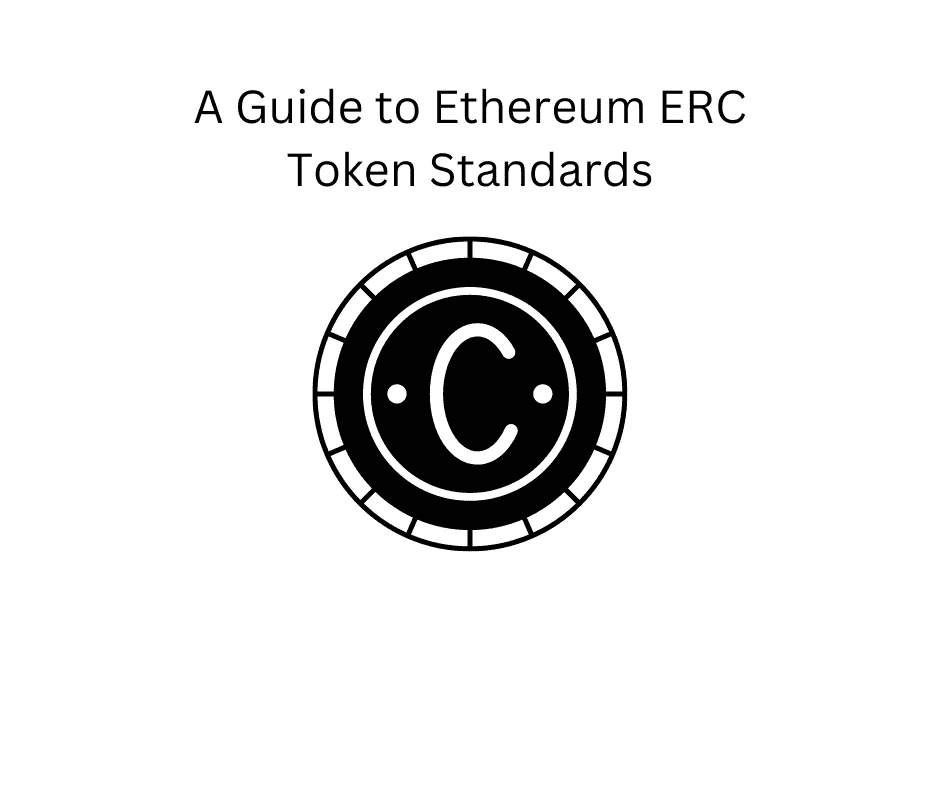

# 以太坊 ERC 令牌标准指南

> 原文：<https://medium.com/coinmonks/a-guide-to-ethereum-erc-token-standards-37a5e95a5893?source=collection_archive---------38----------------------->

这种分类是什么，为什么重要。

What is this classification and why it is important.

ERC 代表以太坊命令请求。通过阅读该定义，您可以理解，它用于开发一个特定的令牌，并在以太坊区块链中以令牌形式指定一组函数。

> 不知道什么时候买卖，试试[复制交易](http://coincodecap.com/go/bityard)。

ERC 令牌标准本质上是一种结构，开发者在编程以太坊上发布的令牌如何工作时使用。以太坊社区成员不是从零开始创建新的区块链，而是按照这些标准在现有的区块链建筑之上进行建设。

以下是最重要的 ERC 令牌标准列表:

最著名和最重要的 ERC 标准是 ERC-20。

**ERC-20** 已经成为以太坊区块链上令牌实施的第一个标准。开发人员使用 ERC-20 在以太坊区块链上实现所有智能合约。ERC-20 代币是可以在以太坊区块链上转移和接收的数字资产。有了 ERC-20 标准，开发者可以在以太坊的基础上构建新的令牌或分散应用(dApps)。

**ERC-721** 另一个重要的 ERC 标准是 ERC-721，它用于不可替代令牌(NFT)。人们正在使用 ERC-721 标准来标记独特的个人项目和东西，作为加密游戏行业的收藏品。

**ERC-223** 通过通知用户错误地向智能合约地址发送令牌并取消交易，保护用户免受意外合约转移的影响。

**ERC-777** 被用作操作器。它用于高级功能，以便与其他几个令牌进行交互。代表另一个地址发送令牌，并给予持有者对其令牌的更多控制

**ERC-1363** 是代币合约的标准功能，使用代币来实现代币的可支付性。

**ERC-1155** 是一种多令牌标准，与 ERC-721 一起用于加密游戏行业，允许管理可替换和不可替换的令牌。ERC-1155 旨在让用户拥有任意数量的令牌类型，并由单个智能合约支持和管理功能。

ERC-4907 是 ERC-721 的延伸。它允许用户允许其他人使用 NFT，但不能转让初始所有权。此功能允许用户租用他们的 NFT 并保留初始令牌。

随着时间的推移，新的标准被创建来修复旧的错误并改进现有的 ERC 令牌标准。

你可以在下面的链接中看到关于 ERC 令牌标准的一切，最后的调用，草案和开放代码:

[https://eips.ethereum.org/erc](https://eips.ethereum.org/erc)

以太坊社区成员通过实现新特性和设计新功能，不断努力改进现有标准。

如果你喜欢阅读并学到了一些东西——关注更多！

你可以在推特上找到我——https://twitter.com/pinadefi

子栈—【https://pinadefi.substack.com/ 

发布时间 0x—[https://www.publish0x.com/@Pina-DeFi](https://www.publish0x.com/@Pina-DeFi)

> 加入 Coinmonks [电报频道](https://t.me/coincodecap)和 [Youtube 频道](https://www.youtube.com/c/coinmonks/videos)了解加密交易和投资

# 另外，阅读

*   [Bookmap 评论](https://coincodecap.com/bookmap-review-2021-best-trading-software) | [美国 5 大最佳加密交易所](https://coincodecap.com/crypto-exchange-usa)
*   [加密交易机器人](/coinmonks/crypto-trading-bot-c2ffce8acb2a) | [造币评论](https://coincodecap.com/coingate-review)
*   最佳加密[硬件钱包](/coinmonks/hardware-wallets-dfa1211730c6) | [Bitbns 评论](/coinmonks/bitbns-review-38256a07e161)
*   [新加坡十大最佳加密交易所](https://coincodecap.com/crypto-exchange-in-singapore) | [购买 AXS](https://coincodecap.com/buy-axs-token)
*   [红狗赌场评论](https://coincodecap.com/red-dog-casino-review) | [Swyftx 评论](https://coincodecap.com/swyftx-review)