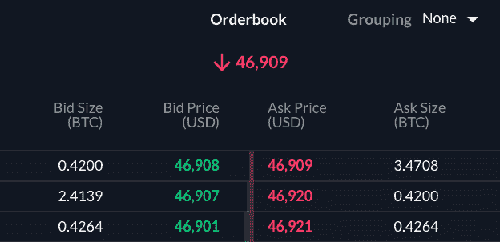
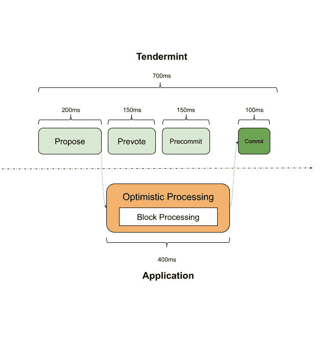

# 理解 Sei 网络的指南:第一个订单集中的 L1 区块链

> 原文：<https://medium.com/coinmonks/a-guide-to-understanding-sei-network-the-first-order-book-focused-l1-blockchain-9cac7317ba54?source=collection_archive---------3----------------------->

Sei Network 是第一个以订单簿为中心的 L1 区块链，它在不牺牲分散性的情况下提供了高吞吐量和低延迟。它专门用于交易，比其他类型的区块链更快更可靠。

Sei 使用 Cosmos SDK(tender mint 核心)构建，并具有内置的集中式(或分散式)限价订单簿(CLOB/DLOB)模块，该模块提供了高度优化的订单下达和匹配引擎。

CLOB 是中央限价指令簿，其中指令信息由中央机构维护和匹配。DLOB 是一个分散的限价订单簿，其中订单消息由分布式节点网络传播和匹配。

自 2000 年以来，中央限价委托单(CLOBs)一直是 TradFi 做市的组成部分。你今天在纳斯达克或其他指数上交易的每一项资产都是用一个来填充的。然而，crypto 中的 CLOBs 很大程度上只存在于集中交易所(CEXs)中。

这是因为在链上提交订单非常困难。cex 只能利用它们，因为它们利用了 Web2 基础设施。问题是，他们倾向于集中化和其他我们熟悉的存在于 Web2 中的风险。

由于这种单一的集权事实，AMM 反而成为 DeFi 的标准。但 AMMs 的问题是，它们天生效率较低，因为 CLOBs 提供更低的滑点、更紧的点差等等。

现在需要注意的是，Sei 网络并不是第一个推出 CLOBs 的。像 [@ProjectSerum](https://twitter.com/ProjectSerum) 这样的团队已经尝试引入链上 CLOBs。

Serum 取得了一些成功，但 AMMs 继续主导 DeFi，cex 继续主导基于 CLOB 的交易。这是因为血清的效率和能力取决于它所依赖的链条。当索拉纳充血或处理活性问题时，血清也是如此。

这就是 Sei 网络出现的地方和原因。在观察 Serum 及其成功/缺点后，Sei 推断 CLOB 赖以生存的区块链必须是专门为它设计和优化的。

因此，Sei 成为第一个订单特定的 L1 区块链。

与其他区块链相比，Sei 网络具有许多优势，包括:

-高吞吐量和速度

-流动性

-关注订单簿

-全面的交易解决方案

Sei 针对速度、稳定性和成本效益进行了优化；CLOB 和基于它构建的应用程序需要的所有东西。它引入了专门用于交换的事务排序、块处理和并行化的新方法。基于 Sei 的 dapps 可以建立在 DLOB 之上，其他基于 Cosmos 的区块链可以使用 DLOB Sei 作为共享的流动性中心。

通过链上 CLOB 模块和匹配引擎，Sei 可以为交易者和应用提供深度的流动性和价格-时间-优先级匹配。

这是它的边缘！

Sei 上的应用利用其:

*   内置订单簿基础设施，
*   深度流动性，以及
*   完全分散的匹配服务。

另一方面，用户利用这个模型精确地选择他们交易的价格、大小和方向(也有 MEV 保护)。

Sei 设想自己成为 DeFi 产品新梯队的大本营。Sei 计划成为下一代 Cosmos 生态系统 DeFi 产品的基础设施和流动性中心，因为它弥合了集中式和分散式交易所之间的性能差距。

为此，他们选择了 Cosmos SDK、Tendermint Core 和 CosmWasm。此外，Sei 网络支持 IBC，并与 wasmd 模块集成，以支持 CosmWasm (CW)智能合约。

作为一个区块链网络，Sei 有许多活动部件。Sei 在两者之间开启了一个全新的设计空间——不是通用的，也不是特定于应用的，而是特定于行业的，这使 Sei 能够为 DEX 应用创建一个定制的环境。

在本文中，我们将关注 Sei 的七个主要创新领域:

*   智能块传播
*   乐观块处理
*   DeliverTx 并行
*   端块并行化
*   本地价格神谕
*   频繁的批量拍卖
*   交易订单捆绑

在我们进一步深入这个兔子洞之前，我们先来了解一下 Sei 网络是如何达成共识的。

现在，为了在协议级别验证交易的有效性，Sei 网络使用了 **Twin turbo consensus 算法。**

使用双涡轮共识，一旦一个完整的节点收到来自用户的交易，它必须广播到网络中的其他节点。完整的节点将随机地向网络中的其他节点散布这个事务。一旦验证器收到一个事务，它就验证该事务的有效性，并将该事务添加到验证器的本地内存池中。

因此，Sei 在块建议中发送事务散列，允许验证器在本地重构块(通过查看它们的内存池),而不是等待通过网络接收它们。以前，块提议者发送包含每个事务的块。在事务提交时，验证器已经在它们之间传播事务，所以大多数验证器已经在它们的本地 mempool 中有了每个事务。

**智能块传播**

借助智能数据块传播，数据块建议者现在将发送一个建议，其中包含数据块中每个事务的哈希。当验证器收到块提议时，它们可以使用来自它们的 mempool 的事务来快速重建块。

如果验证器的本地 mempool 中没有所有的事务，它们可以等待整个块的内容到达。这导致总吞吐量增加了约 40%。

**乐观块处理**

这就是验证器处理块提议的方式。验证者将同时启动一个进程，乐观地处理他们收到的任何高度的第一个块建议。

如果该块被网络接受，那么来自缓存的数据将被提交。如果网络拒绝该块，则来自缓存的数据将被丢弃，并且该高度的未来轮次将不使用乐观块处理。

总的来说，乐观块处理使吞吐量增加了 33%。这是因为 Twin-turbo consensus 正在帮助 Sei 获得每秒处理 22k 以上的订单，同时保持接近 450 毫秒的阻塞时间。

在 [@Tendermint_Core](https://twitter.com/Tendermint_Core) 提出的步骤中，提出了一个块，并分发给其他验证器。然后，验证器相互发送 prevote 和 pre-commit 消息，同意这是它们想要提交的块。

发送预提交消息后，验证器将检查块中的每个事务，并执行状态更改。如果建议的块最终被接受(通常是这种情况)，则候选状态被接受。否则，它将被丢弃。只有每个高度的第一个建议块将被乐观地处理，以避免验证器过载。

延迟改进的准确估计值为 min(300ms，N * T ),其中 N 是事务数量，T 是单个事务的平均延迟。对于 1 秒的数据块时间，预计延迟将减少 30%，吞吐量将增加 43%。

有关该提案的全部细节，请访问:

[https://github . com/sei-protocol/sei-chain/blob/master/docs/RFC/RFC-000-乐观-提议-处理. md](https://github.com/sei-protocol/sei-chain/blob/master/docs/rfc/rfc-000-optimistic-proposal-processing.md)

现在，我们转到 Sei 的并行化。

Sei 已经配置了 DeliverTx 和 EndBlock 来并行处理事务，这意味着同时在多个线程中处理事务。这导致在 DeliverTx 阶段应用的大多数类型的事务的状态改变，除了在 EndBlock 逻辑期间应用其大多数状态改变的 CLOB 事务。

**DeliverTx 并行化**

在 DeliverTx 期间，Sei 并行处理事务，而不是一次处理一个。这允许同时处理多个事务，从而提高了性能。Sei 通过维护事务消息类型到它们需要访问的键的映射(依赖映射)来做到这一点。

Sei 知道不同类型的事务使用哪些资源，并并发运行不涉及相同状态的事务。

**端块并行化**

在这项创新中，Sei 在块的末尾处理与订单簿相关的事务。

使用这种方法，如果两个订单不影响同一个区块的同一个市场，它们就成为独立的。如果不同市场之间存在依赖关系，将在部署智能合同时进行定义。如果依赖项定义不正确，则依赖智能协定的事务将失败。

这将允许 Sei 在相同的时间内处理更多的订单，也将允许 Sei 收取更低的气费。它还有助于确保价格公平和防止抢注。

**土特产价格神谕**

Sei 区块链有一个本地价格 oracle 来支持资产汇率定价。这意味着验证者(Sei 网络的参与者)需要提供准确的资产定价信息，以确保价格是可靠的。为了保持价格信息的新鲜，可以将投票窗口配置为一个街区长，这样可以快速更新价格。

**频繁批量拍卖**

Sei 的本地订单匹配引擎使用频繁批量拍卖(FBA)来帮助匹配和填充交易。市场订单不是按顺序执行交易，而是在一个交易块的末尾汇总，并以相同的价格执行。

例如，假设订单簿有 2 个限价卖单，

*   一种是以 10 美元的价格出售 1 单位资产 ABC，以及
*   另一个是以 11 美元出售 1 单位资产 ABC

然后，两个购买 1 单位相同资产的市场订单进来——它们会以什么价格成交？

在顺序执行的情况下，买入订单将与卖出订单相等地匹配。第一笔市场买入将在 10 美元成交，第二笔将在 11 美元成交。即使两个市场订单在同一个块中，第二个订单由于在该块中排序而获得更差的价格。

这也意味着顺序执行也允许前端运行。

一个例子是，如果一个验证器看到一个传入的市价买入 10 美元，在一个订单簿上有 2%的滑点，该订单簿上只有 1 个单位的资产以 10 美元的价格限价卖出，那么验证器在该传入的市价订单之前下了 2 个订单。

他们插入:

*   以 10 美元购买该资产的市价单
*   限价单以 10.20 美元出售

由于订单簿上没有其他流动性，用户的交易以 10.20 美元而不是 10 美元成交，验证者获得无风险利润 0.20 美元

随着频繁的批量拍卖(FBA)，两个市价订单将以 10.50 美元的统一清算价格成交，限价订单将分别以 10 美元和 11 美元的预期价格成交。

通过这种机制，块内事务的顺序并不重要。此外，由于订单是在块的末尾聚合的，所以验证器不能在订单之前运行。

因此，FBA 有助于在单个块的范围内防止与订单簿相关的抢先。但它不会阻止与非订单相关的 MEV(例如与 AMM 相关)和多块前置。

**比赛:**

在宇宙内部，Sei 在衍生品市场面临一些竞争。其中最值得注意的是 dYdX。

但是也许还有一线希望…

dYdX 处理交易、清算、转让、去杠杆化和基于链外逻辑的 oracle 定价更新。这与 Sei 的工作方式非常不同。

Sei 试图将尽可能多的产品带上链。

Sei 如果成功的话，有可能在宇宙内外造成巨大的破坏。如果他们能够提供相当于或超过 CEX(或 dYdX)的网上订单体验，他们就可以改变网上交易和流动性的性质。

**结论:**

虽然我不认为 CLOBs 会杀死 AMMs，但他们肯定会占据 AMMs 的大部分市场份额。有一些应用程序依赖于订单簿，因此到目前为止难以在链上存在。如果这些应用在 Sei 上获得成功，新的建设者、用户和 TVL 将会到来。这些人习惯了订单簿体验，并希望继续使用它们。

由于在 TradFi CLOBs 已经成为标准超过 20 年，许多人已经习惯了它们。对冲基金就是 rn 的一个例子，如果他们在加密，他们最有可能使用 CEX 的 CLOB。因此，他们可以随着时间的推移探索 Sei。

如果 Sei 成功的话，它关于链上订单设计的论文将被证明是正确的，它将成为先行者。随着时间的推移，类似的内置 CLOB 模块的连锁店可能会出现，但 Sei 将有机会利用先发优势。

机会很明显，现在是团队执行的时候了。Sei 的工程团队在大型技术和加密(更具体地说是在 Cosmos)领域都有多年的经验。有些人在贸易和投资领域有广泛的背景。因此，他们似乎更有能力弥合 DeFi、机构和零售之间的差距。

Sei 网络是一个令人兴奋的项目，有可能彻底改变数字资产交易的世界。今天，Sei 正处于被称为“Seinami”的激励性测试网络阶段一旦他们通过了所有的 testnet 阶段，接下来就是 mainnet 阶段。

Sei 的完整白皮书可在以下网址找到:

[https://github . com/Sei-protocol/Sei-chain/blob/master/white 白皮书/Sei_Whitepaper.pdf](https://github.com/sei-protocol/sei-chain/blob/master/whitepaper/Sei_Whitepaper.pdf)

> 交易新手？在[最佳密码交易所](/coinmonks/crypto-exchange-dd2f9d6f3769)上尝试[密码交易机器人](/coinmonks/crypto-trading-bot-c2ffce8acb2a)或[复制交易](/coinmonks/top-10-crypto-copy-trading-platforms-for-beginners-d0c37c7d698c)